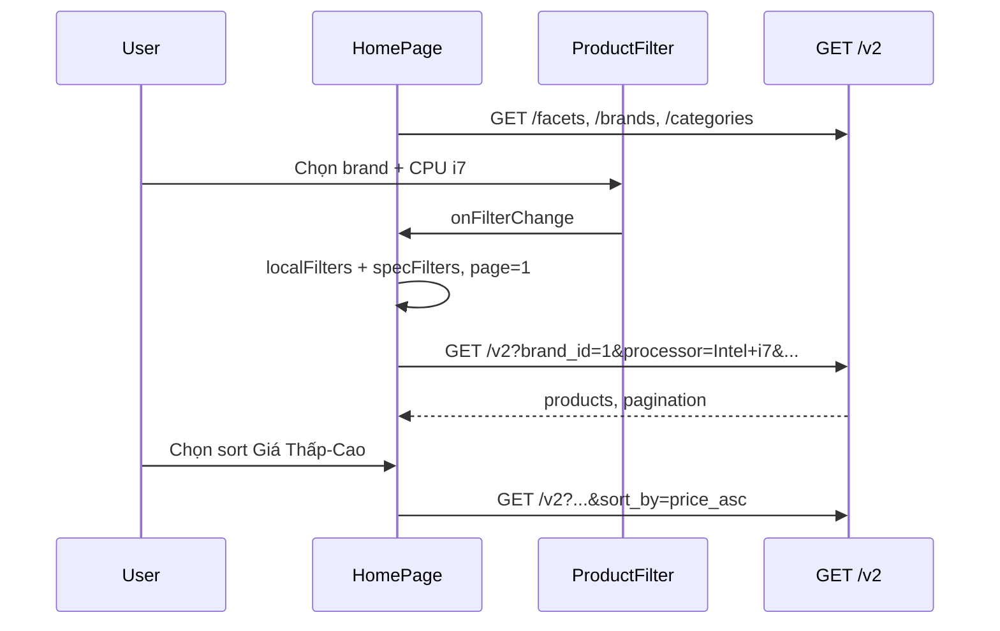

# Functional Requirement (FR) — Lọc và sắp xếp sản phẩm (Filter & Sort Products)

## 1. Feature Overview

Trang chủ catalog (**HomePage**) cho phép khách **thu hẹp** danh sách laptop và **sắp xếp** kết quả. Toàn bộ logic listing dùng **`GET /api/products/v2`** qua hook `useProductsV2`, kết hợp:

- **Metadata:** brands, categories (`/products/brands`, `/products/categories`).
- **Facet options:** CPU, RAM, storage, GPU, screen, weight (`/products/facets`).
- **Local state:** `localFilters`, `specFilters`, `sortBy`.
- **URL:** `search` query param (xem `FR_SearchProductsByKeyword.md`).

UI: mega-menu brand/category, panel filter (`ProductFilter`), chip “đã áp dụng”, dropdown spec, sort pills, pagination.

---

## 2. Actors

| Actor | Mô tả |
|-------|-------|
| **Customer** | Lọc/sort trên HomePage |
| **Frontend** | `HomePage.jsx`, `ProductFilter.jsx` |
| **Backend** | `getProductsV2`, `getProductFacets` |

---

## 3. Scope

### Filter dimensions

| Dimension | State (FE) | Query param (BE) | Target |
|-----------|------------|------------------|--------|
| Brand | `localFilters.brand_id[]` | `brand_id` CSV | `products.brand_id` |
| Category | `localFilters.category_id[]` | `category_id` CSV | `products.category_id` |
| Giá | `minPrice`, `maxPrice` | `min_price`, `max_price` | `products.base_price` * |
| CPU | `specFilters.processor[]` | `processor` CSV | `variations.processor` IN |
| RAM | `specFilters.ram[]` | `ram` | `variations.ram` |
| Storage | `specFilters.storage[]` | `storage` | `variations.storage` |
| GPU | `specFilters.graphics_card[]` | `graphics_card` | `variations.graphics_card` |
| Màn hình | `specFilters.screen_size[]` | `screen_size` | `variations.screen_size` |
| Cân nặng | `minWeight`, `maxWeight` | `min_weight`, `max_weight` | Parse `specs->>'weight'` numeric |
| Tên | `urlSearchQuery` | `search` | `product_name` ILIKE |

\* Caveat cột `base_price` — xem FR v2.

### Sort options (HomePage `sortChoices`)

| Label UI | `sortBy` value | BE `sort_by` |
|----------|----------------|--------------|
| Phổ biến | `""` (empty) | default `created_at DESC` |
| Khuyến mãi HOT | `best_selling` | subquery sold_qty |
| Giá Thấp - Cao | `price_asc` | `base_price ASC` |
| Giá Cao - Thấp | `price_desc` | `base_price DESC` |

**Không có** “Mới nhất” trên UI dù BE hỗ trợ `newest`.

### Out of Scope

- Filter theo tag.
- Saved filter presets / user accounts.
- Legacy `GET /products` sort `view_count` (admin only).

---

## 4. State Management

### `localFilters`

```javascript
{
  brand_id: [],      // number[]
  category_id: [],
  minPrice: "",
  maxPrice: "",
  page: 1,
  limit: 30,
}
```

### `specFilters`

```javascript
{
  processor: [],
  ram: [],
  storage: [],
  graphics_card: [],
  screen_size: [],
  minWeight: "",
  maxWeight: "",
}
```

### Merge → API

```javascript
const v2Filters = {
  ...filters,           // includes search from URL
  sortBy,
  processor: specFilters.processor,
  // ...
  _version: "inactive_enabled", // React Query only
};
```

**Mọi thay đổi filter/sort** → `setLocalFilters(..., page: 1)` reset trang.

---

## 5. Backend — `getProductsV2` (tóm tắt)

- **Variation filters:** `required: true` trên include khi có `variationWhere` — chỉ SP có SKU khớp.
- **Pagination:** `page`, `limit`, response `pagination` + duplicate `total`, `totalPages`.
- **Distinct:** `distinct: true` tránh đếm trùng khi join variations.

---

## 6. UI Components

### `ProductFilter.jsx`

- Checkbox brands / categories (multi-select).
- Price min/max inputs.
- Props `filters.search` hiển thị read-only từ URL (không đổi URL khi clear brand).

### HomePage filter panel

- Collapsible `showFilterPanel`.
- Spec checkboxes populated từ `useProductFacets()`.
- Weight min/max (2 chỗ: quick dropdown + panel).
- **Applied chips** (`appliedChips`) — remove từng filter.

### Mega-menu (brand logos, category tiles)

- Toggle `brand_id` / `category_id` via `toggleNumberInList`.

### Pagination

```javascript
handlePageChange(newPage) => {
  setLocalFilters({ ...localFilters, page: newPage });
  window.scrollTo({ top: 0, behavior: "smooth" });
};
```

Hiện khi `totalPages > 1`.

---

## 7. Clear Filters

```javascript
handleClearFilters() => {
  // reset localFilters + specFilters + sortBy
  // KHÔNG xóa URL ?search= (comment: có thể dùng setSearchParams sau)
};
```

---

## 8. Facets Integration

`useProductFacets()` — `staleTime: 10 phút`.

Chỉ cung cấp **danh sách giá trị** — không count. Checkbox labels = string từ DB.

---

## 9. Business Rules

| # | Rule | Chi tiết |
|---|------|----------|
| BR-01 | **Multi brand/category** | OR trong cùng dimension (`IN`) |
| BR-02 | **Multi spec values** | OR trong field (`processor IN (...)` ) |
| BR-03 | **Cross-dimension AND** | Brand AND category AND search AND specs |
| BR-04 | **Reset page on change** | Tránh empty page khi filter siết |
| BR-05 | **Featured carousel độc lập** | `featuredFilters` không inherit user filters |
| BR-06 | **Default sort “Phổ biến”** | Empty sortBy → newest-by-created_at BE |

---

## 10. Sequence Diagram



---

## 11. Comparison với Legacy `GET /products`

| | Legacy | V2 (HomePage) |
|--|--------|---------------|
| Spec filter | Không | Có |
| Sort | `sort` + `order` whitelist | `sort_by` presets |
| FE hook | `useProducts` | `useProductsV2` |
| Default limit | 12 | 30 |

---

## 12. Edge Cases

| Case | Hành vi |
|------|---------|
| Filter quá chặt | 0 products — empty state |
| Chỉ min price | `base_price >= min` |
| Spec filter + product 0 variation match | Loại SP |
| `sortBy` + `best_selling` featured block | Featured query riêng, không bị user sort ảnh hưởng |
| Mobile horizontal brand scroll | UX only |

---

## 13. Related Features

| FR | Quan hệ |
|----|---------|
| `FR_GetProductFacets.md` | Option lists |
| `FR_ListBrands.md`, `FR_ListCategories.md` | Metadata |
| `FR_SearchProductsByKeyword.md` | `search` param |
| `FR_ViewProductListV2.md` | API contract |
| `FR_ViewFeaturedProductsCarousel.md` | Tách query |

---

## 14. Source Files

| Layer | File |
|-------|------|
| FE | `client/app/pages/HomePage.jsx` |
| FE | `client/app/components/ProductFilter.jsx` |
| FE | `client/app/components/ProductCard.jsx` |
| FE hook | `client/app/hooks/useProducts.js` |
| BE | `server/controllers/productController.js` |

---

## 15. Acceptance Criteria

- **AC1:** Chọn brand → grid chỉ SP brand đó (OR nhiều brand).
- **AC2:** Chọn CPU facet → chỉ SP có variation CPU khớp.
- **AC3:** Sort “Giá Thấp-Cao” → thứ tự đổi (theo `base_price` BE).
- **AC4:** Đổi filter → về page 1.
- **AC5:** Applied chips xóa đúng từng filter.
- **AC6:** Pagination hoạt động với filter đang active.

---

## 16. Known Gaps

1. UI thiếu sort **“Mới nhất”** (`newest`).
2. `base_price` vs `variations.price` inconsistency.
3. Không có facet counts.
4. Clear filters không xóa URL search.
