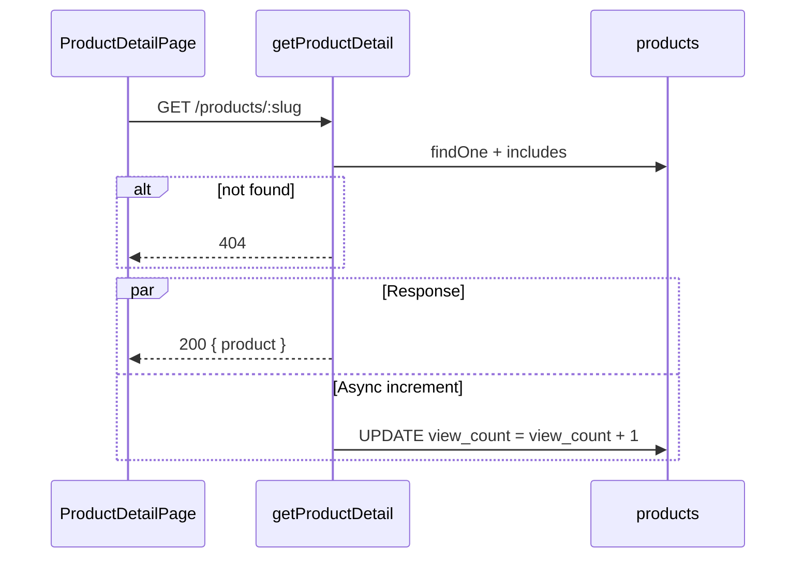

# Functional Requirement (FR) — Tăng lượt xem sản phẩm (Increment View Count)

## 1. Feature Overview

Mỗi lần client gọi **`GET /api/products/:id`** (chi tiết sản phẩm) thành công, hệ thống **tăng thêm 1** vào cột `products.view_count` — **side effect best-effort**, không chặn response nếu increment thất bại.

**Không có** endpoint riêng `POST /view` hay `PATCH /view-count`. Toàn bộ logic nằm trong `getProductDetail` sau khi tìm thấy product.

Mục đích đồ án: metric phổ biến (sản phẩm hot, sort legacy `view_count`) và analytics nội bộ; hiện FE **không** hiển thị số view trên `ProductDetailPage` (có thể dùng sau).

---

## 2. Actors

| Actor | Mô tả |
|-------|-------|
| **Visitor** | Mở trang `/products/:slug` hoặc `/products/:id` |
| **Frontend** | `useProduct(id)` → một GET detail mỗi mount/refetch |
| **Backend** | `product.increment("view_count")` |

---

## 3. Scope

### In Scope

- Increment khi `Product.findOne` trả về bản ghi (trước `res.json`).
- Cột `view_count` INTEGER, default 0 (`Product` model).
- Fire-and-forget: `.catch(() => {})` — lỗi increment không ảnh hưởng HTTP 200.

### Out of Scope

- Chống spam / rate limit / dedupe theo session IP.
- Increment khi xem listing (chỉ detail).
- Bot filtering.
- Real-time analytics pipeline.

---

## 4. Preconditions

- Product tồn tại (id hoặc slug hợp lệ).
- Request tới đúng `getProductDetail` (không phải admin API khác).

---

## 5. Implementation (code hiện tại)

```javascript
// server/controllers/productController.js — getProductDetail
if (!product) return res.status(404).json({ message: "Product not found" });

product.increment("view_count").catch(() => {});
```

**Sequelize `increment`:** atomic `UPDATE products SET view_count = view_count + 1 WHERE product_id = ?`.

---

## 6. Business Rules

| # | Rule | Chi tiết |
|---|------|----------|
| BR-01 | **Mỗi GET detail thành công +1** | Kể cả refresh, nhiều tab |
| BR-02 | **404 không increment** | Return trước khi gọi increment |
| BR-03 | **Không await** | Response JSON song song với UPDATE |
| BR-04 | **Lỗi increment im lặng** | User vẫn nhận product JSON |
| BR-05 | **Không phụ thuộc auth** | Guest và user đều tăng view |

---

## 7. Interaction với Frontend

| Hành vi FE | Ảnh hưởng view_count |
|------------|----------------------|
| `useProduct(id)` mount | +1 (mỗi fetch thành công) |
| React Query refetch (focus, invalidate) | +1 mỗi lần refetch |
| React Strict Mode double mount (dev) | Có thể +2 trong dev |
| Prefetch / SSR | Không có SSR trong repo hiện tại |

**Gap:** Không debounce phía client — số view có thể “phình” so với user thực.

---

## 8. Sort legacy listing

`GET /api/products` (legacy) whitelist sort gồm **`view_count`** — admin/list có thể sắp theo lượt xem. **`GET /api/products/v2`** không expose sort `view_count` (chỉ `price_asc`, `price_desc`, `newest`, `best_selling`).

---

## 9. Database

| Cột | Model |
|-----|-------|
| `view_count` | `DataTypes.INTEGER`, `defaultValue: 0` |

Không có index riêng cho sort view trong migration docs — sort vẫn chạy full table scan nếu dataset lớn.

---

## 10. Sequence Diagram



---

## 11. Edge Cases

| Case | Hành vi |
|------|---------|
| Crawler hit detail | Vẫn +1 |
| Product `is_active: false` vẫn GET được? | Detail **không** filter `is_active` trong `where` — vẫn trả + increment |
| Race concurrent GET | Sequelize increment an toàn ở DB level |
| DB connection fail on increment | `.catch` swallow — user không biết |

---

## 12. Related Features

| FR | Quan hệ |
|----|---------|
| `FR_ViewProductDetail.md` | Host endpoint chứa increment |
| `FR_ViewProductListLegacy.md` | Sort theo `view_count` |

---

## 13. Source Files

| Layer | File |
|-------|------|
| Controller | `server/controllers/productController.js` → `getProductDetail` (~L480-481) |
| Model | `server/models/Product.js` → `view_count` |
| FE trigger | `client/app/hooks/useProducts.js` → `useProduct` |
| FE page | `client/app/pages/ProductDetailPage.jsx` |

---

## 14. Acceptance Criteria

- **AC1:** Sau GET detail thành công, `view_count` trong DB tăng 1.
- **AC2:** GET 404 không tăng.
- **AC3:** Response time không phụ thuộc hoàn tất increment (không await).
- **AC4:** Lỗi increment không đổi status 200 của detail response.

---

## 15. Known Gaps / Improvements (ngoài scope hiện tại)

1. Không chống đếm trùng (session / cookie / 24h window).
2. Refetch React Query làm tăng ảo.
3. Không hiển thị `view_count` trên UI customer.
