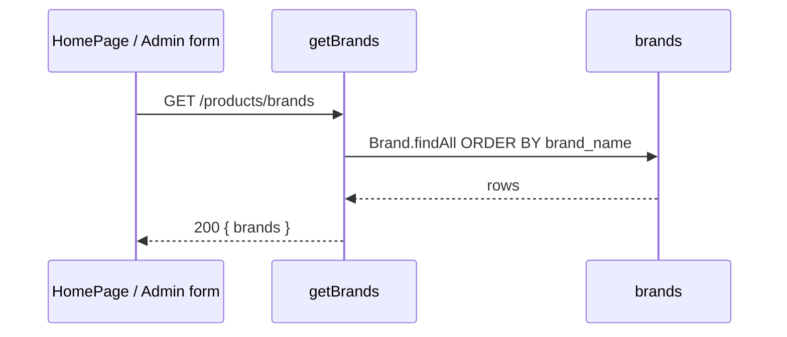

# Functional Requirement (FR) — Danh sách thương hiệu (List Brands)

## 1. Feature Overview

API công khai **`GET /api/products/brands`** trả về **toàn bộ** thương hiệu laptop trong hệ thống, sắp xếp theo tên (`brand_name ASC`). Dùng cho:

- Bộ lọc sidebar trên **HomePage** (`ProductFilter`, mega-menu thương hiệu).
- Form admin tạo/sửa sản phẩm (`AdminProductNewPage`, `AdminProductEditPage` — hook `useBrands`).
- Bất kỳ màn hình cần dropdown/map `brand_id` → tên/logo.

**Không** yêu cầu JWT. Dữ liệu ít thay đổi → FE cache lâu (`staleTime: Infinity` trên các hook customer/admin brands).

---

## 2. Actors

| Actor | Mô tả |
|-------|-------|
| **Guest / Customer** | Xem danh sách, chọn filter |
| **Admin** | Chọn brand khi CRUD sản phẩm (cùng endpoint public) |
| **System** | `productController.getBrands` |

---

## 3. Scope

### In Scope

- `GET /api/products/brands`
- `Brand.findAll({ order: [["brand_name", "ASC"]] })`
- Response `{ brands: Brand[] }` — toàn bộ cột model Sequelize (không `attributes` giới hạn).

### Out of Scope

- CRUD brand → `GET/POST/PUT/DELETE /api/admin/brands` (`adminController`).
- Đếm số sản phẩm theo brand (không có aggregation trong endpoint này).
- Phân trang, tìm kiếm, lọc `is_active` (bảng `brands` không có cờ active trong model).

---

## 4. Preconditions

- Bảng `brands` đã seed / có dữ liệu.
- Route đăng ký **trước** `GET /api/products/:id` trong `productRoutes.js` (tránh `:id` nuốt `"brands"`).

---

## 5. API Contract

### Endpoint

```
GET /api/products/brands
```

**Auth:** Public.

### Response — 200 OK

```json
{
  "brands": [
    {
      "brand_id": 1,
      "brand_name": "Apple",
      "slug": "apple",
      "logo_url": "https://...",
      "description": "...",
      "created_at": "...",
      "updated_at": "..."
    }
  ]
}
```

### Response — 500

Lỗi DB → `next(error)` → middleware lỗi chung.

---

## 6. Data Model (`server/models/Brand.js`)

| Cột | Kiểu | Ghi chú |
|-----|------|---------|
| `brand_id` | INTEGER PK | |
| `brand_name` | STRING(100) NOT NULL UNIQUE | |
| `slug` | STRING(100) NOT NULL UNIQUE | URL, SEO |
| `logo_url` | STRING(255) | Hiển thị filter / card |
| `description` | TEXT | |
| `created_at`, `updated_at` | timestamps | |

**Quan hệ:** `Product.brand_id` → `brands.brand_id` (nhiều sản phẩm một brand).

---

## 7. Business Rules

| # | Rule | Chi tiết |
|---|------|----------|
| BR-01 | **Full list** | Không pagination — phù hợp catalog laptop (số brand hữ hạn) |
| BR-02 | **Sort cố định** | `brand_name ASC` — không nhận query `sort` từ client |
| BR-03 | **Public read** | Không ẩn brand “trống sản phẩm” |
| BR-04 | **Slug unique** | Admin tạo brand phải slug unique (admin flow) |

---

## 8. Frontend Integration

| Hook / nơi dùng | Query key | Xử lý response |
|-----------------|-------------|----------------|
| `customerUseBrandsFull()` | `["brands-full"]` | `data.brands` → mảng raw (HomePage mega-menu) |
| `customerUseBrands()` | `["brands"]` | Map `{ id, name }` qua `mapBrand` |
| `useBrands()` | `["admin-brands"]` | Object `{ brands }` cho admin form |

**HomePage:** `brandsFull` → map `brand_id` → logo, slug; `brandsSimple` cho `ProductFilter` (`{ id, name }`).

**API path:** `api.get("/products/brands")` với `baseURL` = `VITE_API_URL` (mặc định `http://localhost:5000/api`).

---

## 9. Processing Flow



---

## 10. Edge Cases

| Case | Hành vi |
|------|---------|
| Bảng rỗng | `200 { brands: [] }` |
| Brand không có sản phẩm | Vẫn trả về trong list |
| Gọi nhầm `/api/products/brands` sau khi route `/:id` sai thứ tự | Có thể 404 “Product not found” — **phụ thuộc thứ tự route** |

---

## 11. Related Features

| FR / API | Quan hệ |
|----------|---------|
| `FR_ListCategories.md` | Cùng pattern catalog metadata |
| `FR_ViewProductListV2.md` | Filter `brand_id` trên listing |
| `FR_ViewProductDetail.md` | Include `brand` trên chi tiết SP |
| Admin `/api/admin/brands` | Ghi dữ liệu nguồn |

---

## 12. Source Files

| Layer | File |
|-------|------|
| Route | `server/routes/productRoutes.js` L13 |
| Controller | `server/controllers/productController.js` → `getBrands` |
| Model | `server/models/Brand.js` |
| FE hooks | `client/app/hooks/useProducts.js` |
| FE UI | `client/app/pages/HomePage.jsx`, `ProductFilter.jsx`, admin product pages |

---

## 13. Acceptance Criteria

- **AC1:** GET trả 200 và mảng `brands` sắp theo tên A→Z.
- **AC2:** Không cần token.
- **AC3:** HomePage load filter thương hiệu từ endpoint này.
- **AC4:** Mỗi phần tử có `brand_id`, `brand_name`, `slug` usable cho link/filter.
