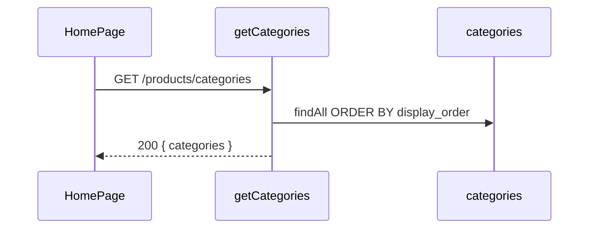

# Functional Requirement (FR) — Danh sách danh mục (List Categories)

## 1. Feature Overview

API công khai **`GET /api/products/categories`** trả về **toàn bộ** danh mục sản phẩm, sắp theo **`display_order ASC`** (thứ tự hiển thị do admin cấu hình). Phục vụ bộ lọc HomePage, menu danh mục, và form admin gán `category_id` cho sản phẩm.

Hỗ trợ **cây danh mục** qua `parent_id` (self-FK `categories`), nhưng endpoint **không** build tree — trả mảng phẳng; FE tự nhóm nếu cần (`HomePage` có logic `categoriesNeedList`).

---

## 2. Actors

| Actor | Mô tả |
|-------|-------|
| **Guest / Customer** | Lọc theo danh mục trên trang chủ |
| **Admin** | Dropdown category khi tạo/sửa SP |
| **System** | `productController.getCategories` |

---

## 3. Scope

### In Scope

- `GET /api/products/categories`
- `Category.findAll({ order: [["display_order", "ASC"]] })`
- Response `{ categories: Category[] }`

### Out of Scope

- CRUD category → `/api/admin/categories`
- Đệ quy children trong response API
- Lọc chỉ category “có sản phẩm”

---

## 4. Preconditions

- Route `/categories` đăng ký **trước** `GET /:id` trong `productRoutes.js`.

---

## 5. API Contract

### Endpoint

```
GET /api/products/categories
```

**Auth:** Public.

### Response — 200 OK

```json
{
  "categories": [
    {
      "category_id": 1,
      "category_name": "Laptop Gaming",
      "slug": "laptop-gaming",
      "description": "...",
      "parent_id": null,
      "icon_url": "https://...",
      "display_order": 1,
      "created_at": "...",
      "updated_at": "..."
    }
  ]
}
```

---

## 6. Data Model (`server/models/Category.js`)

| Cột | Kiểu | Ghi chú |
|-----|------|---------|
| `category_id` | INTEGER PK | |
| `category_name` | STRING(100) UNIQUE | |
| `slug` | STRING(100) UNIQUE | |
| `description` | TEXT | |
| `parent_id` | INTEGER FK → categories | null = gốc |
| `icon_url` | STRING(255) | Menu / tile |
| `display_order` | INTEGER default 0 | Thứ tự API sort |
| timestamps | | |

**Quan hệ:** `Product.category_id` → `categories`.

---

## 7. Business Rules

| # | Rule | Chi tiết |
|---|------|----------|
| BR-01 | **Sort by display_order** | Admin điều khiển thứ tự menu |
| BR-02 | **Flat list** | `parent_id` có trong JSON; FE quyết định hiển thị cây |
| BR-03 | **Full export** | Không pagination |
| BR-04 | **Public** | Không auth |

---

## 8. Frontend Integration

| Hook | Query key | Output |
|------|-----------|--------|
| `customerUseCategoriesFull()` | `["categories-full"]` | Mảng raw category objects |
| `customerUseCategories()` | `["categories"]` | `{ id, name }[]` |
| `useCategories()` | `["admin-categories"]` | `{ categories }` cho form (cùng URL public) |

**HomePage:**

- `categoriesFull` — icon, slug, parent.
- `categoriesSimple` — `ProductFilter`.
- `categoriesNeedList` — subset hiển thị trên UI (logic memo phía FE).

**Lưu ý:** `useAdminCategories` dùng `/api/admin/categories` — khác endpoint nhưng cùng mục đích admin list.

---

## 9. Processing Flow



---

## 10. Edge Cases

| Case | Hành vi |
|------|---------|
| `parent_id` trỏ category đã xóa | FE có thể orphan — không validate ở GET list |
| Category không có SP | Vẫn hiện trong filter |
| Trùng `display_order` | Thứ tự phụ thuộc DB secondary sort (không định nghĩa thêm) |

---

## 11. Related Features

| FR | Quan hệ |
|----|---------|
| `FR_ListBrands.md` | Metadata catalog song song |
| `FR_ViewProductListV2.md` | Filter `category_id` |
| `FR_ViewProductDetail.md` | Include `category` |

---

## 12. Source Files

| Layer | File |
|-------|------|
| Route | `server/routes/productRoutes.js` L12 |
| Controller | `server/controllers/productController.js` → `getCategories` |
| Model | `server/models/Category.js` |
| FE | `client/app/hooks/useProducts.js`, `HomePage.jsx`, `ProductFilter.jsx` |

---

## 13. Acceptance Criteria

- **AC1:** GET 200, `categories` sort theo `display_order` tăng dần.
- **AC2:** Phần tử có `category_id`, `category_name`, `slug`, `parent_id`, `icon_url`.
- **AC3:** HomePage filter danh mục hoạt động với dữ liệu endpoint.
- **AC4:** Không yêu cầu authentication.
