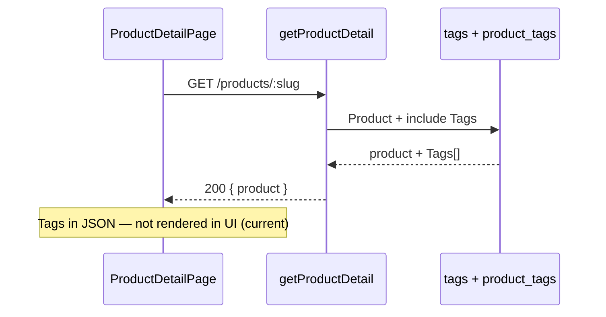

# Functional Requirement (FR) — Tags sản phẩm trên trang chi tiết (Product Tags in Detail)

## 1. Feature Overview

Hệ thống hỗ trợ **gắn nhãn (tag)** cho sản phẩm qua quan hệ **many-to-many** `products` ↔ `product_tags` ↔ `tags`. Khi gọi **`GET /api/products/:id`**, backend **eager-load** association `Tag` và trả về trong JSON product (thường key Sequelize: **`Tags`**).

Mục đích nghiệp vụ: phân loại marketing (“Gaming”, “Ultrabook”, “Mới”), lọc/tìm kiếm mở rộng, SEO — trong đồ án hiện tại tags **được load từ API** nhưng **chưa render** trên `ProductDetailPage.jsx`.

---

## 2. Actors

| Actor | Mô tả |
|-------|-------|
| **Customer** | Xem chi tiết SP (tags dự kiến hiển thị) |
| **Admin** | Gán tag khi CRUD sản phẩm (admin flow, ngoài scope GET) |
| **Backend** | `getProductDetail` include `Tag` |

---

## 3. Scope

### In Scope (backend — đã có)

- Model `Tag`, bảng `tags`, junction `product_tags`.
- Include trong `getProductDetail`:

```javascript
{ model: Tag, through: { attributes: [] } }
```

- JSON response chứa mảng tag (metadata `tag_id`, `tag_name`, `slug`, timestamps).

### In Scope (frontend — hiện trạng)

- **Không có** component hiển thị tag trên `ProductDetailPage`.
- Dữ liệu vẫn nằm trong `productData.product` nếu client inspect network/Redux không cache detail.

### Out of Scope

- API list/filter theo `tag_id` hoặc `tag slug`.
- CRUD tag public.
- Click tag → listing filtered by tag.

---

## 4. Data Model

### `tags` (`server/models/Tag.js`)

| Cột | Kiểu | Ghi chú |
|-----|------|---------|
| `tag_id` | INTEGER PK | |
| `tag_name` | STRING(50) UNIQUE | Hiển thị |
| `slug` | STRING(50) UNIQUE | URL-friendly |
| timestamps | | |

### Association (`server/models/index.js`)

```javascript
Product.belongsToMany(Tag, { through: "product_tags", foreignKey: "product_id" })
Tag.belongsToMany(Product, { through: "product_tags", foreignKey: "tag_id" })
```

Junction **không** trả pivot attributes (`through: { attributes: [] }`).

---

## 5. API — Payload Tags trong Product Detail

**Endpoint:** `GET /api/products/:id` (xem `FR_ViewProductDetail.md`).

**Ví dụ fragment (shape Sequelize):**

```json
{
  "product": {
    "product_id": 1,
    "product_name": "...",
    "Tags": [
      { "tag_id": 3, "tag_name": "Gaming", "slug": "gaming" },
      { "tag_id": 7, "tag_name": "RTX Series", "slug": "rtx-series" }
    ]
  }
}
```

**Lưu ý naming:** Sequelize mặc định pluralize model name → **`Tags`** (chữ T hoa). FE nên normalize:

```javascript
const tags = product.Tags ?? product.tags ?? [];
```

---

## 6. Business Rules

| # | Rule | Chi tiết |
|---|------|----------|
| BR-01 | **Optional association** | SP không có tag → mảng rỗng hoặc thiếu key |
| BR-02 | **Load cùng detail** | Không cần request riêng cho tags |
| BR-03 | **Unique tag_name / slug** | Tránh trùng nhãn toàn hệ thống |
| BR-04 | **Hiển thị FE** | Chưa implement — gap documented |

---

## 7. Intended UX (đề xuất khi triển khai FE)

| Element | Hành vi đề xuất |
|---------|------------------|
| Vị trí | Dưới tên SP hoặc cạnh brand/category |
| UI | Chip/badge `tag_name`, có thể link `/` + query tag (cần API listing) |
| Empty | Không render block nếu `tags.length === 0` |

**Hiện tại:** Không có UI — chỉ dữ liệu API.

---

## 8. Related Backend / Admin

- Admin gán tag khi tạo/sửa sản phẩm (nếu form admin có field tags — kiểm tra `AdminProductNewPage` / `AdminProductEditPage`; có thể chưa có UI tag).
- Không có `GET /api/products/tags` public.

---

## 9. Processing Flow



---

## 10. Edge Cases

| Case | Hành vi |
|------|---------|
| SP không gán tag | `Tags: []` hoặc không có key |
| Tag bị xóa khỏi DB nhưng junction còn | Sequelize/DB FK constraint tùy migration |
| JSON key `tags` vs `Tags` | FE phải defensive |

---

## 11. Related Features

| FR | Quan hệ |
|----|---------|
| `FR_ViewProductDetail.md` | Host API include tags |
| `FR_FilterSortProducts.md` | Chưa filter theo tag |

---

## 12. Source Files

| Layer | File |
|-------|------|
| Controller | `server/controllers/productController.js` → `getProductDetail` (include Tag) |
| Models | `server/models/Tag.js`, `server/models/index.js` |
| FE | `client/app/pages/ProductDetailPage.jsx` — **no tag UI** |
| FE hook | `client/app/hooks/useProducts.js` → `useProduct` |

---

## 13. Acceptance Criteria

- **AC1:** SP có tag trong DB → `GET /products/:id` response chứa mảng tag với `tag_id`, `tag_name`, `slug`.
- **AC2:** SP không có tag → mảng rỗng, detail vẫn 200.
- **AC3:** (Gap) FE hiển thị chip tag — **chưa đạt** trong code hiện tại.
- **AC4:** Junction không lộ pivot fields trong JSON.

---

## 14. Known Gaps

1. **FE không render** `Tags` trên `ProductDetailPage`.
2. **Không có** listing/filter theo tag từ URL.
3. **Không có** API quản lý tag phía customer.
