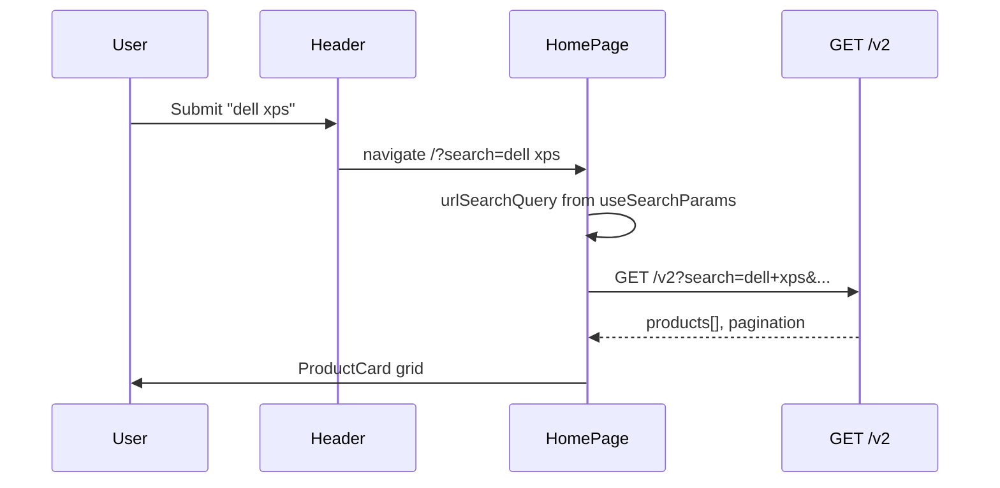

# Functional Requirement (FR) — Tìm kiếm sản phẩm theo từ khóa (Search Products by Keyword)

## 1. Feature Overview

Khách tìm laptop bằng **từ khóa trong tên sản phẩm** (`product_name`), không full-text description. Có **hai lớp** trong đồ án:

| Lớp | API / UI | Mục đích |
|-----|----------|----------|
| **Typeahead** | `GET /api/products/search-suggestions?q=` | Gợi ý nhanh ≤5 SP (`Header`) |
| **Full listing** | `GET /api/products/v2?search=` | Lưới sản phẩm HomePage |

Tham số tìm kiếm full listing được đồng bộ qua **URL** `/?search=keyword` (`useSearchParams`) để share link và điều hướng từ Header.

---

## 2. Actors

| Actor | Mô tả |
|-------|-------|
| **Guest / Customer** | Gõ từ khóa, xem kết quả |
| **Header** | Submit search → navigate URL |
| **HomePage** | Đọc `search` từ URL → gọi v2 |
| **Backend** | `getSearchSuggestions`, `getProductsV2` |

---

## 3. Scope

### In Scope

- ILIKE `%keyword%` trên `product_name` (PostgreSQL `Op.iLike`).
- Min length **2 ký tự** cho suggestions (BE + FE).
- URL-driven search trên HomePage.
- Kết hợp search **cùng** brand/category/spec filters (AND trên query v2).

### Out of Scope

- Tìm trong `description`, brand name, tags.
- Full-text search / Elasticsearch.
- Search history persistence (Header dùng **MOCK** history).

---

## 4. Full Listing Search (v2)

### API

```
GET /api/products/v2?search={trimmed}&page=1&limit=30&...
```

**Controller:**

```javascript
const search = (req.query.search || "").trim();
if (search) where.product_name = { [Op.iLike]: `%${search}%` };
```

**Không** filter `is_active` — khác suggestions.

### Frontend — HomePage

```javascript
const [searchParams] = useSearchParams();
const urlSearchQuery = searchParams.get("search") || "";

const filters = useMemo(() => ({
  ...localFilters,
  search: urlSearchQuery,
}), [localFilters, urlSearchQuery]);

const v2Filters = useMemo(() => ({ ...filters, sortBy, ...specFilters }), [...]);
useProductsV2(v2Filters);
```

**UI:**

- Tiêu đề “Tất cả sản phẩm **(keyword)**” khi có `urlSearchQuery`.
- Empty: “Không tìm thấy sản phẩm nào phù hợp”.

### Hook — `useProductsV2`

```javascript
if (filters.search) params.append("search", filters.search);
```

---

## 5. Header Search Flow

### Submit form

```javascript
const handleSearch = (e) => {
  e.preventDefault();
  if (searchQuery.trim()) {
    navigate(`/?search=${searchQuery}`);
    setIsSearchFocused(false);
  }
};
```

**Lưu ý:** `searchQuery` không encodeURIComponent — khoảng trắng có thể thành `+` hoặc `%20` tùy browser.

### Live suggestions (`searchQuery.length >= 2`)

```javascript
useSearchSuggestions(searchQuery);
// GET /products/search-suggestions?q=...
```

Click suggestion → `navigate(/products/${slug})` — **đi thẳng detail**, không cập nhật `/?search=`.

### “Xem tất cả kết quả”

```javascript
<Link to={`/?search=${searchQuery}`} />
```

---

## 6. Search Suggestions (companion)

Xem `FR_SearchSuggestions.md` chi tiết.

| | Suggestions | Full v2 |
|--|-------------|---------|
| Endpoint | `/search-suggestions` | `/v2` |
| Min chars | 2 | 0 (empty = no name filter) |
| `is_active` | true | không |
| Limit | 5 | pagination |

---

## 7. Legacy API

`GET /api/products?search=` — cùng logic ILIKE, dùng **AdminProducts** / `useProducts`, **không** dùng cho HomePage customer.

---

## 8. Business Rules

| # | Rule | Chi tiết |
|---|------|----------|
| BR-01 | **Case-insensitive** | `Op.iLike` |
| BR-02 | **Substring match** | `%q%` anywhere in name |
| BR-03 | **URL là source of truth** cho listing | `ProductFilter` **không** ghi đè URL search khi đổi brand/price |
| BR-04 | **Combine filters** | search AND category AND brand AND specs |
| BR-05 | **Clear filters** | `handleClearFilters` **không** xóa `?search=` URL (comment trong code) |

---

## 9. Sequence Diagram



---

## 10. Edge Cases

| Case | Hành vi |
|------|---------|
| `search` rỗng | Không thêm điều kiện tên — trả full catalog (filtered) |
| Ký tự đặc biệt `%` `_` | Wildcard ILIKE semantics |
| Chỉ khoảng trắng | trim → rỗng |
| Search + spec filter không có SKU | Inner join variation → có thể 0 kết quả |
| Unicode / tiếng Việt | PostgreSQL collation dependent |

---

## 11. Related Features

| FR | Quan hệ |
|----|---------|
| `FR_SearchSuggestions.md` | Typeahead layer |
| `FR_FilterSortProducts.md` | Kết hợp filter/sort |
| `FR_ViewProductListV2.md` | Host API listing |

---

## 12. Source Files

| Layer | File |
|-------|------|
| BE v2 | `server/controllers/productController.js` → `getProductsV2` |
| BE suggestions | `getSearchSuggestions` |
| FE | `client/app/components/Header.jsx` |
| FE | `client/app/pages/HomePage.jsx` |
| FE hook | `client/app/hooks/useProducts.js` |

---

## 13. Acceptance Criteria

- **AC1:** Header submit → URL có `search` → HomePage hiển thị SP tên khớp.
- **AC2:** Keyword không khớp → empty state.
- **AC3:** Search kết hợp brand filter → chỉ SP thỏa cả hai.
- **AC4:** Gõ &lt;2 ký tự → suggestions không gọi API; có thể submit full search 1 ký tự qua URL (v2 vẫn filter).
- **AC5:** Link share `/?search=macbook` mở đúng kết quả.

---

## 14. Known Gaps

1. **MOCK** lịch sử / xu hướng trên Header — không lưu search thật.
2. Không encode search query consistently.
3. Không tìm description/tags.
4. Listing không lọc `is_active` trong khi suggestions có.
