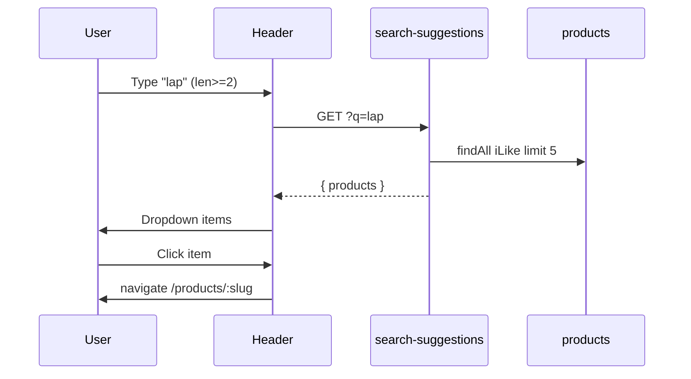

# Functional Requirement (FR) — Gợi ý tìm kiếm (Search Suggestions)

## 1. Feature Overview

API **`GET /api/products/search-suggestions?q=<keyword>`** trả về tối đa **5 sản phẩm** khớp tên (case-insensitive), chỉ **`is_active: true`**, kèm thumbnail và giá variation đầu tiên — phục vụ **dropdown live search** trên `Header.jsx`.

Đây là bước “typeahead” trước khi user submit tìm kiếm đầy đủ trên HomePage (`/?search=...` → `GET /api/products/v2`).

---

## 2. Actors

| Actor | Mô tả |
|-------|-------|
| **User** | Gõ ≥ 2 ký tự trong ô search header |
| **Frontend** | `useSearchSuggestions(searchQuery)` |
| **Backend** | `getSearchSuggestions` |

---

## 3. Scope

### In Scope

- Query param `q` (trim).
- Ngưỡng độ dài: **&lt; 2 ký tự** → `200 { products: [] }` (không query DB).
- `Op.iLike` trên `product_name`.
- `limit: 5` sản phẩm.
- Include 1 variation (price), primary image.

### Out of Scope

- Lịch sử / xu hướng tìm kiếm — **MOCK** trên Header (`MOCK_HISTORY`, `MOCK_TRENDING`).
- Gợi ý theo brand/category.
- Highlight từ khóa trong tên.
- Elasticsearch / full-text description.

---

## 4. API Contract

### Endpoint

```
GET /api/products/search-suggestions?q=mac
```

**Auth:** Public.

### Response — 200 (q &lt; 2)

```json
{ "products": [] }
```

### Response — 200 (có kết quả)

```json
{
  "products": [
    {
      "product_id": 1,
      "product_name": "Macbook Pro M3",
      "slug": "macbook-pro-m3",
      "thumbnail_url": "https://...",
      "base_price": null,
      "discount_percentage": "5.00",
      "variations": [{ "price": "45000000" }],
      "images": [{ "image_url": "https://..." }]
    }
  ]
}
```

**Lưu ý:** `base_price` có trong `attributes` select nhưng cột có thể không tồn tại trên model/DB thực tế — FE fallback `variations[0].price`.

---

## 5. Query Logic

```javascript
const search = (req.query.q || "").trim();
if (search.length < 2) return res.json({ products: [] });

Product.findAll({
  where: {
    is_active: true,
    product_name: { [Op.iLike]: `%${search}%` },
  },
  attributes: ["product_id", "product_name", "slug", "thumbnail_url", "base_price", "discount_percentage"],
  include: [
    { model: ProductVariation, as: "variations", attributes: ["price"], limit: 1 },
    { model: ProductImage, as: "images", where: { is_primary: true }, required: false, attributes: ["image_url"] },
  ],
  limit: 5,
});
```

| Khía cạnh | Chi tiết |
|-----------|----------|
| **Active only** | Khác listing v2 (không filter `is_active` trên v2) |
| **Substrings** | `%keyword%` — không word boundary |
| **Không sort** | Thứ tự mặc định DB |
| **1 variation** | `limit: 1` trên include — không đảm bảo `is_primary` |

---

## 6. Frontend — `Header.jsx`

| State / logic | Hành vi |
|---------------|---------|
| `searchQuery` | Controlled input |
| `useSearchSuggestions(searchQuery)` | `enabled: query.length >= 2` |
| `isSearchEmpty` | `searchQuery.trim().length < 2` |
| Dropdown | Focus → hiện; empty → MOCK history/trending |
| Live | ≥2 ký tự → gọi API, list click → `navigate(/products/${slug})` |
| Giá hiển thị | `variations[0].price` hoặc `base_price` × discount |
| Submit form | `navigate(/?search=${searchQuery})` — full listing v2 |
| Link “Xem tất cả” | `/?search=...` |

**Hook (`useSearchSuggestions`):**

- `staleTime: 5 * 60 * 1000`
- `queryKey: ["search-suggestions", query]`

---

## 7. Comparison với listing search

| | Search suggestions | `GET /products/v2` search |
|--|-------------------|-------------------------|
| Min length | 2 (BE + FE) | Không (empty = no filter) |
| `is_active` | **true** | Không filter |
| Limit | 5 | pagination `limit` |
| Fields | Minimal | Full product + includes |

---

## 8. Sequence Diagram



---

## 9. Edge Cases

| Case | Hành vi |
|------|---------|
| `q` chỉ khoảng trắng | trim → length 0 → `[]` |
| SQL wildcard `%` `_` trong input | iLike literal — user có thể widen match |
| Không có kết quả | `products: []` — Header hiển thị empty state |
| Gõ nhanh | React Query cache theo từng `query` key |

---

## 10. Security & Performance

- Public endpoint — có thể bị abuse (no rate limit).
- `iLike` + leading `%` — không dùng index tốt trên large catalog.
- Limit 5 giảm tải.

---

## 11. Related Features

| FR | Quan hệ |
|----|---------|
| `FR_ViewProductListV2.md` | Full search results |
| `FR_ViewProductDetail.md` | Destination click suggestion |

---

## 12. Source Files

| Layer | File |
|-------|------|
| Route | `server/routes/productRoutes.js` L10 |
| Controller | `server/controllers/productController.js` → `getSearchSuggestions` |
| FE hook | `client/app/hooks/useProducts.js` |
| FE UI | `client/app/components/Header.jsx` |

---

## 13. Acceptance Criteria

- **AC1:** `q` 1 ký tự → `products: []` không lỗi.
- **AC2:** `q` ≥2 khớp tên → ≤5 items, chỉ `is_active`.
- **AC3:** Click suggestion → detail bằng `slug`.
- **AC4:** Submit search → HomePage v2 với `search` query param.
- **AC5:** FE không gọi API khi `query.length < 2` (hook disabled).
