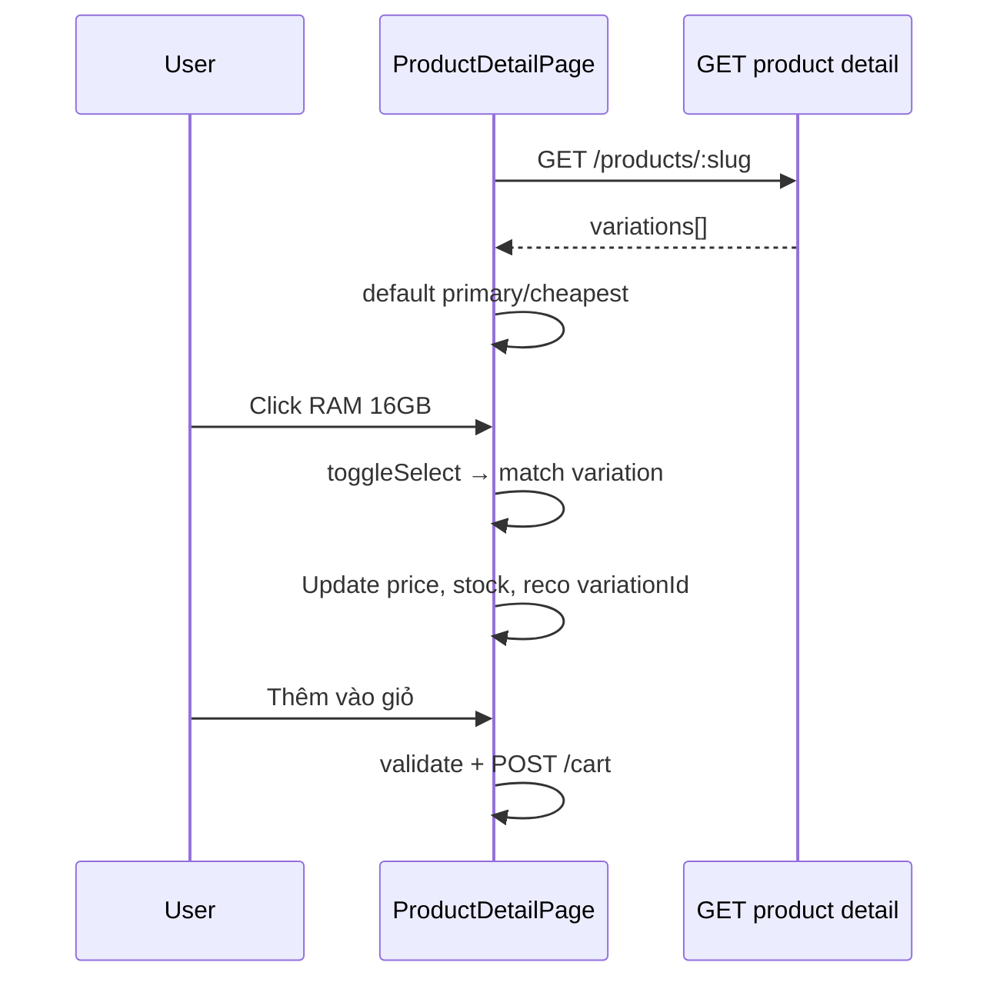

# Functional Requirement (FR) — Chọn biến thể / cấu hình sản phẩm (Select Product Variation)

## 1. Feature Overview

Sản phẩm laptop trong đồ án có **nhiều SKU** (`product_variations`): khác CPU, RAM, SSD, GPU, màn hình, màu — mỗi SKU có **giá** và **tồn kho** riêng. Trên `ProductDetailPage`, khách chọn cấu hình qua **chip buttons** theo từng thuộc tính; hệ thống **match** một variation thỏa tất cả lựa chọn, cập nhật giá, stock, add-to-cart, compare, và **KNN recommendations**.

Thuộc tính configurable (`ATTRS`):

`processor`, `ram`, `storage`, `graphics_card`, `screen_size`, `color`

---

## 2. Actors

| Actor | Mô tả |
|-------|-------|
| **Customer** | Chọn cấu hình, mua hàng |
| **Frontend** | State `sel`, `selectedVariation`, validation |
| **Backend** | `variations[]` trong `GET /api/products/:id` |

---

## 3. Scope

### In Scope

- Load variations từ product detail API.
- Default selection on mount (`useEffect`).
- `toggleSelect` / `isDisabled` (compatibility matrix).
- `isReady`, `matched`, `getValidationReason`.
- Giá `finalPrice` từ `selectedVariation.price` × discount.
- Stock check add-to-cart / buy-now.
- Reset “Thiết lập lại”.
- Block khi `product.is_active === false`.

### Out of Scope

- URL query `?v=variation_id` — **RecoCard link có `?v=` nhưng PDP không đọc** (gap).
- Admin tạo variation (admin pages).

---

## 4. State Model

| State | Mô tả |
|-------|-------|
| `sel` | `{ processor, ram, storage, graphics_card, screen_size, color }` — string mỗi key |
| `selectedVariation` | Object variation matched hoặc null |
| `quantity` | Số lượng mua (default 1) |

### Matching

```javascript
const matchVariation = (v, s) =>
  ATTRS.every((k) => !s[k] || String(v[k]) === String(s[k]));

const matched = product.variations.find((v) => matchVariation(v, sel));
const requiredKeys = ATTRS.filter((k) => uniqueOptions[k]?.length > 0);
const allSelected = requiredKeys.every((k) => !!sel[k]);
const isReady = Boolean(matched) && allSelected;
```

---

## 5. Default Selection (`useEffect`)

Khi `product.variations` load:

1. Ưu tiên `is_primary === true`.
2. Else: variation **giá thấp nhất**.
3. `setSelectedVariation(defaultVariation)`.
4. `setSel` từ attributes của variation đó.

---

## 6. UI — Configuration Picker

Block **“Lựa chọn cấu hình tuỳ chỉnh”**:

- Mỗi attribute có label tiếng Việt (Bộ vi xử lý, RAM, …).
- Chips: active = border đỏ; disabled = opacity + “Kết hợp này không có sẵn”.
- `isDisabled(k, val)`: không tồn tại variation nào thỏa partial selection + thử gán `val` cho `k`.

**Reset:**

```javascript
setSel(ATTRS.reduce((o, k) => ({ ...o, [k]: "" }), {}));
setSelectedVariation(null);
```

---

## 7. Validation & Actions

### `getValidationReason()`

| Reason | Điều kiện |
|--------|-----------|
| `inactive` | `product.is_active === false` |
| `choose-attrs` | `!isReady` |
| `out-of-stock` | `stockQty === 0` khi ready |
| `soldout` | `is_available === false` |
| `exceed-stock` | `qty > stockQty` |

`actionDisabled = !!validationReason` — disable “Thêm giỏ” / “Mua ngay”.

### Add to cart

- Bắt buộc `isReady && matched`.
- `addToCart.mutate({ variation_id, quantity })`.
- Guest → `pendingCheckout` + redirect login.

### Compare

- `addCompare` requires `selectedVariation` (disabled nếu null).

### Recommendations

- `useRecommendedByVariation(selectedVariation?.variation_id || first variation)`.

---

## 8. Price Display

```javascript
const currentVariation = selectedVariation || product.variations?.[0];
const price = Number(currentVariation?.price) || 0;
const finalPrice = price * (1 - discount / 100);
```

Hiển thị `formatPrice(finalPrice)` khi block variations có data.

---

## 9. API — Variation Fields

Từ `getProductDetail` include:

```javascript
attributes: [
  "variation_id", "price", "stock_quantity", "is_available", "is_primary",
  "processor", "ram", "storage", "graphics_card", "screen_size", "color",
]
```

**`primaryVariationId`** trong JSON — BE fallback sort nếu thiếu; FE tự chọn default riêng.

---

## 10. Sequence Diagram



---

## 11. Edge Cases

| Case | Hành vi |
|------|---------|
| Chỉ 1 variation | Chips vẫn render nếu có options |
| Deselect chip (toggle) | `sel[k]=""` → có thể mất match |
| Partial selection | `isReady` false — banner “Chọn cấu hình…” |
| SP inactive | `disabledByProduct` — chips disabled |
| Hết hàng | Banner đỏ “Hết hàng” |

---

## 12. Related Features

| FR | Quan hệ |
|----|---------|
| `FR_ViewProductDetail.md` | API host |
| `FR_CompareProducts.md` | Cần variation |
| `FR_ViewKNNRecommendationsOnProduct.md` | variationId input |
| `FR_ViewProductListV2.md` | Filter spec ở listing |

---

## 13. Source Files

| Layer | File |
|-------|------|
| FE | `client/app/pages/ProductDetailPage.jsx` |
| BE | `server/controllers/productController.js` → `getProductDetail` |
| Model | `server/models/ProductVariation.js` |
| Cart | `client/app/hooks/useCart.js` |

---

## 14. Acceptance Criteria

- **AC1:** Load PDP → auto-chọn variation primary hoặc rẻ nhất.
- **AC2:** Chọn đủ attributes hợp lệ → `isReady` true, hiển thị giá đúng SKU.
- **AC3:** Combination không tồn tại → chip disabled.
- **AC4:** Add to cart gửi đúng `variation_id`.
- **AC5:** Đổi variation → recommendations refetch.
- **AC6:** Reset xóa selection và disable compare.

---

## 15. Known Gaps

1. **`?v=` query** không pre-select variation khi vào từ link gợi ý.
2. Không sync `sel` với URL state (không shareable config link).
