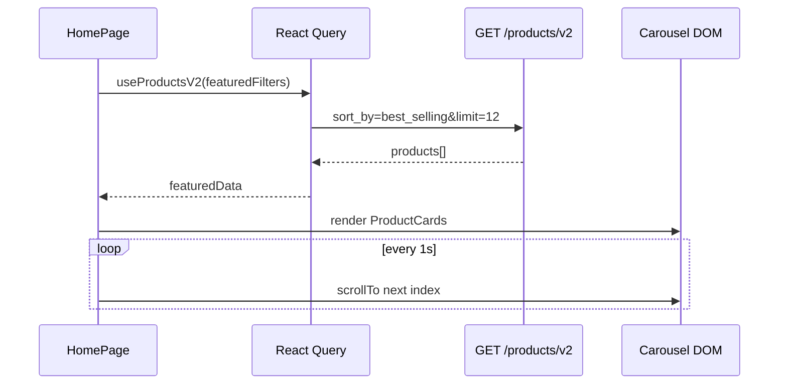

# Functional Requirement (FR) — Carousel sản phẩm nổi bật (Featured Products)

## 1. Feature Overview

Khối **“SẢN PHẨM NỔI BẬT”** trên **HomePage** hiển thị carousel ngang các `ProductCard`, dữ liệu từ **`GET /api/products/v2`** với bộ lọc cố định:

- `page: 1`, `limit: 12`
- `sort_by: best_selling` (bán chạy theo subquery `order_items`)

Carousel **tự chạy** mỗi 1 giây, có nút prev/next, pause khi hover; dùng scroll ngang DOM + `scrollTo` thay vì thư viện carousel bên thứ ba.

---

## 2. Actors

| Actor | Mô tả |
|-------|-------|
| **Guest / Customer** | Xem SP nổi bật trên trang chủ |
| **Frontend** | `HomePage.jsx` — refs, interval, `ProductCard` |
| **Backend** | `getProductsV2` + `sort_by=best_selling` |

---

## 3. Scope

### In Scope

- Section UI gradient + pattern (hero sub-block).
- Fetch `useProductsV2(featuredFilters)` tách khỏi grid chính.
- Horizontal scroll, auto-advance, manual navigation.
- Loading skeleton 6 ô.
- Empty state copy.

### Out of Scope

- Admin cấu hình “featured” thủ công (pin product) — logic purely **best_selling**.
- Carousel trên trang khác HomePage.

---

## 4. Data Source

```javascript
const featuredFilters = useMemo(
  () => ({
    page: 1,
    limit: 12,
    sortBy: "best_selling",
    _version: "inactive_enabled", // chỉ bust React Query cache — không gửi BE
  }),
  []
);

const { data: featuredData, isLoading: isFeaturedLoading } =
  useProductsV2(featuredFilters);
const featuredProducts = featuredData?.products ?? [];
```

**API thực tế:** `GET /api/products/v2?page=1&limit=12&sort_by=best_selling`

**Best selling logic (BE):** tổng `quantity` từ `order_items` join orders status ∈ `confirmed`, `processing`, `shipping`, `delivered`, `PAID`.

---

## 5. Carousel Mechanics

| State / ref | Vai trò |
|-------------|---------|
| `featuredRef` | Container `overflow-x-auto` |
| `featuredItemRef` | Đo `offsetWidth` item đầu (240–260px) |
| `featuredIndexRef` | Index hiện tại (mod length) |
| `featuredTimerRef` | `setInterval` 1000ms |

**Scroll:**

```javascript
el.scrollTo({ left: index * (itemW + gap), behavior: "smooth" });
// gap = 16px
```

**Auto-play:**

- `useEffect` khi `featuredProducts.length` đổi → reset index 0, start timer.
- `onMouseEnter` → `stopFeaturedTimer`
- `onMouseLeave` → `startFeaturedTimer`

**Navigation:**

- `featuredNext` / `featuredPrev` — circular `(index ± 1) % count`.

---

## 6. UI Structure

```
HomePage
└─ section "🔥 SẢN PHẨM NỔI BẬT"
   ├─ gradient overlays (left/right fade)
   ├─ buttons ChevronLeft / ChevronRight
   └─ flex row
      └─ ProductCard × N (min-w 240–260px)
```

Mỗi card link tới `/products/:slug` (logic trong `ProductCard`).

---

## 7. Business Rules

| # | Rule | Chi tiết |
|---|------|----------|
| BR-01 | **Featured = best sellers** | Không có flag `is_featured` trong DB |
| BR-02 | **Max 12 items** | `limit: 12` |
| BR-03 | **Auto interval 1s** | Có thể gây motion nhạy — by design hiện tại |
| BR-04 | **Inactive products** | v2 không filter `is_active` — có thể lẫn SP ngừng KD |
| BR-05 | **Tách query** | Featured và main grid dùng 2 query React Query khác nhau |

---

## 8. Loading & Empty

| State | UI |
|-------|-----|
| `isFeaturedLoading` | 6 skeleton boxes `animate-pulse` |
| `featuredProducts.length === 0` | “Chưa có sản phẩm nổi bật.” |
| Có data | Map `ProductCard` |

---

## 9. Sequence Diagram



---

## 10. Edge Cases

| Case | Hành vi |
|------|---------|
| 1 sản phẩm | Next/prev modulo 1 — không scroll |
| `itemW === 0` (chưa layout) | `scrollFeaturedToIndex` no-op |
| Resize window | Có thể lệch scroll until remount |
| Không có đơn hàng | `sold_qty` = 0 — sort tie-break `created_at DESC` |

---

## 11. Related Features

| FR | Quan hệ |
|----|---------|
| `FR_ViewProductListV2.md` | Cùng API, filter/sort khác |
| `FR_FilterSortProducts.md` | `best_selling` cũng là sort option grid |

---

## 12. Source Files

| Layer | File |
|-------|------|
| FE | `client/app/pages/HomePage.jsx` (~L178–192, L450–502, L536–615) |
| FE component | `client/app/components/ProductCard.jsx` |
| FE hook | `client/app/hooks/useProducts.js` → `useProductsV2` |
| BE | `server/controllers/productController.js` → `getProductsV2` |

---

## 13. Acceptance Criteria

- **AC1:** HomePage hiển thị section nổi bật với tối đa 12 SP.
- **AC2:** Dữ liệu từ v2 `sort_by=best_selling`.
- **AC3:** Carousel tự chuyển ~1s; hover dừng.
- **AC4:** Nút prev/next scroll mượt.
- **AC5:** Click card → trang chi tiết SP.
