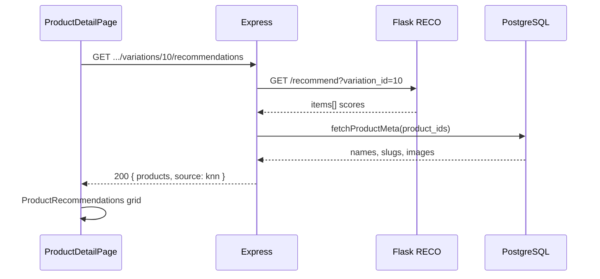

# Functional Requirement (FR) — Gợi ý KNN trên trang chi tiết sản phẩm

## 1. Feature Overview

Khi khách xem **chi tiết laptop** và đã chọn (hoặc mặc định) một **biến thể (SKU)**, hệ thống hiển thị block **“Gợi ý cho cấu hình đang chọn”** — danh sách sản phẩm tương tự tính bằng **KNN / recommendation service** (Python Flask), Node.js đóng vai **adapter/proxy**.

**Luồng:**

1. FE: `variationId` = `selectedVariation.variation_id` (hoặc variation đầu tiên).
2. `GET /api/products/variations/:variation_id/recommendations`
3. BE gọi `GET {RECO_API_BASE}/recommend?variation_id=...`
4. BE enrich metadata từ PostgreSQL (`fetchProductMeta`) → JSON cho `ProductRecommendations`.

---

## 2. Actors

| Actor | Mô tả |
|-------|-------|
| **Customer** | Xem gợi ý, click card, thêm giỏ |
| **Node API** | `getRecommendedByVariation` |
| **Recommendation service** | `recommendation_service` Flask `app.py` |
| **Frontend** | `ProductRecommendations.jsx`, `ProductDetailPage` |

---

## 3. Scope

### In Scope

- Proxy + normalize nhiều shape response Flask (`items`, `debug`, raw array).
- Dedupe theo `product_id` giữ score cao nhất.
- Map sang card: `id`, `variation_id`, `name`, `image`, `slug`, `price`, `score`, `rating_average`.
- FE grid 2×5 (mobile/desktop), limit 5 items, skeleton loading.
- Deep link `/products/{slug}?v={variation_id}` trên RecoCard (**query `v` chưa đọc** ở detail page — gap).

### Out of Scope

- Training model (offline `train_recommend.py`).
- Gợi ý trên HomePage listing.
- Admin cấu hình số lượng gợi ý.

---

## 4. Environment Variables

| Biến | Default | Mô tả |
|------|---------|-------|
| `RECO_API_BASE` | `http://127.0.0.1:8000` | Flask base URL |
| `RECO_TIMEOUT_MS` | `7000` | Axios timeout |

Service phải chạy song song server Node (port 8000 mặc định).

---

## 5. API Contract (Node)

### Endpoint

```
GET /api/products/variations/:variation_id/recommendations
```

**Auth:** Public.

**Validation:** `variation_id` không phải số hợp lệ → `400 { products: [], error: "invalid variation_id" }`.

### Success — 200

```json
{
  "products": [
    {
      "id": 12,
      "variation_id": 45,
      "name": "Laptop XYZ",
      "image": "https://...",
      "slug": "laptop-xyz",
      "price": 22000000,
      "score": 0.87,
      "rating_average": 4.5,
      "explain": {
        "source": "indexed",
        "score_source": "fresh:benchmark"
      }
    }
  ],
  "basedOn": { "variationId": 10 },
  "generated_at": "2025-05-27T10:00:00.000Z",
  "source": "knn"
}
```

### Upstream failure — 502

```json
{
  "products": [],
  "basedOn": { "variationId": 10 },
  "source": "knn",
  "error": "upstream_404",
  "upstream": { ... }
}
```

Hoặc `adapter_exception` khi axios throw.

---

## 6. Flask Service

**File:** `recommendation_service/app.py`

```
GET /recommend?variation_id={int}
GET /recommend/{variation_id}
```

Gọi `recommend_core(variation_id)` — logic KNN trong `core/recommend.py`, features CPU/GPU/RAM từ variations.

---

## 7. Node Adapter Logic (tóm tắt)

1. `axios.get(`${BASE}/recommend`, { params: { variation_id } })`
2. Parse `payload.items` || `payload.debug` || `payload` array.
3. `bestByProduct` Map theo `product_id`, score từ `score` / `performance_score` / `rank_score`.
4. `fetchProductMeta(productIds)` — name, slug, thumbnail, images fallback.
5. Sort products by `score` DESC.
6. Return JSON.

---

## 8. Frontend

### `ProductDetailPage.jsx`

```javascript
const currentVariationId =
  selectedVariation?.variation_id || product?.variations?.[0]?.variation_id;
const { data: recommendations } = useRecommendedByVariation(currentVariationId);

// ...
<ProductRecommendations variationId={currentVariationId} />
```

Khi user đổi cấu hình (`toggleSelect`) → `selectedVariation` đổi → **refetch** recommendations (`queryKey: ["reco-by-variation", variationId]`).

### `ProductRecommendations.jsx`

- `useRecommendedByVariation(variationId)`
- `items = (data?.products ?? []).slice(0, limit)` — default `limit=5`
- Loading: 5 skeletons
- Empty: “Chưa có gợi ý phù hợp.”
- `RecoCard`: Link + `addItem` Redux cart (cần `id` + `variation_id`)

### Hook

```javascript
// staleTime: 60_000, keepPreviousData: true
api.get(`/products/variations/${variationId}/recommendations`)
```

---

## 9. Route Ordering Warning

`productRoutes.js` đặt `GET /:id` **trước** `GET /variations/:variation_id/recommendations`. Request recommendations có thể bị match `id="variations"` → **404 product**. Cần đăng ký route recommendations **trước** `/:id` khi deploy production.

---

## 10. Business Rules

| # | Rule | Chi tiết |
|---|------|----------|
| BR-01 | **Theo variation, không product** | KNN dùng cấu hình SKU |
| BR-02 | **Graceful degrade** | Lỗi service → block rỗng, trang detail vẫn dùng được |
| BR-03 | **Max 5 visible** | FE slice; BE có thể trả nhiều hơn |
| BR-04 | **Score explain** | Field `explain` optional cho debug |

---

## 11. Sequence Diagram



---

## 12. Related Features

| FR | Quan hệ |
|----|---------|
| `FR_SelectProductVariation.md` | `variationId` đầu vào |
| `FR_ViewProductDetail.md` | Host page |
| `docs/master_specification.md` | Mô tả recommendation pipeline |

---

## 13. Source Files

| Layer | File |
|-------|------|
| Route | `server/routes/productRoutes.js` |
| Controller | `server/controllers/productController.js` → `getRecommendedByVariation`, `fetchProductMeta` |
| Python | `recommendation_service/app.py`, `core/recommend.py` |
| FE | `client/app/components/ProductRecommendations.jsx` |
| FE | `client/app/pages/ProductDetailPage.jsx` |
| FE hook | `client/app/hooks/useProducts.js` → `useRecommendedByVariation` |

---

## 14. Acceptance Criteria

- **AC1:** Trang detail với variation hợp lệ → hiển thị ≤5 gợi ý hoặc empty message.
- **AC2:** Đổi cấu hình → gợi ý refetch theo `variation_id` mới.
- **AC3:** Flask down → FE không crash; message trống / 502 handled.
- **AC4:** Card link tới product slug; add-to-cart gửi đúng `variation_id`.

---

## 15. Known Gaps

1. Route Express order có thể chặn endpoint recommendations.
2. **`?v=`** trên URL không được `ProductDetailPage` đọc để pre-select variation.
3. Reco không gửi `discount_percentage` — card discount thường 0.
