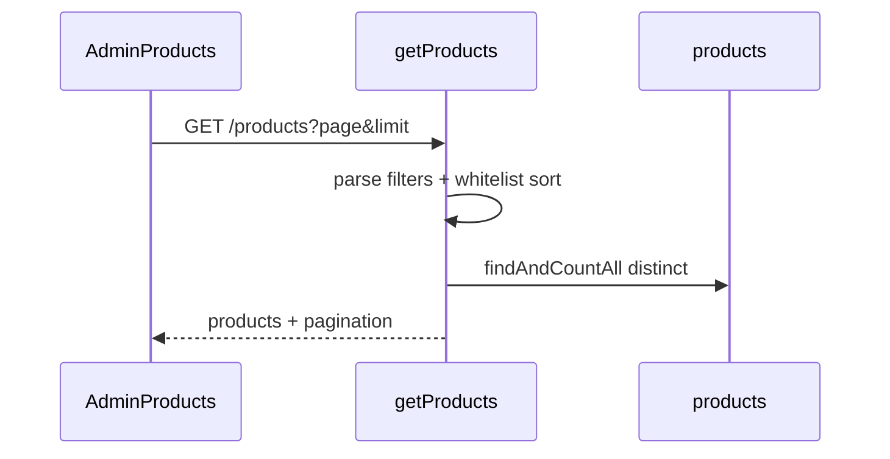

# Functional Requirement (FR) — Danh sách sản phẩm Legacy (`GET /api/products`)

## 1. Feature Overview

Endpoint **`GET /api/products`** là API danh sách sản phẩm **phiên bản cũ (legacy)** — lọc cơ bản theo category, brand, khoảng giá, từ khóa tên; phân trang; sắp xếp qua **`sort` + `order`** whitelist (chống SQL injection).

**Trạng thái trong đồ án hiện tại:**

| Consumer | Dùng legacy? |
|----------|----------------|
| **HomePage** (customer) | **Không** — dùng `useProductsV2` |
| **AdminProducts** | **Có** — `useProducts({ page, limit: 20 })` |
| Hook `useProducts` | Gọi `GET /products?...` |

Legacy **thiếu** lọc spec (CPU/RAM/…), **thiếu** `sort_by` preset (`best_selling`, …), **không** filter `variation` required. Vẫn được giữ cho admin và tương thích API cũ (`READMEAPI.md`).

---

## 2. Actors

| Actor | Mô tả |
|-------|-------|
| **Admin** | Quản lý danh sách SP trong admin panel |
| **Developer / Client cũ** | Có thể gọi trực tiếp REST |
| **System** | `productController.getProducts` |

---

## 3. Scope

### In Scope

- Pagination: `page` (default 1), `limit` (default 12).
- Filters: `category_id`, `brand_id` (CSV hoặc array query), `min_price`, `max_price`, `search`.
- Sort whitelist: `created_at`, `base_price`, `rating_average`, `view_count`, `product_name`.
- Order: `ASC` | `DESC` (default `DESC`).
- Includes: category, brand, variations (subset attrs), primary image.
- Response: `products`, `pagination`, duplicate `total`, `totalPages`.

### Out of Scope

- Facet filters (processor, ram, …) → v2.
- `sort_by=best_selling` → v2 subquery sold qty.
- Weight filter → v2.

---

## 4. API Contract

### Endpoint

```
GET /api/products
```

**Auth:** Public.

### Query Parameters

| Param | Type | Mô tả |
|-------|------|-------|
| `page` | int | ≥1, default 1 |
| `limit` | int | ≥1, default 12 |
| `sort` | string | Whitelist, default `created_at` |
| `order` | string | `ASC` \| `DESC`, default `DESC` |
| `category_id` | CSV hoặc `category_id[]` | Một hoặc nhiều id |
| `brand_id` | CSV hoặc `brand_id[]` | Một hoặc nhiều id |
| `min_price` | number | `base_price >=` |
| `max_price` | number | `base_price <=` |
| `search` | string | `product_name ILIKE %search%` |

**Ví dụ:**

```
GET /api/products?page=1&limit=20&sort=view_count&order=DESC&brand_id=1,2&search=dell
```

### Response — 200 OK

```json
{
  "products": [ /* Sequelize Product + nested */ ],
  "pagination": {
    "total": 100,
    "page": 1,
    "limit": 12,
    "totalPages": 9
  },
  "total": 100,
  "totalPages": 9
}
```

Mỗi product include:

- `category`: `category_id`, `category_name`, `slug`
- `brand`: `brand_id`, `brand_name`, `slug`, `logo_url`
- `variations`: `variation_id`, `price`, `stock_quantity`, `is_primary`, spec fields
- `images`: primary `image_url` (optional)

---

## 5. Filter Logic

```javascript
// category / brand
if (categoryIds.length === 1) where.category_id = categoryIds[0];
else if (categoryIds.length > 1) where.category_id = { [Op.in]: categoryIds };

// search
if (search) where.product_name = { [Op.iLike]: `%${search}%` };

// price on base_price column
if (minPrice != null || maxPrice != null) {
  where.base_price = { [Op.gte]: minPrice, [Op.lte]: maxPrice };
}
```

**Lưu ý schema:** Controller filter/sort **`base_price`** nhưng model `Product.js` trong repo **không khai báo** `base_price` — `master_specification` cũng không liệt kê. Giá thực tế SKU nằm ở `product_variations.price`. Filter giá legacy có thể **không hoạt động** nếu cột DB không tồn tại — **documented gap**.

**`is_active`:** Legacy **không** filter — inactive products có thể xuất hiện (admin có thể cần thấy).

**Variations:** Include **không** `required: true` — SP không khớp variation filter vẫn hiện (khác v2 khi có spec filter).

---

## 6. Sort Whitelist (Security)

```javascript
const allowedSort = new Set(["created_at", "base_price", "rating_average", "view_count", "product_name"]);
const allowedOrder = new Set(["ASC", "DESC"]);
```

Giá trị ngoài whitelist → fallback `created_at` / `DESC`.

---

## 7. Frontend — `useProducts`

```javascript
// client/app/hooks/useProducts.js
export function useProducts(filters = {}) {
  // Builds URLSearchParams: search, category_id join, brand_id join,
  // min_price, max_price, page, limit
  // KHÔNG gửi: sort, order (admin không truyền → default created_at DESC)
  return api.get(`/products?${params}`);
}
```

**AdminProducts.jsx:**

```javascript
const { data, isLoading } = useProducts({ page, limit: 20 });
```

---

## 8. So sánh Legacy vs V2

| Tính năng | Legacy `GET /` | V2 `GET /v2` |
|-----------|----------------|--------------|
| Customer HomePage | Không dùng | **Dùng** |
| Spec filters | Không | processor, ram, storage, gpu, screen, weight |
| Sort | `sort` + `order` | `sort_by` presets |
| Variation filter | Không (include all) | `required: true` khi có spec filter |
| `is_active` | Không filter | Không filter (giống) |
| Best selling | Không | Subquery order_items |
| Default limit FE | 12 (BE) / admin 20 | Home 30 |

---

## 9. Sequence Diagram



---

## 10. Edge Cases

| Case | Hành vi |
|------|---------|
| `page` invalid / 0 | `Math.max(1, parseInt(...))` |
| Empty filters | Tất cả products (paginated) |
| `sort` injection attempt | Whitelist chặn |
| Trùng product do join | `distinct: true` trên findAndCountAll |

---

## 11. Related Features

| FR | Quan hệ |
|----|---------|
| `FR_ViewProductListV2.md` | Thay thế cho customer listing |
| `FR_IncrementProductViewCount.md` | Sort `view_count` |
| `FR_ListBrands.md`, `FR_ListCategories.md` | Metadata filter |

---

## 12. Source Files

| Layer | File |
|-------|------|
| Route | `server/routes/productRoutes.js` L11 |
| Controller | `server/controllers/productController.js` → `getProducts` |
| FE hook | `client/app/hooks/useProducts.js` → `useProducts` |
| FE admin | `client/app/pages/admin/AdminProducts.jsx` |

---

## 13. Acceptance Criteria

- **AC1:** Admin list load qua `GET /products` với pagination.
- **AC2:** `sort` ngoài whitelist không gây SQL error.
- **AC3:** `search` lọc theo `product_name` ILIKE.
- **AC4:** Response có `pagination.total` và `products` array.
- **AC5:** HomePage customer **không** phụ thuộc endpoint này (dùng v2).

---

## 14. Known Gaps

1. **`base_price`** dùng trong filter/sort nhưng không có trong model/schema docs.
2. Không filter `is_active` — khác search-suggestions.
3. Customer catalog chuyển sang v2 — legacy chủ yếu admin.
