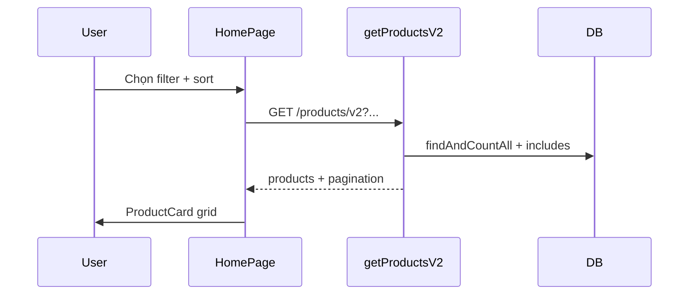

# Functional Requirement (FR) — Danh sách sản phẩm V2 (`GET /api/products/v2`)

## 1. Feature Overview

**`GET /api/products/v2`** là API danh sách sản phẩm **chính cho khách hàng** — trang chủ catalog laptop (`HomePage.jsx`). Hỗ trợ:

- Phân trang (`page`, `limit` — FE default **30**).
- Lọc **category**, **brand**, **giá** (`min_price`/`max_price` trên `base_price`).
- Lọc **cấu hình SKU**: processor, ram, storage, graphics_card, screen_size (IN list trên `product_variations`).
- Lọc **cân nặng** từ `products.specs` JSONB (regex parse số).
- Tìm kiếm tên `search` (ILIKE).
- Sắp xếp preset: `price_asc`, `price_desc`, `newest`, `best_selling`.

Kết hợp **`GET /facets`**, **`/categories`**, **`/brands`** và URL `?search=` từ Header.

---

## 2. Actors

| Actor | Mô tả |
|-------|-------|
| **Guest / Customer** | Duyệt, lọc, sort, phân trang trên HomePage |
| **System** | `getProductsV2` |

---

## 3. Scope

### In Scope

- Toàn bộ query params documented below.
- `findAndCountAll` + `distinct: true`.
- Include category, brand, variations (filtered), primary image.
- Subquery `sold_qty` khi `sort_by=best_selling`.

### Out of Scope

- Facet counts trong response (client gọi `/facets` riêng).
- Product detail fields (description, Q&A).
- Filter `is_active` (không có trong `where` hiện tại).

---

## 4. API Contract

### Endpoint

```
GET /api/products/v2
```

**Auth:** Public.

### Query Parameters

| Param | Aliases | Mô tả |
|-------|---------|-------|
| `page` | — | Default 1 |
| `limit` | — | Default 12 (FE thường 30) |
| `category_id` | `category_id[]` | CSV ids |
| `brand_id` | `brand_id[]` | CSV ids |
| `min_price` | — | `base_price >=` |
| `max_price` | — | `base_price <=` |
| `processor` | `cpu` | CSV strings → variation IN |
| `ram` | — | CSV |
| `storage` | `ssd` | CSV |
| `graphics_card` | `gpu` | CSV |
| `screen_size` | `screenSize` | CSV |
| `min_weight` | — | Numeric parse từ specs JSON |
| `max_weight` | — | Numeric parse từ specs JSON |
| `search` | — | ILIKE `product_name` |
| `sort_by` | `sortBy` | `price_asc`, `price_desc`, `newest`, `best_selling` |

**Parse helpers:** `parseIdList`, `parseStringList` — hỗ trợ array query hoặc CSV.

### Response — 200 OK

```json
{
  "products": [ /* Product instances */ ],
  "pagination": {
    "total": 45,
    "page": 1,
    "limit": 30,
    "totalPages": 2
  },
  "total": 45,
  "totalPages": 2
}
```

---

## 5. Filter Implementation Details

### Product-level `where`

- Category / brand: giống legacy.
- Search: `product_name ILIKE`.
- Price: `base_price` range (**cùng caveats legacy** về cột `base_price`).
- Weight:

```javascript
const weightExpr = Sequelize.literal(
  `NULLIF(REGEXP_REPLACE("Product"."specs"->>'weight','[^0-9\\.]','','g'),'')::numeric`
);
// min_weight / max_weight → Op.gte / Op.lte on weightExpr
```

### Variation-level filter

```javascript
const variationWhere = {};
if (processors.length) variationWhere.processor = { [Op.in]: processors };
// ... ram, storage, graphics_card, screen_size

include: {
  model: ProductVariation,
  as: "variations",
  ...(Object.keys(variationWhere).length
    ? { where: variationWhere, required: true }
    : {}),
}
```

**`required: true`:** Chỉ giữ products có **ít nhất một** variation khớp **tất cả** điều kiện variation đã set (AND trong cùng object where).

### Default order

Nếu không có `sort_by` hợp lệ: **`created_at DESC`**.

| `sort_by` | `order` |
|-----------|---------|
| `price_asc` | `base_price ASC` |
| `price_desc` | `base_price DESC` |
| `newest` | `created_at DESC` |
| `best_selling` | `sold_qty DESC`, `created_at DESC` |

### Best selling subquery

```sql
SELECT COALESCE(SUM(oi.quantity), 0)
FROM order_items oi
JOIN orders o ON o.order_id = oi.order_id
JOIN product_variations pv ON pv.variation_id = oi.variation_id
WHERE pv.product_id = "Product"."product_id"
  AND o.status IN ('confirmed','processing','shipping','delivered','PAID')
```

Thêm attribute `sold_qty` khi sort best_selling.

---

## 6. Frontend — HomePage

### Data flow

```text
URL ?search= → urlSearchQuery
localFilters: brand_id[], category_id[], minPrice, maxPrice, page, limit
specFilters: processor[], ram[], storage[], graphics_card[], screen_size[], minWeight, maxWeight
sortBy: "" | price_asc | ...

v2Filters = { ...filters, search: urlSearchQuery, sortBy, ...specFilters, _version }
useProductsV2(v2Filters)  // main grid
useProductsV2(featuredFilters)  // sortBy: best_selling, limit 12
useProductFacets()
customerUseBrandsFull / customerUseCategoriesFull
```

### UI components

- `ProductFilter` — brand/category/price.
- Panel spec — CPU, RAM, … từ facets.
- `ProductCard` — render từng item trong `products`.
- Pagination `handlePageChange` → scroll top.

### Featured block

```javascript
const featuredFilters = { page: 1, limit: 12, sortBy: "best_selling", _version: 'inactive_enabled' };
```

`_version` chỉ để bust React Query cache — **không** gửi lên BE.

---

## 7. Hook — `useProductsV2`

Build `URLSearchParams`:

- Arrays → `join(",")` cho category_id, brand_id, spec lists.
- `sort_by` từ `filters.sortBy`.
- GET `/products/v2?...`

Query key: `["products-v2", filters]` — mọi thay đổi filter refetch.

---

## 8. Integration với Search

| Bước | API |
|------|-----|
| Gõ gợi ý header | `search-suggestions` |
| Enter / “Xem tất cả” | `/?search=keyword` → v2 `search=` |
| Lọc thêm brand | v2 + `brand_id` |

---

## 9. `ProductCard` expectations

Card dùng:

- `product.images[0]`, `thumbnail_url`
- `product.variations` — chọn primary hoặc first
- `discount_percentage`, `product_name`, `slug`
- Link `/products/${slug || product_id}`

Giá: `variation.price` với discount (không bắt buộc `base_price`).

---

## 10. Business Rules

| # | Rule | Chi tiết |
|---|------|----------|
| BR-01 | **V2 = customer catalog** | Legacy cho admin |
| BR-02 | **Spec filter = INNER JOIN variation** | SP không có SKU khớp bị ẩn |
| BR-03 | **Best selling từ đơn đã xác nhận** | Status whitelist cố định |
| BR-04 | **Search đồng bộ URL** | Shareable link `/?search=` |
| BR-05 | **Không filter inactive** | Comment FE `_version: inactive_enabled` — BE vẫn trả inactive nếu có |

---

## 11. Sequence Diagram



---

## 12. Edge Cases

| Case | Hành vi |
|------|---------|
| Chỉ `min_weight` | AND clause trên weightExpr |
| Nhiều `processor` values | OR trong `IN` — match bất kỳ value |
| `sort_by` invalid | Fallback `created_at DESC` |
| `page` vượt totalPages | `products: []` |
| Filter spec + product không có variation field | Product biến mất khỏi list |

---

## 13. Related Features

| FR | Quan hệ |
|----|---------|
| `FR_GetProductFacets.md` | Options for spec filters |
| `FR_ListBrands.md`, `FR_ListCategories.md` | Brand/category filters |
| `FR_SearchSuggestions.md` | Entry to search param |
| `FR_ViewProductListLegacy.md` | Admin alternative |
| `FR_ViewProductDetail.md` | Click through |

---

## 14. Source Files

| Layer | File |
|-------|------|
| Route | `server/routes/productRoutes.js` L9 |
| Controller | `server/controllers/productController.js` → `getProductsV2` |
| FE | `client/app/pages/HomePage.jsx` |
| FE | `client/app/components/ProductFilter.jsx`, `ProductCard.jsx` |
| FE hook | `client/app/hooks/useProducts.js` → `useProductsV2` |

---

## 15. Acceptance Criteria

- **AC1:** HomePage load sản phẩm qua v2 không lỗi.
- **AC2:** Chọn brand + category → query params đúng và kết quả lọc.
- **AC3:** `sort_by=best_selling` trả featured section hợp lý.
- **AC4:** `?search=` từ URL áp dụng vào request v2.
- **AC5:** Spec filter (vd. processor) chỉ hiện SP có variation khớp.
- **AC6:** Pagination `total` / `totalPages` khớp UI.

---

## 16. Known Gaps

1. **`base_price`** filter/sort vs giá SKU thực tế (`variations.price`).
2. Không lọc `is_active: true` trên listing (khác suggestions).
3. Route order: `GET /:id` trước một số path khác — không ảnh hưởng `/v2`.
4. Facet không có count — UX không biết số SP per option.
