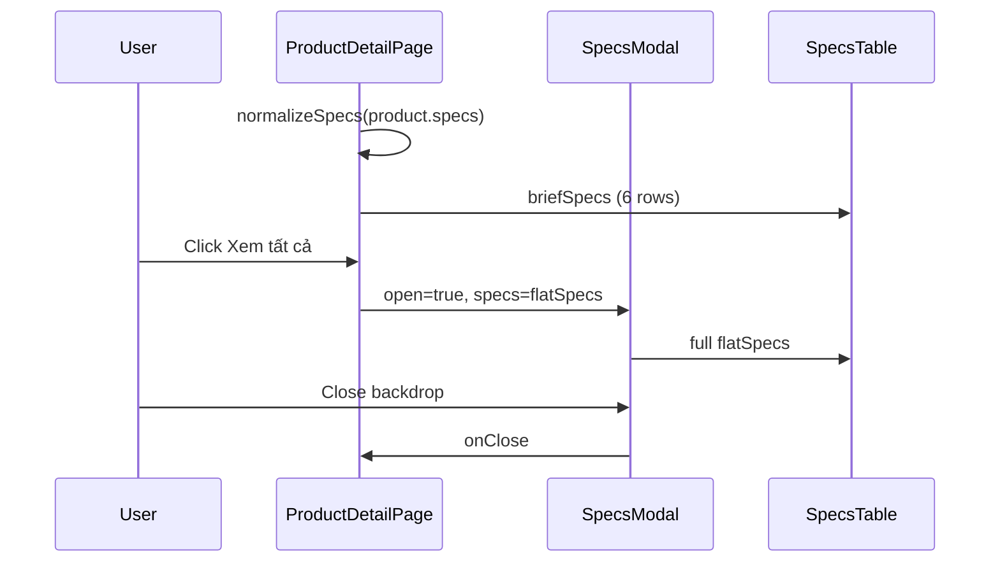

# Functional Requirement (FR) — Modal thông số kỹ thuật (Product Specs Modal)

## 1. Feature Overview

Trang chi tiết sản phẩm hiển thị thông số kỹ thuật từ cột **`products.specs`** (JSONB) theo hai mức:

1. **Tóm tắt inline:** `SpecsTable` với **6 dòng đầu** (`briefSpecs`) + nút “Xem tất cả”.
2. **Modal full:** `SpecsModal` — overlay toàn màn hình với bảng đầy đủ `flatSpecs`.

Dữ liệu được **chuẩn hóa** (`normalizeSpecs`) từ nhiều shape JSON (array of `{key,value}`, nested object, scalar) thành object phẳng `{ label: value }` cho `SpecsTable`.

---

## 2. Actors

| Actor | Mô tả |
|-------|-------|
| **Customer** | Xem specs trên PDP |
| **Admin** | Nhập `specs` khi tạo/sửa SP (JSON structure) |
| **Components** | `SpecsModal`, `SpecsTable`, `ProductDetailPage` |

---

## 3. Scope

### In Scope

- State `specOpen` boolean trên `ProductDetailPage`.
- Mở modal: nút “Xem thông số kỹ thuật” (icon Cpu) hoặc “Xem tất cả” dưới bảng tóm tắt.
- `SpecsModal`: backdrop blur, đóng X / click backdrop.
- `SpecsTable`: 2 cột label/value, zebra rows.

### Out of Scope

- Specs theo **variation** (CPU/RAM trên chip chọn cấu hình là field variation, không phải modal specs JSONB).
- Export PDF / print specs.
- So sánh specs (xem `FR_CompareProducts.md`).

---

## 4. Data Pipeline

### Nguồn

`GET /api/products/:id` → `product.specs` (null → `{}` ở BE).

### `normalizeSpecs` (ProductDetailPage)

| Input shape | Xử lý |
|-------------|--------|
| `section: [{ key, value }]` | Flatten từng item |
| `section: { k: v }` | Key `Title(section) - Title(k)` |
| `section: scalar` | Key `Title(section)` |

Output: `flatSpecs` — object string keys.

### `briefSpecs`

```javascript
const briefSpecs = Object.fromEntries(Object.entries(flatSpecs).slice(0, 6));
```

---

## 5. Components

### `SpecsModal.jsx`

| Prop | Type | Mô tả |
|------|------|-------|
| `open` | boolean | Render null nếu false |
| `onClose` | fn | Đóng modal |
| `specs` | object | Truyền `flatSpecs` |

**Layout:**

- `z-[1000]` fixed inset
- Backdrop `bg-black/40 backdrop-blur-sm` → `onClick={onClose}`
- Panel `max-w-3xl`, `max-h-[75vh]` scroll
- Title: “Thông số kỹ thuật”

### `SpecsTable.jsx`

```javascript
export default function SpecsTable({ specs = {}, dense = false })
```

- Empty → “Chưa có thông số kỹ thuật.”
- `Object.entries(specs)` → rows

**Props:**

- `dense` — font nhỏ hơn trên PDP inline block.

---

## 6. Trigger Points (ProductDetailPage)

| UI element | Action |
|------------|--------|
| Button “Xem thông số kỹ thuật” (Cpu icon) | `setSpecOpen(true)` |
| Link “Xem tất cả” (section specs) | `setSpecOpen(true)` |
| `SpecsModal` | `open={specOpen}` `onClose={() => setSpecOpen(false)}` `specs={flatSpecs}` |

---

## 7. Example `specs` JSONB (admin)

```json
{
  "weight": "1.8kg",
  "display": [
    { "label": "Kích thước", "value": "15.6 inch" },
    { "label": "Độ phân giải", "value": "FHD IPS" }
  ],
  "audio": { "speakers": "Stereo" }
}
```

Sau normalize → keys như `Kích thước`, `Độ phân giải`, `Audio - Speakers`, `Weight`.

**Weight facet:** `GET /facets` đọc `specs->>'weight'` riêng — có thể trùng label trong modal.

---

## 8. Business Rules

| # | Rule | Chi tiết |
|---|------|----------|
| BR-01 | **Product-level specs** | Không đổi theo variation đã chọn |
| BR-02 | **Brief limit 6** | Chỉ UI truncate; modal đầy đủ |
| BR-03 | **Accessible close** | Backdrop + nút X |
| BR-04 | **HTML in values** | `SpecsTable` dùng `String(v)` — không render HTML raw |

---

## 9. CompareModal reuse pattern

`CompareModal.jsx` có `normalizeSpecs` **tương tự** logic flatten — duplicate code với PDP (maintenance note).

---

## 10. Sequence Diagram



---

## 11. Edge Cases

| Case | Hành vi |
|------|---------|
| `specs` {} | Table “Chưa có thông số…” |
| Nested unknown shape | Bỏ qua hoặc `toText` best effort |
| Modal open + navigate away | Component unmount — modal đóng |
| Very long value | Scroll trong `max-h-[75vh]` |

---

## 12. Related Features

| FR | Quan hệ |
|----|---------|
| `FR_ViewProductDetail.md` | Host page + API specs |
| `FR_GetProductFacets.md` | Weight từ cùng JSONB |
| `FR_CompareProducts.md` | Cùng normalize pattern |

---

## 13. Source Files

| Layer | File |
|-------|------|
| FE | `client/app/components/SpecsModal.jsx` |
| FE | `client/app/components/SpecsTable.jsx` |
| FE | `client/app/pages/ProductDetailPage.jsx` (`normalizeSpecs`, `specOpen`) |
| BE | `server/controllers/productController.js` — `specs` in detail |
| Model | `server/models/Product.js` — `specs` JSONB |

---

## 14. Acceptance Criteria

- **AC1:** SP có specs → inline table hiển thị tối đa 6 dòng.
- **AC2:** “Xem tất cả” mở modal với đủ entries.
- **AC3:** Đóng modal bằng X và backdrop.
- **AC4:** SP không specs → message empty, không crash.
- **AC5:** Modal scroll khi nội dung dài.
