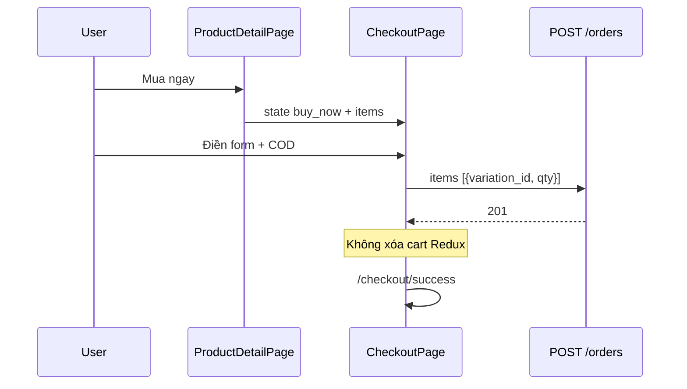

# Functional Requirement (FR) — Mua ngay & Pending Checkout (Buy Now with Pending Checkout)

## 1. Feature Overview

**Mua ngay** cho phép đặt hàng **một SKU** đã chọn cấu hình trên `ProductDetailPage` **không thêm vào giỏ server** (authenticated path). Luồng guest lưu intent vào `localStorage` (`pendingCheckout`) rồi đăng nhập — xem `FR_PendingCheckoutRestoreAfterLogin`.

```
Authenticated: navigate("/checkout", { state: { mode: "buy_now", items: [...] } })
Guest:         localStorage.pendingCheckout + navigate("/login?redirect=/checkout")
```

---

## 2. Actors

| Actor | Mô tả |
|-------|-------|
| **Customer** | Nút "Mua ngay" PDP |
| **ProductDetailPage** | `handleBuyNow`, validation variation |
| **CheckoutPage** | `intentMode === "buy_now"` |
| **createOrder** | Nhận `items[]`, không xóa cart server ngoài SKU (không có trong cart) |

---

## 3. Scope

### In Scope

- Validate chọn đủ thuộc tính → `matched` variation.
- Stock check client trước navigate.
- Checkout intent kèm `product` display-only.
- POST order chỉ gửi `variation_id`, `quantity`.
- Sau COD success: **không** `removeMany` Redux cart.

### Out of Scope

- Buy now từ list/card sản phẩm (chỉ PDP).
- Tự động `POST /cart` trước checkout.

---

## 4. Preconditions

| # | Điều kiện |
|---|-----------|
| PRE-01 | Product loaded, variation matcher `isReady` |
| PRE-02 | `getValidationReason()` null |
| PRE-03 | `quantity` ≤ `stock_quantity`, stock > 0 |
| PRE-04 | Login (hoặc pending + login) để vào `/checkout` |

---

## 5. handleBuyNow Logic

```javascript
const handleBuyNow = () => {
  const r = getValidationReason();
  if (r) { alert(reasonToMessage(r)); return; }
  if (!isReady) return;

  const qty = Math.max(1, Number(quantity) || 1);

  const itemPayload = {
    variation_id: matched.variation_id,
    quantity: qty,
    product: {
      product_name: product.product_name,
      thumbnail_url: product.thumbnail_url,
      discount_percentage: product.discount_percentage,
      variation: { price: Number(matched.price) },
    },
  };

  if (!isAuthenticated) {
    localStorage.setItem('pendingCheckout', JSON.stringify({
      mode: "buy_now",
      items: [itemPayload],
      redirectAfterLogin: true,
      timestamp: Date.now(),
    }));
    navigate(`/login?redirect=/checkout`);
    return;
  }

  navigate("/checkout", {
    state: { mode: "buy_now", items: [itemPayload] },
  });
};
```

---

## 6. CheckoutPage — buy_now mode

| Khía cạnh | buy_now | cart |
|-----------|---------|------|
| Nguồn items | `location.state.items` | Selected cart lines |
| `cart_id` trên viewItems | Thường `null` | Có để `removeMany` |
| Sau COD order | Không dispatch cart | `removeMany` ids |
| Server cart | Không xóa (items không trong cart) | Xóa variation_ids đã order |

### viewItems merge

```javascript
const byVarId = new Map(cartItems.map(ci => [ci.variation_id, ci]));
return intentItems.map(it => ({
  ...it,
  product: inCart?.product || it.product || null, // buy_now dùng product từ state
  cart_id: inCart?.id || null,
}));
```

Preview/order vẫn tính từ **DB** khi POST.

---

## 7. So sánh — Guest Add to Cart (cùng file)

`handleAddToCart` khi guest:

- Cũng `localStorage.pendingCheckout` với `mode: "buy_now"` (copy paste).
- Navigate `/login?redirect=/checkout`.
- **Không** có `timestamp` → TTL App.jsx có thể xóa (GAP).

Authenticated add-to-cart: `POST /api/cart` — **không** buy now.

---

## 8. Sequence — Authenticated



---

## 9. Business Rules

| # | Rule |
|---|------|
| BR-01 | Buy now **không** gọi `addToCart` API |
| BR-02 | Một lần checkout một tập `items` từ state — không đọc full cart |
| BR-03 | Giá hiển thị PDP có thể lệch preview nếu admin đổi giá — BE authoritative |
| BR-04 | `ProtectedRoute` checkout — guest phải login trước |

---

## 10. Related FRs

| FR | Liên kết |
|----|----------|
| `FR_PendingCheckoutRestoreAfterLogin` | Guest path |
| `FR_CheckoutPageFlow` | Host page |
| `FR_CreateOrder` | API |
| `FR_SelectCartItemsForCheckout` | Luồng cart thay thế |

---

## 11. Source Files

| File | Vai trò |
|------|---------|
| `client/app/pages/ProductDetailPage.jsx` | `handleBuyNow`, `handleAddToCart` |
| `client/app/pages/CheckoutPage.jsx` | `intentMode` |
| `client/app/pages/LoginPage.jsx` | restore pending |
| `server/controllers/orderController.js` | `createOrder` items branch |

---

## 12. Acceptance Criteria

- [ ] Auth buy now → checkout 1 dòng đúng SKU/qty.
- [ ] Guest buy now → login → checkout cùng SKU.
- [ ] COD success không xóa cart items khác.
- [ ] POST order body chỉ variation_id + quantity.
- [ ] Hết hàng → alert trước navigate.

---

## 13. Known Gaps

| # | Mô tả |
|---|--------|
| GAP-01 | Guest add-to-cart dùng cùng pending schema `buy_now` — nhầm nghĩa. |
| GAP-02 | Không sync cart server khi buy now — OK by design nhưng user có thể thắc mắc. |
| GAP-03 | `product` trong state lỗi thời sau login lâu — preview API sửa khi có province. |
| GAP-04 | Buy now không kiểm tra `is_available` server-side trước navigate (chỉ stock số). |
