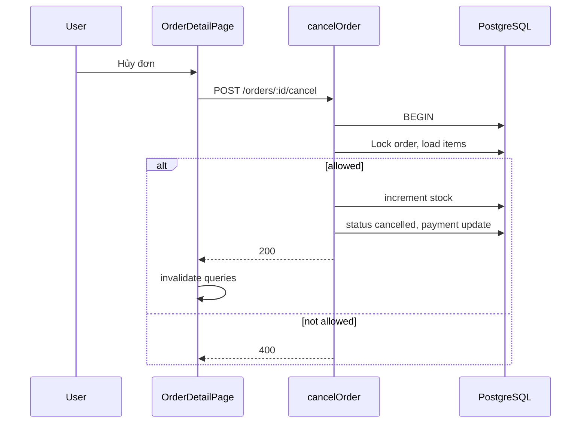

# Functional Requirement (FR) — Hủy đơn hàng (Cancel Order)

## 1. Feature Overview

Khách hàng **chủ đơn** hủy đơn trong các trạng thái được phép; backend **hoàn kho** và cập nhật `orders` + `payments` trong transaction:

```
POST /api/orders/:order_id/cancel
Authorization: Bearer <JWT>
Body: { "reason": "optional string max 500" }
```

**FE:** `useCancelOrder` — `OrdersPage`, `OrderDetailPage` (reason mặc định `"Khách tự hủy"`).  
**Util:** `canCancel(order)` mirror logic BE.

---

## 2. Actors

| Actor | Mô tả |
|-------|-------|
| **Customer** | Nút "Hủy đơn" |
| **orderController.cancelOrder** | Transaction + stock restore |
| **Admin** | Không dùng endpoint này (admin có flow status/refund riêng) |

---

## 3. Scope

### In Scope

- Lock order row `FOR UPDATE`.
- Restore `stock_quantity` theo `OrderItem`.
- Append cancel reason vào `order.note` (`appendNote`).
- Cập nhật `payment_status` theo case COD/VNPay.
- Invalidate FE: orders, order, cart, counters.

### Out of Scope

- Hủy bởi admin từ panel (PUT status).
- Tự động hủy cron (xem `FR_ReserveInventoryOnOrder`).
- Hoàn tiền VNPay tự động (admin `refund`).

---

## 4. Preconditions — Được phép hủy

Định nghĩa trong BE và `orderCanCancel.js`:

| Case | order.status | payment.provider | payment.payment_status |
|------|--------------|------------------|------------------------|
| Chờ thanh toán VNPay | `AWAITING_PAYMENT` | `VNPAY` | `pending` |
| Chờ giao COD | `processing` | `COD` | `pending` |
| Chờ giao VNPay đã trả tiền | `processing` | `VNPAY` | `completed` |

**Không** hủy được khi: `shipping`, `delivered`, `cancelled`, VNPay chưa thu nhưng không thuộc awaiting, v.v.

```javascript
// orderCanCancel.js
export function canCancel(order) {
  const { provider: prov, payment_status: ps } = order.payment || {};
  const os = order.status;
  return (
    (prov === "VNPAY" && os === "AWAITING_PAYMENT" && ps === "pending") ||
    (prov === "COD" && os === "processing" && ps === "pending") ||
    (prov === "VNPAY" && os === "processing" && ps === "completed")
  );
}
```

---

## 5. API Contract

### Request

```json
{ "reason": "Khách tự hủy" }
```

`reason` cắt 500 ký tự; có thể rỗng.

### Response — 200

```json
{
  "message": "Order cancelled successfully",
  "order": {
    "order_id": 1,
    "status": "cancelled",
    "payment_status": "failed"
  }
}
```

`payment_status` sau hủy:

| Case | payment.payment_status |
|------|------------------------|
| Awaiting VNPay / To-ship COD | `failed` |
| To-ship VNPay đã completed | `pending` (đánh dấu chờ admin hoàn tiền) |

### Errors

| HTTP | Message |
|------|---------|
| 404 | `Order not found` |
| 400 | `Order cannot be cancelled in current state.` |

---

## 6. Backend Logic

```text
1. BEGIN TRANSACTION
2. Order.findOne({ order_id, user_id }, lock UPDATE, skipLocked)
3. Payment.findOne, OrderItem.findAll (separate queries)
4. Validate cancel guards (§4)
5. FOR each OrderItem:
     increment stock_quantity (lock variation)
6. order.update({ status: "cancelled", note: appendNote(old, reason) })
7. payment.update per case (failed vs pending)
8. COMMIT
```

### appendNote

```
[Cancel @<ISO8601>] <reason>
```

Nối vào `note` cũ bằng newline nếu có.

---

## 7. Frontend Behavior

### OrdersPage

- Nút hủy khi `canCancel(o)`; không confirm modal (click trực tiếp).
- `onSuccess`: list refetch qua invalidate (không navigate).

### OrderDetailPage

```javascript
cancelOrder.mutate(
  { orderId: o.order_id, reason: "Khách tự hủy" },
  { onSuccess: () => navigate("/orders?tab=cancelled", { replace: true }) }
);
```

Hai nút hủy (header + khối thanh toán) — cùng mutation.

---

## 8. Sequence



---

## 9. Interaction với Cron / VNPay

| Nguồn hủy | Stock | Order status |
|-----------|-------|--------------|
| User cancel | Hoàn | `cancelled` |
| Cron expire VNPay | Hoàn | `cancelled` |
| VNPay return fail | **Không** hoàn (chờ cancel/cron) | order có thể vẫn AWAITING |

---

## 10. Related FRs

| FR | Liên kết |
|----|----------|
| `FR_ReserveInventoryOnOrder` | Hoàn kho |
| `FR_ViewUserOrders` | Nút list |
| `FR_ViewOrderDetailSlim` | Nút detail |
| Admin refund | `POST /admin/orders/:id/refund` sau cancel VNPAY |

---

## 11. Source Files

| Layer | File |
|-------|------|
| Route | `server/routes/orderRoutes.js` |
| Controller | `orderController.js` — `cancelOrder`, `appendNote` |
| FE Hook | `client/app/hooks/useOrders.js` — `useCancelOrder` |
| FE Util | `client/app/utils/orderCanCancel.js` |
| FE Pages | `OrdersPage.jsx`, `OrderDetailPage.jsx` |

---

## 12. Acceptance Criteria

- [ ] Hủy awaiting VNPay → stock restored, payment failed, status cancelled.
- [ ] Hủy COD processing → stock restored, payment failed.
- [ ] Hủy VNPay processing+completed → stock restored, payment pending (refund queue).
- [ ] Hủy đơn đang shipping → 400.
- [ ] User khác → 404.
- [ ] `canCancel` FE khớp BE cho các case chuẩn.

---

## 13. Known Gaps

| # | Mô tả |
|---|--------|
| GAP-01 | Không có confirm dialog — dễ hủy nhầm. |
| GAP-02 | VNPay paid nhưng order vẫn `AWAITING` (return lỗi) — cancel có thể không available. |
| GAP-03 | `payment_status: pending` sau hủy VNPay paid — admin phải refund thủ công; FE banner refunded chỉ khi `refunded`. |
| GAP-04 | `skipLocked` trên order có thể trả 404 thay vì chờ. |
| GAP-05 | Tab `cancelled` gồm cả `FAILED` — user hủy và thanh toán fail trộn chung. |
