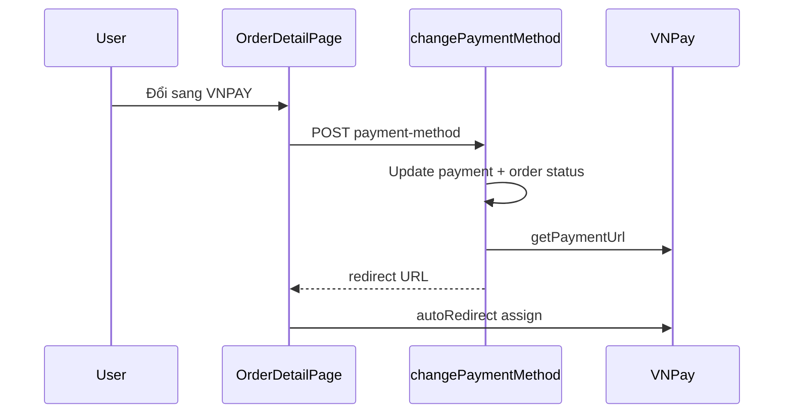

# Functional Requirement (FR) — Đổi phương thức thanh toán (Change Payment Method)

## 1. Feature Overview

Cho phép khách **đổi provider/method** của đơn đã tạo nhưng **chưa hoàn tất thanh toán online** (hoặc chuyển sang VNPay), trong transaction:

```
POST /api/orders/:order_id/payment-method
Authorization: Bearer <JWT>
Body: { "provider": "COD" | "VNPAY", "method": "..." }
```

**FE chính:** `OrderDetailPage` + `ChangePaymentMethodDialog` + `useChangePaymentMethod({ autoRedirect: true })`.  
**UI copy:** Chỉ marketing **COD → VNPAY**; backend hỗ trợ thêm chiều VNPAY → COD.

---

## 2. Actors

| Actor | Mô tả |
|-------|-------|
| **Customer** | Đổi payment trên detail |
| **changePaymentMethod** | Cập nhật Order + Payment + VNPay URL |
| **emailService** | `sendOrderUpdateEmail` (async) |

---

## 3. Scope

### In Scope

- Validate `VALID` map giống `createOrder`.
- Chặn khi order `shipping` | `delivered` | `cancelled`.
- Chặn khi `payment.payment_status === completed` (đã trả tiền — không đổi).
- COD → reset txn fields, order → `processing`.
- VNPAY → new `txn_ref`, order → `AWAITING_PAYMENT`, trả `redirect`.
- Email thông báo đổi PM (best effort).

### Out of Scope

- Đổi payment trên Checkout (chọn lúc tạo).
- `retryVnpayPayment` (chỉ tạo link mới, không đổi provider) — endpoint riêng.
- Recalculate `final_amount` / shipping khi đổi PM.

---

## 4. Preconditions

| # | Điều kiện |
|---|-----------|
| PRE-01 | JWT + chủ đơn |
| PRE-02 | Order tồn tại, không ở trạng thái chặn (§6) |
| PRE-03 | Payment chưa `completed` |
| PRE-04 | FE: thường COD + processing (nút "Đổi sang VNPAY") |

---

## 5. API Contract

### Request

```json
{
  "provider": "VNPAY",
  "method": "VNPAYQR"
}
```

| provider | method hợp lệ |
|----------|----------------|
| `COD` | `COD` |
| `VNPAY` | `VNPAYQR`, `VNBANK`, `INTCARD`, `INSTALLMENT` |

### Response — 200

```json
{
  "message": "Payment method updated",
  "order": {
    "order_id": 1,
    "status": "AWAITING_PAYMENT"
  },
  "payment": {
    "provider": "VNPAY",
    "method": "VNPAYQR",
    "status": "pending"
  },
  "redirect": "https://sandbox.vnpayment.vn/..."
}
```

`redirect` chỉ khi `provider === VNPAY` và cấu hình OK.

### Errors

| HTTP | Message |
|------|---------|
| 400 | `Unsupported provider` / `Invalid method` |
| 400 | `Cannot change payment in current state.` |
| 400 | `Payment already completed; cannot change method.` |
| 400 | `Payment record not found` |
| 404 | `Order not found` |
| 502 | `VNPAY configuration error` |

---

## 6. State Transitions

### → COD

```javascript
payment.update({
  provider: "COD", payment_method: "COD", payment_status: "pending",
  amount: order.final_amount,
  transaction_id: null, txn_ref: null, raw_return: null, raw_ipn: null, paid_at: null,
});
order.update({ status: "processing" });
```

**Kho:** Không đổi (đã reserve từ create).

### → VNPAY

```javascript
const newTxnRef = `${order_id}-${Date.now()}`;
payment.update({ provider: "VNPAY", payment_method: method, payment_status: "pending", txn_ref: newTxnRef, ... });
order.update({ status: "AWAITING_PAYMENT" });
redirect = await getPaymentUrl({ method, amount, txnRef: newTxnRef, ... });
```

**Thiếu:** Không set `reserve_expires_at` (khác `createOrder`).

---

## 7. Frontend

### Hiển thị nút

```javascript
!["shipping", "delivered", "cancelled"].includes(o.status) &&
pay?.provider === "COD" &&
(o.status === "AWAITING_PAYMENT" || o.status === "processing")
```

→ Mở `ChangePaymentMethodDialog`.

### Dialog

- Hardcode message: chuyển **COD → VNPAY**.
- `provider` state luôn `"VNPAY"`; chọn `method` trong select.
- `onSubmit({ provider: "VNPAY", method })`.

### Hook

```javascript
useChangePaymentMethod({ autoRedirect: true });
// POST /orders/:orderId/payment-method
// onSuccess: invalidate order, orders, counters; window.location.assign(redirect)
```

---

## 8. Sequence



---

## 9. Related FRs

| FR | Liên kết |
|----|----------|
| `FR_CreateOrder` | VALID map, VNPay URL |
| `FR_ViewOrderDetailSlim` | UI host |
| Retry payment | `POST /orders/:id/payments/retry` khi cùng provider VNPAY |

---

## 10. Source Files

| Layer | File |
|-------|------|
| Route | `server/routes/orderRoutes.js` |
| Controller | `orderController.js` — `changePaymentMethod` |
| VNPay | `server/services/vnpayService.js` |
| Email | `server/services/emailService.js` |
| FE Hook | `client/app/hooks/useOrders.js` |
| FE Component | `client/app/components/ChangePaymentMethodDialog.jsx` |
| FE Page | `client/app/pages/OrderDetailPage.jsx` |

---

## 11. Acceptance Criteria

- [ ] COD processing → VNPAY: order AWAITING_PAYMENT, redirect hợp lệ.
- [ ] Đơn delivered → 400.
- [ ] Payment completed → 400.
- [ ] FE auto redirect khi có `redirect`.
- [ ] Invalidate queries sau success.

---

## 12. Known Gaps

| # | Mô tả |
|---|--------|
| GAP-01 | **FE không expose VNPAY → COD** dù BE hỗ trợ. |
| GAP-02 | **Không set `reserve_expires_at`** khi chuyển sang VNPay — cron/countdown sai. |
| GAP-03 | Dialog ghi INSTALLMENT nhưng create cũng cho phép — cần test VNPay method code. |
| GAP-04 | `payment.status` trong response luôn string `"pending"` cho cả COD/VNPAY (typo field name `method` vs `payment_method`). |
| GAP-05 | Đổi PM không gửi lại `items_breakdown` — email update có thể thiếu chi tiết. |
| GAP-06 | `changePaymentMethod` chặn `cancelled` nhưng không chặn `FAILED` / `AWAITING` với payment failed — edge case cần QA. |
