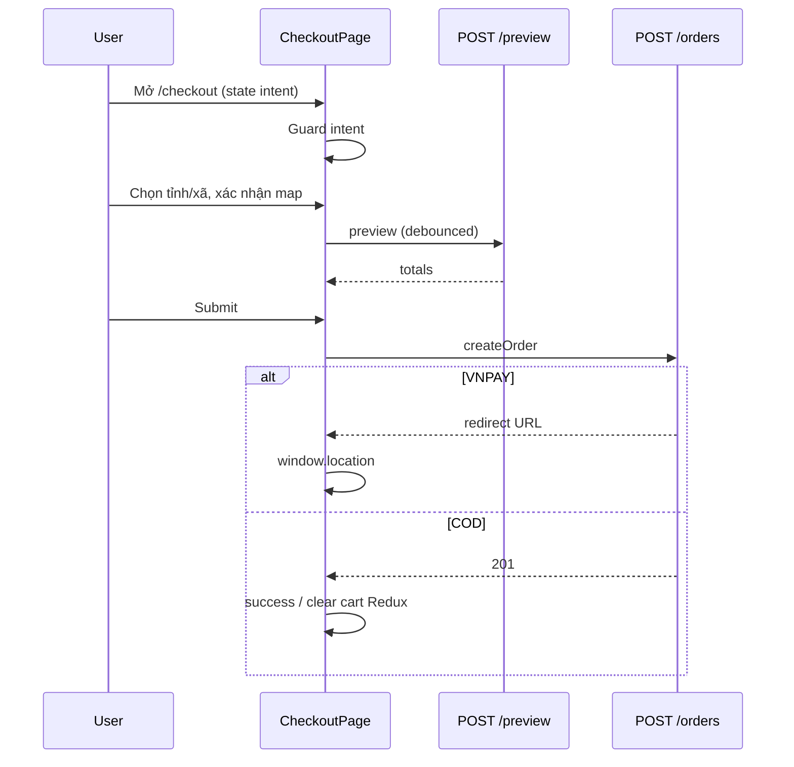

# Functional Requirement (FR) — Luồng trang thanh toán (Checkout Page Flow)

## 1. Feature Overview

`CheckoutPage` là trang **multi-step form** gom: danh sách món từ checkout intent, địa chỉ (tỉnh/xã + geocode + bản đồ), preview giá (`POST /orders/preview`), chọn thanh toán, và submit `POST /orders`.

**Route:** `/checkout` — `ProtectedRoute` (JWT / Redux auth).  
**Intent-driven:** Chỉ checkout đúng `items` trong `location.state` — **không** auto full cart.

---

## 2. Actors

| Actor | Mô tả |
|-------|-------|
| **Customer** | Hoàn tất đơn |
| **CartPage / ProductDetailPage** | Truyền `state` |
| **useOrderPreview** | Debounce preview |
| **useCreateOrder** | Submit |
| **MapPicker**, **PaymentOptions** | UI con |
| **Nominatim OSM** | Geocode client |

---

## 3. Scope

### In Scope

- Modes: `cart` | `buy_now`.
- Guard intent rỗng → `/cart`.
- Form shipping + `province_id`, `ward_id`, `geo_lat/lng` + `locationConfirmed`.
- Preview totals sidebar.
- COD → success page; VNPay → external redirect.
- Cart mode: Redux `removeMany` sau COD.

### Out of Scope

- Guest checkout không login.
- Multi-address book / saved addresses.
- Voucher.

---

## 4. Entry Points

| Nguồn | Navigation |
|-------|------------|
| CartPage | `navigate("/checkout", { state: { mode: "cart", items: [{variation_id, quantity}] } })` |
| ProductDetail buy now | `mode: "buy_now", items: [...]` + optional `product` |
| Login/OAuth restore | `navigate("/checkout", { state: checkoutData })` |

### Guard

```javascript
useEffect(() => {
  if (!intentMode || intentItems.length === 0) {
    navigate("/cart", { replace: true });
  }
}, [intentMode, intentItems.length, navigate]);
```

---

## 5. viewItems — Chuẩn hóa hiển thị

```javascript
const viewItems = intentItems.map(it => {
  const inCart = byVarId.get(it.variation_id);
  return {
    variation_id, quantity,
    product: inCart?.product || it.product || null,
    cart_id: inCart?.id || null,
  };
});
```

Sidebar list + preview payload dùng `viewItems`.

---

## 6. Địa chỉ & Bản đồ

### Province / Ward

- `useProvinces(true)`, `useWards(provinceId)`.
- Đổi tỉnh → reset ward, cập nhật `formData.city/ward` text.

### Geocode

| Trigger | Hành vi |
|---------|---------|
| Chọn ward | `geocodeSimple("${ward}, ${province}, Vietnam")` — center map, **chưa** confirmed |
| Chọn tỉnh (chưa ward) | Center tỉnh zoom 12 |
| Blur address | `handleAddressBlur` → Nominatim |
| MapPicker drag | `locationConfirmed = false` + banner warning |

### cleanAddressDetail

Loại bỏ từ hành chính trùng ward/province khỏi chuỗi địa chỉ chi tiết trước khi ghép `shipping_address`:

```
[addressDetail, wardName, provinceName].join(", ")
```

### canSubmit

```javascript
viewItems.length > 0 &&
formData.full_name && formData.phone && formData.email &&
formData.address && provinceId && wardId &&
locationLL && locationConfirmed
```

---

## 7. Preview giá

Hook `useOrderPreview({ provinceId, wardId, viewItems })`:

- Gọi khi có `provinceId` + items.
- Debounce 500ms.

UI:

```javascript
showSubtotal = preview?.subtotal_after_discount ?? fallbackSubtotalAfterDiscount
showShipping = preview?.shipping_fee ?? 0
showTotal = preview?.final_amount ?? fallback...
```

Fallback tính từ `product.variation.price` trên viewItems (có thể sai nếu thiếu product).

---

## 8. Thanh toán — PaymentOptions

```javascript
const [payment, setPayment] = useState({
  payment_provider: "COD",
  payment_method: "COD",
});
// <PaymentOptions onChange={setPayment} />
```

Component:

- Toggle COD vs VNPAY.
- VNPAY sub-methods (QR, bank, …) **ẩn** trong UI — default `VNPAYQR` khi chọn VNPAY.
- `INSTALLMENT` có trong BE VALID nhưng không expose UI checkout.

---

## 9. Submit — createOrder

```javascript
const orderData = {
  shipping_address, shipping_phone, shipping_name, note,
  payment_provider, payment_method,
  province_id: +provinceId,
  ward_id: +wardId,
  geo_lat: locationLL.lat,
  geo_lng: locationLL.lng,
  items: viewItems.map(({ variation_id, quantity }) => ({ variation_id, quantity })),
};

const res = await createOrder.mutateAsync(orderData);

if (res?.redirect) {
  window.location.href = res.redirect;
  return;
}

// COD cart mode
if (intentMode === "cart") {
  dispatch(removeMany({ ids: viewItems.map(i => i.cart_id).filter(Boolean) }));
}

navigate("/checkout/success", { state: { order_code, customer_name, payment_provider }, replace: true });
```

| Branch | Hành vi |
|--------|---------|
| VNPay | Full page redirect gateway; cart Redux untouched |
| COD cart | Server xóa cart items + Redux removeMany |
| COD buy_now | Chỉ server order; Redux cart không đổi |

Errors: `console.error` — **chưa** toast user-facing.

---

## 10. Form user defaults

```javascript
useState({
  full_name: user?.full_name || "",
  email: user?.email || "",
  phone: user?.phone_number || "",
  address: "", city: "", ward: "", notes: "",
});
```

Email required UI nhưng không gửi lên `orderData` body (chỉ shipping fields).

---

## 11. Sequence Diagram



---

## 12. Related FRs

| FR | Liên kết |
|----|----------|
| `FR_PreviewOrder` | API preview |
| `FR_CreateOrder` | API submit |
| `FR_CheckoutSuccessPage` | COD after |
| `FR_BuyNowWithPendingCheckout` | Intent buy_now |
| `FR_SelectCartItemsForCheckout` | Intent cart |

---

## 13. Source Files

| File | Vai trò |
|------|---------|
| `client/app/pages/CheckoutPage.jsx` | Main flow |
| `client/app/hooks/useOrderPreview.js` | Preview |
| `client/app/hooks/useOrders.js` | createOrder |
| `client/app/components/PaymentOptions.jsx` | PM UI |
| `client/app/components/MapPicker.jsx` | Map |
| `client/app/hooks/useProvinces.js`, `useWards.js` | Geo |
| `client/app/App.jsx` | Route Protected |
| `server/controllers/orderController.js` | create + preview |

---

## 14. Acceptance Criteria

- [ ] Không state → redirect cart.
- [ ] Preview đổi khi đổi tỉnh/phường.
- [ ] Submit disabled until map confirmed.
- [ ] VNPay redirect leaves page.
- [ ] COD cart xóa đúng món Redux + server.
- [ ] `items` POST khớp intent không phải full cart.

---

## 15. Known Gaps

| # | Mô tả |
|---|--------|
| GAP-01 | `PaymentOptions` ẩn chọn VNPAYQR/VNBANK/INTCARD — user không đổi method con. |
| GAP-02 | Legacy `subtotal`/`shipping=30000` vars không dùng cho submit. |
| GAP-03 | Create error không hiển thị UI. |
| GAP-04 | Email thu thập nhưng không lưu order. |
| GAP-05 | `ProtectedRoute` không pass `location` khi redirect login — guest cart path mất state. |
| GAP-06 | `api` import trong CheckoutPage cho `geo/wards/centroid` — cần token cho một số geo API. |
| GAP-07 | Preview trước khi chọn ward — ship có thể khác lúc submit. |
