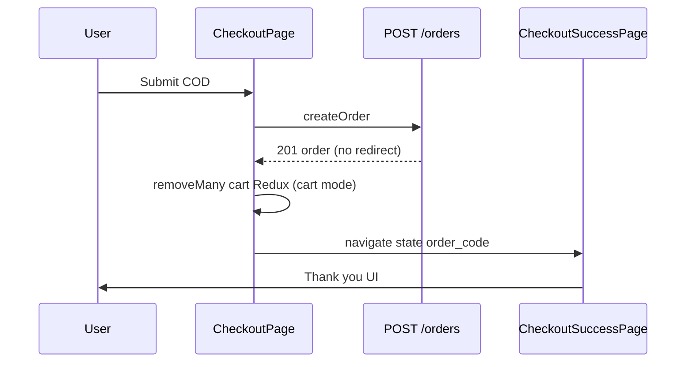

# Functional Requirement (FR) — Trang đặt hàng thành công (Checkout Success Page)

## 1. Feature Overview

Trang cảm ơn sau khi **đặt hàng COD thành công** — không load lại đơn từ server, chỉ hiển thị state truyền qua React Router:

```
Route: /checkout/success
Component: CheckoutSuccessPage.jsx
```

**Luồng VNPay:** Sau `createOrder` FE `window.location.href = redirect` → **không** qua trang này. Kết quả VNPay xử lý tại `VnpayReturn` → redirect `/orders?tab=...`.

---

## 2. Actors

| Actor | Mô tả |
|-------|-------|
| **Customer** | Xem mã đơn sau COD |
| **CheckoutPage** | `navigate("/checkout/success", { state })` |
| **CheckoutSuccessPage** | Render + guard state |

---

## 3. Scope

### In Scope

- Hiển thị `order_code`, `customer_name`, `payment_provider`.
- Nội dung "Tiếp theo" khác nhau COD vs VNPay (copy).
- CTA: "Xem chi tiết đơn hàng" → `/orders`, "Tiếp tục mua sắm" → `/`.
- Guard: thiếu state → `replace` về `/`.

### Out of Scope

- In hóa đơn, QR tracking.
- Gọi `GET /orders/:id` xác nhận.
- VNPay success landing (dùng `VnpayReturn`).
- Protected route (trang **không** bọc `ProtectedRoute`).

---

## 4. Preconditions

| # | Điều kiện |
|---|-----------|
| PRE-01 | User vừa submit checkout COD thành công |
| PRE-02 | `location.state` có `order_code` và `customer_name` |
| PRE-03 | Thường user đã login (checkout bọc ProtectedRoute) |

---

## 5. State Contract (từ CheckoutPage)

```javascript
navigate("/checkout/success", {
  state: {
    order_code: res?.order?.order_code || res?.order_code,
    customer_name: formData.full_name,
    payment_provider: payment.payment_provider, // "COD" | "VNPAY"
  },
  replace: true,
});
```

**Lưu ý:** Chỉ nhánh **không có** `res.redirect` (COD) mới navigate tới đây. VNPay redirect external trước khi tới success page.

| Field | Bắt buộc trên success page |
|-------|----------------------------|
| `order_code` | Có — guard |
| `customer_name` | Có — guard |
| `payment_provider` | Optional hiển thị — không trong guard |

---

## 6. Page Logic

```javascript
const orderData = location.state;

useEffect(() => {
  if (!orderData || !orderData.order_code || !orderData.customer_name) {
    navigate("/", { replace: true });
  }
}, [orderData, navigate]);

if (!orderData) return null;
```

| # | Rule |
|---|------|
| BR-01 | F5 / mở tab mới `/checkout/success` trực tiếp → mất state → redirect `/` |
| BR-02 | Không persist state vào `sessionStorage` |
| BR-03 | Link "Xem chi tiết" → `/orders` **không** deep-link `order_id` (chỉ list) |

---

## 7. UI Content

### Header

- Icon `CheckCircle` xanh, tiêu đề "Đặt hàng thành công!".
- Cảm ơn kèm `customer_name`.

### Khối mã đơn

- `order_code` font lớn.
- Dòng phương thức: COD → "Thanh toán khi nhận hàng"; khác → "Ví điện tử VNPay" (copy — trên thực tế COD path mới tới đây).

### Bullets "Tiếp theo"

| payment_provider | Nội dung |
|------------------|----------|
| `COD` | Email xác nhận, chuẩn bị hàng, SMS, hotline |
| Khác (VNPAY) | Thêm "Email xác nhận thanh toán" — **hiếm khi** hiện vì VNPay không navigate success |

### Footer

Hotline `1900 XXX XXX`, email `support@laptopstore.vn` (placeholder).

---

## 8. Routing (App.jsx)

```jsx
<Route path="checkout" element={<ProtectedRoute><CheckoutPage /></ProtectedRoute>} />
<Route path="checkout/success" element={<CheckoutSuccessPage />} />
<Route path="checkout/vnpay-return" element={<VnpayReturn />} />
```

| Route | Protected? |
|-------|------------|
| `/checkout` | Có |
| `/checkout/success` | **Không** |
| `/checkout/vnpay-return` | **Không** |

Guest theoretically có thể bookmark success URL nhưng guard thiếu state → home.

---

## 9. Sequence — COD



---

## 10. Related FRs

| FR | Liên kết |
|----|----------|
| `FR_CheckoutPageFlow` | Nguồn navigate |
| `FR_CreateOrder` | API tạo đơn |
| `VnpayReturn` | VNPay path thay thế |
| `FR_ViewUserOrders` | CTA xem đơn |

---

## 11. Source Files

| File | Vai trò |
|------|---------|
| `client/app/pages/CheckoutSuccessPage.jsx` | UI |
| `client/app/pages/CheckoutPage.jsx` | Navigate state |
| `client/app/App.jsx` | Route |
| `server/services/emailService.js` | Email async sau create (ngoài trang) |

---

## 12. Acceptance Criteria

- [ ] COD thành công → hiện đúng `order_code` và tên.
- [ ] Truy cập `/checkout/success` không state → redirect `/`.
- [ ] VNPay create → không vào trang này (redirect gateway).
- [ ] Cart mode: giỏ Redux đã xóa món đã mua trước khi vào success.
- [ ] Nút "Xem chi tiết đơn hàng" mở `/orders`.

---

## 13. Known Gaps

| # | Mô tả |
|---|--------|
| GAP-01 | Không có `order_id` — user phải tìm đơn trong list. |
| GAP-02 | F5 mất state — không recovery. |
| GAP-03 | Success page public — không verify token (chỉ obscurity qua state). |
| GAP-04 | Copy VNPay trên success page hầu như dead code. |
| GAP-05 | Không toast/error UI trên CheckoutPage khi create fail (comment todo). |
| GAP-06 | Email xác nhận BE — user không thấy trạng thái gửi email trên UI. |
