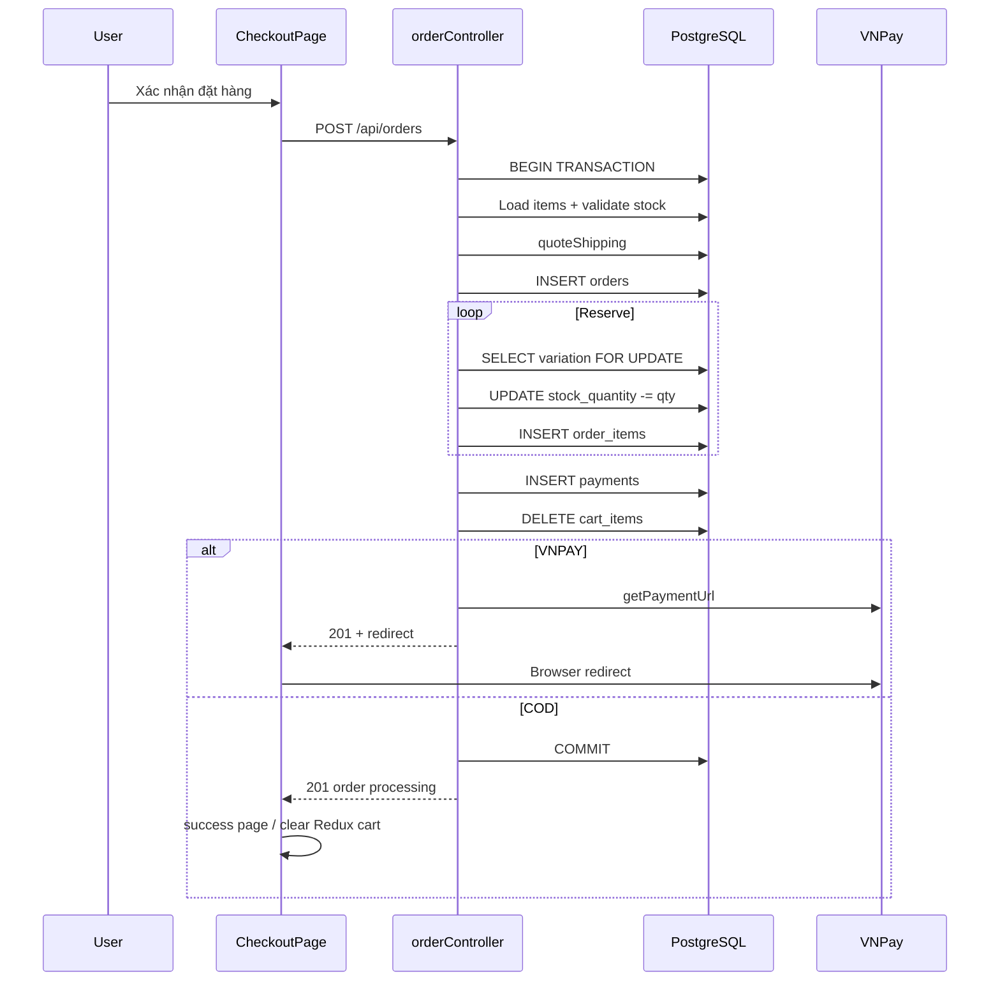

# Functional Requirement (FR) — Tạo đơn hàng (Create Order)

## 1. Feature Overview

Khách hàng **đã đăng nhập** xác nhận checkout và tạo đơn hàng qua:

```
POST /api/orders
Authorization: Bearer <JWT>
```

Backend thực hiện trong **một transaction Sequelize**: validate thanh toán & địa chỉ → lấy danh sách món (body `items` hoặc toàn bộ giỏ) → kiểm tra tồn kho & tính tiền → tạo `Order` + **reserve kho** + `OrderItem` + `Payment` → xóa món khỏi giỏ → (VNPay) trả URL redirect.

**Điểm vào FE:** `CheckoutPage` → `useCreateOrder().mutateAsync(orderData)`.

**Luồng liên quan:** `FR_PreviewOrder`, `FR_ReserveInventoryOnOrder`, `FR_SelectCartItemsForCheckout` (cart mode).

---

## 2. Actors

| Actor | Mô tả |
|-------|-------|
| **Authenticated Customer** | Submit form checkout (COD hoặc VNPay) |
| **CheckoutPage** | Gửi `items`, địa chỉ, geo, payment |
| **orderController.createOrder** | Orchestration + transaction |
| **vnpayService** | Sinh URL thanh toán (VNPay) |
| **emailService** | Gửi email xác nhận (async, không block response) |

---

## 3. Scope

### In Scope

- Tạo đơn từ **partial cart** (`items[]` từ checkout intent) hoặc **full cart** (không gửi `items`).
- COD → `status: processing`; VNPay → `status: AWAITING_PAYMENT` + `reserve_expires_at` + 24h.
- Tính `total_amount`, `discount_amount`, `shipping_fee`, `final_amount` từ **giá DB** (không tin giá client).
- Xóa `CartItem` tương ứng sau khi tạo đơn thành công.
- Response 201 + `order` summary + `redirect` (VNPay).
- FE: redirect VNPay hoặc `/checkout/success`; cart-mode xóa Redux `removeMany`.

### Out of Scope

- Admin tạo đơn thay user.
- Coupon / voucher (chưa có).
- Tách đơn theo kho / seller.
- IPN VNPay server-to-server (chỉ **Return URL** trong `vnpayController`).
- Cập nhật `reserve_expires_at` khi đổi sang VNPay sau này (`changePaymentMethod` không set — xem Known gaps).

---

## 4. Preconditions

| # | Điều kiện |
|---|-----------|
| PRE-01 | JWT hợp lệ (`authenticateToken` trên toàn `orderRoutes`) |
| PRE-02 | `req.user.user_id` tồn tại |
| PRE-03 | Checkout intent hợp lệ trên FE: `mode` + `items.length > 0` |
| PRE-04 | `province_id`, `ward_id`, `geo_lat`, `geo_lng` (BE bắt buộc) |
| PRE-05 | `payment_provider` + `payment_method` khớp bảng VALID |
| PRE-06 | Mỗi variation: `is_available` và `stock_quantity >= quantity` (kiểm tra trước lock; lock lại khi reserve) |

---

## 5. API Contract

### Request body

```json
{
  "shipping_address": "123 Nguyễn Văn A, Phường X, Quận Y",
  "shipping_phone": "0901234567",
  "shipping_name": "Nguyễn Văn A",
  "note": "Giao giờ hành chính",
  "payment_provider": "COD",
  "payment_method": "COD",
  "province_id": 79,
  "ward_id": 12345,
  "geo_lat": 10.776889,
  "geo_lng": 106.700806,
  "items": [
    { "variation_id": 10, "quantity": 2 }
  ]
}
```

| Field | Bắt buộc | Ghi chú |
|-------|----------|---------|
| `shipping_*` | Có | TEXT/VARCHAR lưu Order |
| `payment_provider` | Có | `COD` \| `VNPAY` |
| `payment_method` | Có | COD: `COD`; VNPAY: `VNPAYQR`, `VNBANK`, `INTCARD`, `INSTALLMENT` |
| `province_id`, `ward_id` | Có | Thiếu → 400 tiếng Việt |
| `geo_lat`, `geo_lng` | Có | Thiếu → 400 |
| `items` | Không | Nếu thiếu/rỗng → lấy **toàn bộ** `CartItem` của user |

### Response — 201

```json
{
  "message": "Order created successfully",
  "order": {
    "order_id": 1,
    "order_code": "ORD-XXXX-YYYY",
    "total_amount": 25000000,
    "discount_amount": 2500000,
    "final_amount": 22530000,
    "status": "processing",
    "shipping_fee": 30000,
    "items_breakdown": [ /* xem BR tính tiền */ ]
  },
  "redirect": null
}
```

VNPay: `status: "AWAITING_PAYMENT"`, `redirect` = URL sandbox/production.

### Errors

| HTTP | Message / ngữ cảnh |
|------|---------------------|
| 401 | Unauthorized (middleware / guard trong handler) |
| 400 | Unsupported payment_provider / Invalid payment_method |
| 400 | Vui lòng chọn Tỉnh/Thành và Phường/Xã |
| 400 | Vui lòng xác nhận vị trí trên bản đồ |
| 400 | Cart is empty |
| 400 | Variation not found / Insufficient stock / Out of stock during reserve |
| 502 | VNPAY configuration error (+ `detail`) |
| 500 | Transaction rollback → `next(error)` |

---

## 6. Business Rules

### BR-PAY — Provider / method

```javascript
const VALID = {
  COD: ["COD"],
  VNPAY: ["VNPAYQR", "VNBANK", "INTCARD", "INSTALLMENT"],
};
```

### BR-ITEMS — Nguồn dòng hàng

1. Nếu `Array.isArray(items) && items.length > 0`: load từng `ProductVariation` (+ `Product`) theo `variation_id`.
2. Ngược lại: `Cart` → `CartItem` (+ variation + product). Cart rỗng → 400.

**Lưu ý:** Truy vấn có `include` **không** dùng `lock` (comment trong code: lock chỉ trên bảng đơn).

### BR-PRICE — Tính tiền (đồng bộ preview)

Với mỗi dòng:

- `price` = `variation.price`
- `pct` = `product.discount_percentage` (%)
- `unit_discount_amount` = `round(price * pct / 100)`
- `item_discount` = `unit_discount_amount * quantity`
- `item_subtotal_after_discount` = `item_total - item_discount`

Tổng:

- `subtotalAfterDiscount` = `toVnd(totalAmount - discountAmount)`
- `shipping_fee` = `quoteShipping({ province_id, ward_id, subtotal })`
- `final_amount` = `toVnd(subtotalAfterDiscount + shipping_fee)`

### BR-ORDER — Trạng thái & giữ kho

| Provider | `order.status` | `reserve_expires_at` |
|----------|----------------|----------------------|
| COD | `processing` | `null` |
| VNPAY | `AWAITING_PAYMENT` | `now + 24h` |

Mã đơn: `ORD-{timestamp36}-{random4}` (`generateOrderCode`).

### BR-RESERVE — Trừ kho (xem `FR_ReserveInventoryOnOrder`)

Sau khi tạo Order: vòng lặp `ProductVariation` với `lock: UPDATE`, `skipLocked: true` → `decrement stock_quantity` → `OrderItem.create`.

### BR-PAYMENT — Bản ghi thanh toán

```javascript
Payment.create({
  order_id, provider: payment_provider, payment_method,
  payment_status: "pending", amount: finalAmount,
  txn_ref: isVnpay ? `${order_id}-${Date.now()}` : null,
});
```

### BR-CART — Xóa giỏ

- Có `items[]`: destroy `CartItem` where `variation_id IN (...)` của cart user.
- Không có `items`: destroy **tất cả** `CartItem` của cart.

### BR-VNPAY — Redirect

Kiểm tra ENV: `VNP_TMN_CODE`, `VNP_HASHSECRET`, `VNP_RETURNURL`, `VNP_PAYURL` (tên trong code; có thể khác `.env` thực tế `VNP_*`).

---

## 7. Frontend — CheckoutPage

### Checkout intent

```javascript
navigate("/checkout", {
  state: {
    mode: "cart" | "buy_now",
    items: [{ variation_id, quantity }],
  },
});
```

Không có intent → `replace` về `/cart`.

### Payload submit

```javascript
{
  shipping_address, shipping_phone, shipping_name, note,
  payment_provider, payment_method,
  province_id, ward_id, geo_lat, geo_lng,
  items: viewItems.map(({ variation_id, quantity }) => ({ variation_id, quantity })),
}
```

`canSubmit`: họ tên, phone, email, address, province, ward, `locationLL`, **`locationConfirmed`**.

### Sau thành công

| Case | Hành vi |
|------|---------|
| `res.redirect` | `window.location.href = redirect` (không xóa Redux cart) |
| COD + `mode === "cart"` | `dispatch(removeMany({ ids: cart_id[] }))` từ viewItems |
| COD + buy_now | Không đụng cart |
| COD | `navigate("/checkout/success", { state: { order_code, ... } })` |

`useCreateOrder` onSuccess: invalidate `cart`, `order-counters`.

---

## 8. Sequence Diagram



---

## 9. Database Impact

| Bảng | Thao tác |
|------|----------|
| `orders` | INSERT |
| `order_items` | INSERT (snapshot `price`, `discount_amount`, `subtotal`) |
| `payments` | INSERT |
| `product_variations` | UPDATE `stock_quantity` (-) |
| `cart_items` | DELETE (partial hoặc full) |

---

## 10. Edge Cases

| # | Tình huống | Hành vi hiện tại |
|---|------------|------------------|
| EC-01 | Hai user cùng mua SKU cuối | `skipLocked: true` → một bên có thể fail "not found during reserve" |
| EC-02 | VNPay ENV thiếu | Rollback toàn transaction → không tạo đơn |
| EC-03 | Email lỗi | Log; response vẫn 201 |
| EC-04 | Client gửi giá sai | BE bỏ qua, tính từ DB |
| EC-05 | `items` rỗng array `[]` | Coi như không có items → full cart (nếu cart rỗng → 400) |
| EC-06 | Stock đủ lúc preview nhưng hết lúc POST | Fail ở bước reserve |

---

## 11. Related FRs

| FR | Liên kết |
|----|----------|
| `FR_PreviewOrder` | Cùng công thức tiền, không ghi DB |
| `FR_ReserveInventoryOnOrder` | Lock + decrement |
| `FR_SelectCartItemsForCheckout` | Nguồn `items` cart mode |
| `FR_ViewUserOrders` | Hiển thị đơn sau tạo |
| Auth / Cart FRs | JWT, giỏ |

---

## 12. Source Files

| Layer | File |
|-------|------|
| Route | `server/routes/orderRoutes.js` — `POST /` |
| Controller | `server/controllers/orderController.js` — `createOrder` |
| Shipping | `server/services/shippingService.js` — `quoteShipping` |
| VNPay | `server/services/vnpayService.js` |
| Email | `server/services/emailService.js` — `sendOrderConfirmationEmail` |
| Models | `server/models/Order.js`, `OrderItem`, `Payment`, `Cart`, `CartItem`, `ProductVariation` |
| FE Page | `client/app/pages/CheckoutPage.jsx` |
| FE Hook | `client/app/hooks/useOrders.js` — `useCreateOrder` |
| FE Preview | `client/app/hooks/useOrderPreview.js` |
| Spec | `docs/master_specification.md` §9.4, §10.3–10.4 |

---

## 13. Acceptance Criteria

- [ ] POST hợp lệ COD tạo đơn `processing`, trừ kho, xóa cart items đã chọn, trả 201.
- [ ] POST VNPay tạo `AWAITING_PAYMENT`, `reserve_expires_at` ~24h, trả `redirect`.
- [ ] Thiếu province/ward/geo → 400, không commit.
- [ ] Stock không đủ → 400, rollback, kho không đổi.
- [ ] `items` partial chỉ xóa đúng variation trong cart server.
- [ ] FE checkout không intent → quay `/cart`.
- [ ] VNPay success path (return URL) chuyển order sang `processing` — xem `vnpayController`.

---

## 14. Known Gaps / Inconsistencies

| # | Mô tả |
|---|--------|
| GAP-01 | Master spec ghi order VNPay success → `PAID`; code `vnpayReturn` set `processing` + `payment.completed`. |
| GAP-02 | VNPay **thất bại** return chỉ `payment.failed`; **không** set `order.status = FAILED` → tab `failed` có thể trống. |
| GAP-03 | ENV key trong `createOrder` (`VNP_*`) vs `vnpayService` (`VNPAY_*`) — cần đồng bộ deploy. |
| GAP-04 | `changePaymentMethod` sang VNPAY **không** set `reserve_expires_at` (khác createOrder). |
| GAP-05 | FE `CheckoutPage` vẫn có biến `shipping = 30000` fallback UI cũ (preview hook là nguồn chính). |
| GAP-06 | `getUserOrders` (legacy) vẫn trong controller nhưng route chỉ mount `getUserOrdersV2`. |
| GAP-07 | Typo/stray `` ` `` trong nhánh load cart (line ~121) — không ảnh hưởng logic nhưng nên dọn. |
