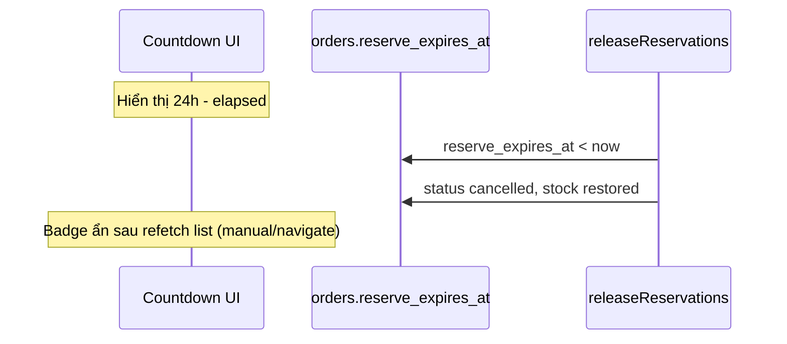

# Functional Requirement (FR) — Đồng hồ đếm ngược thanh toán đơn (Order Payment Countdown Timer)

## 1. Feature Overview

Hiển thị **thời gian còn lại** trước khi đơn VNPay hết hạn giữ kho (`reserve_expires_at`, thường **24h** sau `createOrder`). Không gọi API riêng — chỉ đọc field từ response list/detail.

**Hai component FE độc lập:**

| Component | Trang | Độ chi tiết | Interval |
|-----------|-------|-------------|----------|
| `CountdownBadge` | `OrdersPage` | `Xh Ym` | 60 giây |
| `PaymentCountdown` | `OrderDetailPage` | `HH:MM:SS` + cảnh báo | 1 giây |

**Backend hết hạn thật:** cron `releaseReservations.js` mỗi 2 phút (không đồng bộ realtime với UI).

---

## 2. Actors

| Actor | Mô tả |
|-------|-------|
| **Customer** | Thấy badge / đồng hồ trên đơn AWAITING_PAYMENT |
| **OrdersPage** | `CountdownBadge` |
| **OrderDetailPage** | `PaymentCountdown` |
| **createOrder** | Set `reserve_expires_at` |
| **releaseReservations** | Clear khi hết hạn |

---

## 3. Scope

### In Scope

- UI countdown từ `reserve_expires_at` ISO string.
- Ẩn khi hết giờ hoặc không có `expiresAt`.
- Cảnh báo < 10 phút trên detail (chỉ `PaymentCountdown`).
- Nguồn dữ liệu: `getUserOrdersV2` (có field) vs `getOrderDetailSlim` (thiếu field).

### Out of Scope

- Server push / WebSocket refresh khi cron hủy đơn.
- Countdown cho link retry 15 phút (`retryVnpayPayment.expires_at` — BE trả nhưng FE **không** hiển thị).
- Timer trên `CheckoutPage` (chưa thanh tạo đơn).

---

## 4. Data Source

### Backend — khi set `reserve_expires_at`

```javascript
// createOrder
const holdMs = isVnpay ? 24 * 60 * 60 * 1000 : 0;
reserve_expires_at: holdMs ? new Date(Date.now() + holdMs) : null,
```

COD: `null` → không hiển thị countdown.

### List API — có field

`getUserOrdersV2` map:

```javascript
reserve_expires_at: j.reserve_expires_at,
```

### Slim API — thiếu field (GAP)

`getOrderDetailSlim` **không** đưa `reserve_expires_at` vào `payload.order` → `PaymentCountdown` trên detail **không render** dù list có badge.

---

## 5. CountdownBadge (OrdersPage)

### Điều kiện render

```jsx
{o.status === "AWAITING_PAYMENT" && o.reserve_expires_at && (
  <CountdownBadge expiresAt={o.reserve_expires_at} />
)}
```

### Logic

```javascript
diff = new Date(expiresAt) - Date.now()
if (diff <= 0) → timeLeft = "Hết thời gian" → return null (ẩn badge)
hours = floor(diff / 1h)
minutes = floor((diff % 1h) / 1m)
display: `${hours}h ${minutes}m`
setInterval(updateTimer, 60000)
```

| # | Rule |
|---|------|
| BR-01 | Không hiển thị giây |
| BR-02 | Hết hạn → component `null` (không chữ "Hết thời gian" trên UI) |
| BR-03 | Cập nhật phút — có thể lệch tối đa ~59s |

### Styling

`bg-orange-100 text-orange-800` + icon `Clock` (lucide).

---

## 6. PaymentCountdown (OrderDetailPage)

### Điều kiện render (intended)

```jsx
{o.status === "AWAITING_PAYMENT" && o.reserve_expires_at && (
  <PaymentCountdown expiresAt={o.reserve_expires_at} onExpired={...} />
)}
```

**Thực tế:** `o.reserve_expires_at` undefined từ slim → block không mount.

### Logic

```javascript
// interval 1000ms
hours, minutes, seconds padded 2 digits → "HH:MM:SS"
isExpired → message "Đã hết thời gian thanh toán"
isWarning → hours===0 && minutes<=10 → text đỏ cảnh báo
onExpired callback optional — hiện không refetch
```

### UI states

| State | Hiển thị |
|-------|----------|
| Còn hạn | Đồng hồ + optional warning ≤10p |
| Hết hạn | AlertTriangle + "Đã hết thời gian..." |

---

## 7. Interaction với Cron



FE **không** tự refetch khi timer về 0 (detail `onExpired` trống).

---

## 8. Related FRs

| FR | Liên kết |
|----|----------|
| `FR_CreateOrder` | Set 24h |
| `FR_ReserveInventoryOnOrder` | Cron release |
| `FR_ViewOrderDetailSlim` | Thiếu field |
| `FR_ViewUserOrders` | Badge list |
| `FR_RetryVNPayPayment` | `expires_at` 15p không dùng ở UI |

---

## 9. Source Files

| File | Vai trò |
|------|---------|
| `client/app/pages/OrdersPage.jsx` | `CountdownBadge` |
| `client/app/pages/OrderDetailPage.jsx` | `PaymentCountdown` |
| `server/controllers/orderController.js` | `reserve_expires_at` create |
| `server/jobs/releaseReservations.js` | Hết hạn |
| `server/controllers/orderController.js` | `getUserOrdersV2`, `getOrderDetailSlim` |

---

## 10. Acceptance Criteria

- [ ] Đơn VNPay awaiting trên list hiện badge `Xh Ym` khi còn hạn.
- [ ] COD không có badge.
- [ ] Badge biến mất khi `expiresAt` quá khứ (client clock).
- [ ] Detail: sau khi slim trả `reserve_expires_at` → đồng hồ HH:MM:SS hiện (hiện **FAIL** do GAP).
- [ ] Cảnh báo 10 phút chỉ trên detail component.

---

## 11. Known Gaps

| # | Mô tả |
|---|--------|
| GAP-01 | **Slim thiếu `reserve_expires_at`** — detail countdown không hoạt động; list OK. |
| GAP-02 | `changePaymentMethod` COD→VNPay không set lại 24h — countdown list sai. |
| GAP-03 | Hết giờ UI không refetch — user vẫn thấy "AWAITING" đến khi reload. |
| GAP-04 | `retryVnpayPayment` trả `expires_at` 15p — không dùng. |
| GAP-05 | List badge ẩn khi hết giờ; detail sẽ hiện "hết thời gian" nếu có field — UX không đồng nhất. |
| GAP-06 | Phụ thuộc đồng hồ client; không sync NTP. |
