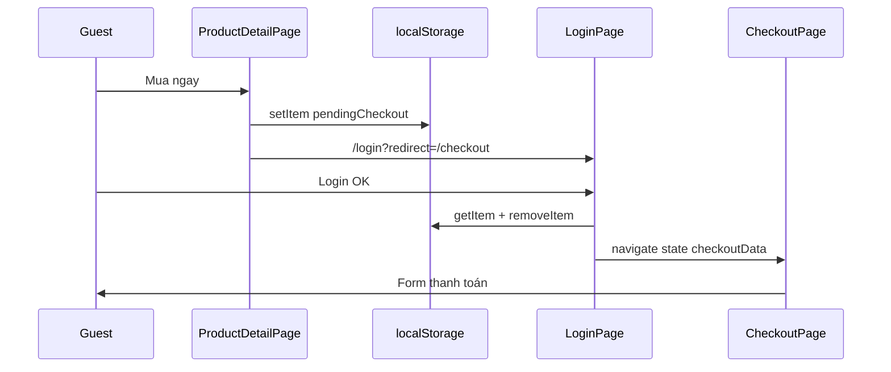

# Functional Requirement (FR) — Khôi phục checkout sau đăng nhập (Pending Checkout Restore After Login)

## 1. Feature Overview

Khi khách **chưa đăng nhập** cố **Mua ngay** (và một số path khác), FE lưu **checkout intent** vào `localStorage` key `pendingCheckout`, rồi chuyển login. Sau khi xác thực thành công, app **khôi phục** intent bằng `navigate("/checkout", { state: checkoutData })` — không dùng query string.

**Storage key:** `pendingCheckout` (JSON string).  
**TTL dọn rác:** 5 phút (App.jsx) khi user đã authenticated.  
**Logout:** `useAuth` xóa key.

---

## 2. Actors

| Actor | Mô tả |
|-------|-------|
| **Guest** | Buy now / add-to-cart redirect login |
| **LoginPage** | Restore sau `login.mutateAsync` |
| **OAuthSuccess** | Restore sau Google/Facebook |
| **App.jsx** | Xóa pending quá cũ |
| **useAuth (logout)** | Clear pending |

---

## 3. Scope

### In Scope

- Schema `pendingCheckout` object.
- Restore priority: pending **trước** `?redirect=` query.
- Remove sau khi dùng (one-shot).
- Timestamp optional cho TTL.

### Out of Scope

- Server-side draft checkout.
- Restore cho **CartPage** guest (hiện **không** lưu pending — xem GAP).
- Encrypt / sign localStorage payload.

---

## 4. Payload Schema

### Buy now (ProductDetailPage)

```json
{
  "mode": "buy_now",
  "items": [
    {
      "variation_id": 42,
      "quantity": 1,
      "product": {
        "product_name": "...",
        "thumbnail_url": "...",
        "discount_percentage": 10,
        "variation": { "price": 25000000 }
      }
    }
  ],
  "redirectAfterLogin": true,
  "timestamp": 1710000000000
}
```

| Field | Mô tả |
|-------|-------|
| `mode` | `"buy_now"` (cart mode có thể dùng nếu lưu tay) |
| `items` | Cùng shape `location.state` CheckoutPage cần |
| `product` trong item | Chỉ **hiển thị** — BE tính giá từ DB |
| `redirectAfterLogin` | Flag documentation — không đọc riêng ở Login |
| `timestamp` | Buy now có; add-to-cart guest **không** có timestamp |

### CheckoutPage consumption

```javascript
const intentMode = location.state?.mode;
const intentItems = location.state?.items || [];
// Thiếu → redirect /cart
```

Restore đặt **toàn bộ object** làm `location.state` — phải có `mode` + `items`.

---

## 5. Write Paths (ai set pendingCheckout)

| Nguồn | Khi nào | Có timestamp? |
|-------|---------|-----------------|
| `ProductDetailPage.handleBuyNow` | Guest | Có |
| `ProductDetailPage.handleAddToCart` | Guest (redirect login) | **Không** |
| `CartPage.handleCheckout` | Guest | **Không lưu** — chỉ `navigate("/login?redirect=/checkout")` |

---

## 6. Restore Paths

### 6.1 LoginPage — email/password

```javascript
await login.mutateAsync({ username, password });

const pendingCheckout = localStorage.getItem('pendingCheckout');
if (pendingCheckout) {
  const checkoutData = JSON.parse(pendingCheckout);
  localStorage.removeItem('pendingCheckout');
  navigate('/checkout', { state: checkoutData });
  return; // bỏ qua redirect query
}

const redirect = searchParams.get("redirect") || "/";
navigate(redirect);
```

**Priority:** `pendingCheckout` > `?redirect=/checkout`.

### 6.2 OAuthSuccess

```javascript
api.get("/auth/me").then(({ data }) => {
  dispatch(setCredentials({ token, user: data.user }));
  const pendingCheckout = localStorage.getItem('pendingCheckout');
  if (pendingCheckout) {
    const checkoutData = JSON.parse(pendingCheckout);
    localStorage.removeItem('pendingCheckout');
    navigate('/checkout', { state: checkoutData, replace: true });
    return;
  }
  navigate("/", { replace: true });
});
```

### 6.3 Không restore

- Register thành công (không đọc pending trong flow chuẩn).
- Login không có pending → `redirect` param hoặc `/`.

---

## 7. Cleanup / TTL

### App.jsx — user đã authenticated

```javascript
if (Date.now() - (pendingCheckout.timestamp || 0) > 300000) {
  localStorage.removeItem('pendingCheckout');
}
```

| # | Rule |
|---|------|
| BR-01 | `timestamp` missing → coi `0` → **luôn > 5 phút** → **xóa ngay** khi user login (add-to-cart guest payload) |
| BR-02 | Chỉ chạy khi `isAuthenticated` true |

### useAuth logout

```javascript
localStorage.removeItem("pendingCheckout");
```

Tránh user B thấy intent của user A trên cùng browser.

---

## 8. Interaction với ProtectedRoute

`/checkout` bọc `ProtectedRoute` — sau login token có → vào được checkout với state restored.

Nếu chỉ có `?redirect=/checkout` **không** có pending:

- User tới `/checkout` **không** có `location.state` → CheckoutPage `useEffect` → **replace `/cart`**.

---

## 9. Sequence — Buy now guest



---

## 10. Related FRs

| FR | Liên kết |
|----|----------|
| `FR_BuyNowWithPendingCheckout` | Ghi pending buy now |
| `FR_CheckoutPageFlow` | Tiêu thụ state |
| `FR_OAuthSuccessCallback` (auth) | OAuth restore |
| `FR_SelectCartItemsForCheckout` | Cart checkout khác guest flow |

---

## 11. Source Files

| File | Vai trò |
|------|---------|
| `client/app/pages/ProductDetailPage.jsx` | set pending |
| `client/app/pages/LoginPage.jsx` | restore |
| `client/app/pages/OAuthSuccess.jsx` | restore OAuth |
| `client/app/App.jsx` | TTL cleanup |
| `client/app/hooks/useAuth.js` | logout clear |
| `client/app/pages/CartPage.jsx` | guest **không** set pending |
| `client/app/pages/CheckoutPage.jsx` | consume state |

---

## 12. Acceptance Criteria

- [ ] Guest buy now → login → checkout hiện đúng SKU/qty.
- [ ] pending bị xóa sau restore (không double apply).
- [ ] OAuth login cùng hành vi.
- [ ] pending có timestamp < 5p vẫn restore được.
- [ ] Logout xóa pending.

---

## 13. Known Gaps

| # | Mô tả |
|---|--------|
| GAP-01 | **Cart guest:** login với `redirect=/checkout` nhưng **mất** selected items — vào checkout redirect cart. |
| GAP-02 | **Add-to-cart guest** lưu pending **không** timestamp → App xóa ngay khi authenticated → race trước Login restore. |
| GAP-03 | Add-to-cart guest payload `mode: buy_now` — misleading (không phải buy now). |
| GAP-04 | Không validate `variation_id` còn tồn tại/stock sau login. |
| GAP-05 | `redirectAfterLogin` không được đọc — dead field. |
| GAP-06 | Multi-tab: hai pending ghi đè nhau. |
