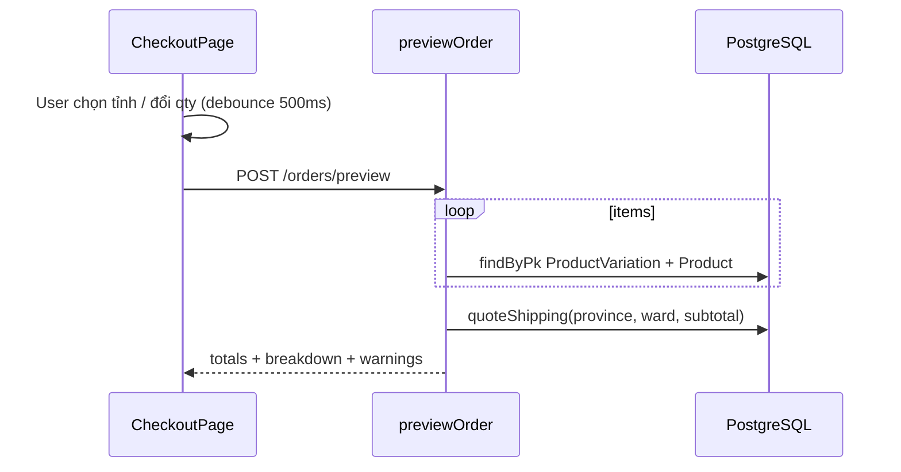

# Functional Requirement (FR) — Xem trước đơn hàng (Preview Order)

## 1. Feature Overview

Trước khi **POST /api/orders**, client gọi API **không ghi DB** để tính tổng tiền, phí ship và cảnh báo tồn kho:

```
POST /api/orders/preview
Authorization: Bearer <JWT> (khuyến nghị; route yêu cầu auth)
Body: { items[], province_id, ward_id? }
```

**Mục đích:** Hiển thị realtime trên `CheckoutPage` khi user chọn tỉnh/phường hoặc đổi số lượng — **debounce 500ms** (`useOrderPreview`).

---

## 2. Actors

| Actor | Mô tả |
|-------|-------|
| **Authenticated Customer** | Checkout với intent items |
| **CheckoutPage** | Truyền `viewItems` + `provinceId` + `wardId` |
| **orderController.previewOrder** | Tính toán read-only |

---

## 3. Scope

### In Scope

- Validate `items` không rỗng, có `province_id`.
- Load variation + product từ DB.
- `items_breakdown` chi tiết từng dòng (giá, giảm, thumbnail, slug).
- `stock_warnings` (không chặn response).
- `quoteShipping` + `final_amount`.
- FE fallback tính tạm nếu chưa có province / preview lỗi.

### Out of Scope

- Ghi Order / Payment / trừ kho.
- Preview khi chưa login (route vẫn 401 nếu không token).
- Coupon, thuế, điểm thưởng.

---

## 4. Preconditions

| # | Điều kiện |
|---|-----------|
| PRE-01 | JWT (middleware `orderRoutes`) |
| PRE-02 | `items.length >= 1` |
| PRE-03 | `province_id` có giá trị (BE); FE chỉ gọi khi đã chọn tỉnh |

---

## 5. API Contract

### Request

```json
{
  "province_id": 79,
  "ward_id": 12345,
  "items": [
    { "variation_id": 10, "quantity": 1 }
  ]
}
```

`quantity` mặc định `1` nếu thiếu (`Math.max(1, Number(...))`).

### Response — 200

```json
{
  "total_amount": 25000000,
  "discount_amount": 2500000,
  "subtotal_after_discount": 22500000,
  "shipping_fee": 30000,
  "shipping_reason": "HCM_SUBTOTAL_FREE",
  "final_amount": 22530000,
  "items_breakdown": [
    {
      "variation_id": 10,
      "product_name": "Laptop X",
      "quantity": 1,
      "unit_price": 25000000,
      "unit_discount_amount": 2500000,
      "unit_final_price": 22500000,
      "item_total": 25000000,
      "item_discount": 2500000,
      "item_subtotal_after_discount": 22500000,
      "thumbnail_url": "https://...",
      "slug": "laptop-x"
    }
  ],
  "stock_warnings": [
    { "variation_id": 10, "message": "Only 0 left in stock" }
  ]
}
```

### Errors

| HTTP | Message |
|------|---------|
| 400 | `No items` |
| 400 | `Missing province_id` |
| 400 | `Variation {id} not found` |

---

## 6. Business Rules

| # | Rule |
|---|------|
| BR-01 | Giá & % giảm lấy từ **DB**, giống `createOrder` |
| BR-02 | `stock_warnings` khi `!is_available` hoặc `available < qty` — **vẫn trả 200** |
| BR-03 | `ward_id` optional trên BE; `quoteShipping` vẫn chạy (có thể thiếu `extra_fee` phường) |
| BR-04 | `shipping_reason` từ `quoteShipping`: `FREE_BY_PROVINCE`, `HCM_SUBTOTAL_FREE`, `NO_PROVINCE`, v.v. |
| BR-05 | Không lock row — race với đơn khác vẫn có thể xảy ra lúc create |

### Công thức (khớp createOrder)

```
unit_discount_amount = round(price * discount_percentage / 100)
item_subtotal_after_discount = unit_final_price * qty (sau round)
subtotal_after_discount = total_amount - discount_amount
final_amount = subtotal_after_discount + shipping_fee
```

---

## 7. Frontend — useOrderPreview

```javascript
// Gọi khi: viewItems.length > 0 && provinceId
// Debounce 500ms
POST /orders/preview {
  province_id: Number(provinceId),
  ward_id: wardId ? Number(wardId) : null,
  items: viewItems.map(({ variation_id, quantity }) => ({ variation_id, quantity })),
}
```

### CheckoutPage hiển thị

| Field UI | Nguồn |
|----------|-------|
| Tạm tính | `preview.subtotal_after_discount` hoặc `fallbackSubtotalAfterDiscount` |
| Phí ship | `preview.shipping_fee` hoặc `0` |
| Tổng | `preview.final_amount` hoặc fallback |

`previewLoading` / `previewError` — có thể không hiển thị banner lỗi rõ (tùy UI).

**Dependency:** `JSON.stringify(viewItems)` trong effect — đổi reference object có thể trigger lại preview.

---

## 8. Sequence



---

## 9. Route Ordering Note

Trong `orderRoutes.js`, `POST /preview` đăng ký **sau** các route `/:order_id/...`. Path tĩnh `/preview` **không** conflict với `POST /:order_id/cancel` vì path khác nhau. **Không** dùng `GET /orders/preview` (sẽ match `GET /:order_id` nếu thêm sau).

---

## 10. Related FRs

| FR | Liên kết |
|----|----------|
| `FR_CreateOrder` | Cùng công thức; create **reject** nếu hết hàng |
| `FR_SelectCartItemsForCheckout` | Nguồn `items` |
| Shipping / Geo | `quoteShipping`, provinces/wards API |

---

## 11. Source Files

| Layer | File |
|-------|------|
| Route | `server/routes/orderRoutes.js` — `POST /preview` |
| Controller | `server/controllers/orderController.js` — `previewOrder` |
| Shipping | `server/services/shippingService.js` |
| FE Hook | `client/app/hooks/useOrderPreview.js` |
| FE Page | `client/app/pages/CheckoutPage.jsx` |

---

## 12. Acceptance Criteria

- [ ] Có items + province → 200 với `final_amount` khớp createOrder cùng input.
- [ ] Hết hàng → `stock_warnings` non-empty, vẫn 200.
- [ ] Không items → 400.
- [ ] Đổi ward sau debounce → shipping_fee cập nhật.
- [ ] Chưa chọn province trên FE → không gọi API (data null).

---

## 13. Known Gaps

| # | Mô tả |
|---|--------|
| GAP-01 | Preview **không** bắt buộc `ward_id`; createOrder **bắt buộc** — user có thể thấy ship khác nếu chưa chọn phường. |
| GAP-02 | Preview không yêu cầu `geo_lat/lng`; createOrder có — user có thể preview xong mới fail geo. |
| GAP-03 | `previewError` trên FE có thể không được render prominently. |
| GAP-04 | Biến `subtotal`/`shipping=30000` legacy trên CheckoutPage không dùng cho submit (chỉ preview/fallback). |
