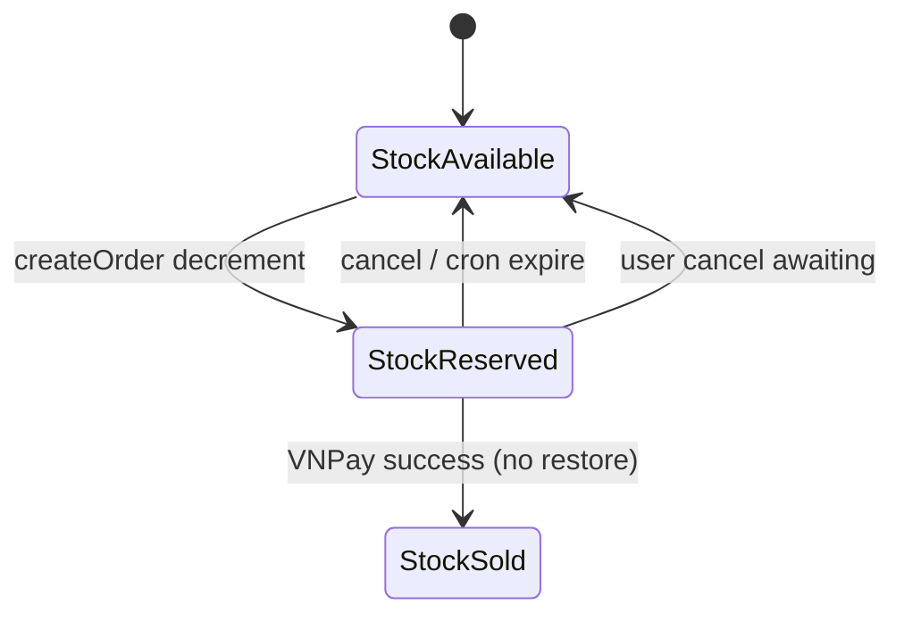

# Functional Requirement (FR) — Giữ kho khi đặt hàng (Reserve Inventory on Order)

## 1. Feature Overview

Khi tạo đơn (và trong một số luồng hủy/hết hạn), hệ thống **trừ ngay** `product_variations.stock_quantity` trong DB — gọi là **reserve** (giữ hàng). Không có bảng `reservations` riêng; trạng thái giữ gắn với `orders.reserve_expires_at` (VNPay) và cron job.

**Triển khai chính:** `orderController.createOrder` bước 4.  
**Hoàn kho:** `cancelOrder`, `releaseReservations` cron.

---

## 2. Actors

| Actor | Mô tả |
|-------|-------|
| **createOrder** | Pessimistic lock + decrement |
| **cancelOrder** | Increment stock theo `OrderItem` |
| **releaseReservations job** | Hết hạn VNPay → hoàn kho + hủy đơn |
| **Admin ship/deliver** | Không hoàn kho (đã bán) |

---

## 3. Scope

### In Scope

- Lock row `product_variations` (`LOCK.UPDATE`, `skipLocked: true`).
- `decrement("stock_quantity", { by: quantity })` trong transaction create.
- Kiểm tra stock **hai lần**: trước tạo order (soft) và khi reserve (hard).
- VNPay: `reserve_expires_at = now + 24h`.
- Cron 2 phút: đơn `AWAITING_PAYMENT` quá hạn → hoàn kho, `cancelled`, payment `failed`.

### Out of Scope

- Reserve khi chỉ preview.
- Soft reserve / cart hold TTL.
- Đồng bộ kho đa kho / warehouse.

---

## 4. Business Rules — Create (Reserve)

```text
FOR each item in itemsForOrder:
  1. ProductVariation.findOne({
       where: { variation_id },
       transaction: t,
       lock: t.LOCK.UPDATE,
       skipLocked: true,
     })
  2. IF !v → rollback 400 "not found during reserve"
  3. IF stock_quantity < quantity → rollback 400 "Out of stock during reserve"
  4. v.decrement("stock_quantity", { by: quantity, transaction: t })
  5. OrderItem.create({ price, discount_amount, subtotal snapshot })
```

| # | Rule |
|---|------|
| BR-01 | **COD và VNPAY đều trừ kho ngay** khi tạo đơn |
| BR-02 | Không lock trên query có `include` Product — tránh deadlock/lỗi Postgres |
| BR-03 | `skipLocked: true` — request khác có thể skip row → fail reserve thay vì chờ |
| BR-04 | `OrderItem` lưu giá tại thời điểm đặt (không đổi khi admin sửa giá sau) |

### VNPay TTL

```javascript
const holdMs = isVnpay ? 24 * 60 * 60 * 1000 : 0;
reserve_expires_at: holdMs ? new Date(Date.now() + holdMs) : null
```

---

## 5. Business Rules — Release (Hoàn kho)

### 5.1 User cancel (`cancelOrder`)

Điều kiện được hủy → với mỗi `OrderItem`:

```javascript
ProductVariation.increment("stock_quantity", { by: it.quantity, transaction: t });
```

### 5.2 Cron `releaseReservations.js`

| Thuộc tính | Giá trị |
|------------|---------|
| Schedule | `*/2 * * * *` (mỗi 2 phút) |
| Advisory lock | PostgreSQL key `987654321` |
| Điều kiện | `status = AWAITING_PAYMENT` AND `reserve_expires_at < now` |

Vòng lặp:

1. Load order (FOR UPDATE, skipLocked).
2. Load `OrderItem`s.
3. Increment stock từng variation.
4. `Payment.update({ payment_status: "failed" })` where VNPAY pending.
5. `order.status = "cancelled"`, `reserve_expires_at = null`.

**Lưu ý:** Comment trong job từng dùng `FAILED`; hiện set **`cancelled`** (chữ thường).

### 5.3 VNPay thanh toán thành công

`vnpayReturn`: **không** cộng lại kho — coi như đã bán.

---

## 6. State Diagram (Kho vs Đơn VNPay)



---

## 7. Interaction với Payment / Order status

| Giai đoạn | Order.status | Stock |
|-----------|--------------|-------|
| VNPay vừa tạo | AWAITING_PAYMENT | Đã trừ |
| VNPay paid | processing | Giữ trừ |
| VNPay hết 24h | cancelled (cron) | Hoàn |
| COD tạo | processing | Đã trừ |
| User hủy chờ ship | cancelled | Hoàn |

---

## 8. Edge Cases

| # | Tình huống | Hành vi |
|---|------------|---------|
| EC-01 | Concurrent checkout SKU=1 | Một bên reserve fail |
| EC-02 | Cron + user cancel cùng lúc | Transaction + lock giảm double-restore (cần test) |
| EC-03 | `changePaymentMethod` COD→VNPay | Kho **đã** trừ từ trước; không trừ lại |
| EC-04 | Admin refund cancelled VNPAY | `adminController.refund` — ngoài scope reserve doc |
| EC-05 | Payment fail return URL | Kho **vẫn** trừ cho đến user cancel/cron |

---

## 9. Related FRs

| FR | Liên kết |
|----|----------|
| `FR_CreateOrder` | Gọi reserve |
| `FR_CancelOrder` | Hoàn kho |
| `FR_PreviewOrder` | Chỉ warning, không reserve |

---

## 10. Source Files

| Layer | File |
|-------|------|
| Create reserve | `server/controllers/orderController.js` (~L239–282) |
| Cancel restore | `server/controllers/orderController.js` — `cancelOrder` |
| Cron | `server/jobs/releaseReservations.js` |
| Model | `server/models/Order.js` — `reserve_expires_at` |
| Server boot | `server/server.js` (import job nếu có) |
| Spec | `docs/master_specification.md` §10.4 |

---

## 11. Acceptance Criteria

- [ ] Sau createOrder thành công, `stock_quantity` giảm đúng tổng qty.
- [ ] Rollback create → stock không đổi.
- [ ] Cancel hợp lệ → stock tăng lại đúng qty từng dòng.
- [ ] Đơn VNPay quá `reserve_expires_at` → cron hoàn kho + cancelled.
- [ ] VNPay success không hoàn kho tự động.

---

## 12. Known Gaps

| # | Mô tả |
|---|--------|
| GAP-01 | `changePaymentMethod` sang VNPAY **không** set `reserve_expires_at` — countdown FE có thể sai. |
| GAP-02 | VNPay return **failed** không auto-release kho (chờ cron 24h hoặc user cancel). |
| GAP-03 | Master spec §10.4 bước 5b ghi order `cancelled`; tab `failed` dùng `order.FAILED` — cron không set FAILED. |
| GAP-04 | Không có IPN — chỉ Return URL cập nhật paid; user đóng tab có thể lệch trạng thái tạm thời. |
| GAP-05 | `skipLocked` có thể gây trải nghiệm "Variation not found during reserve" khó hiểu với user. |
