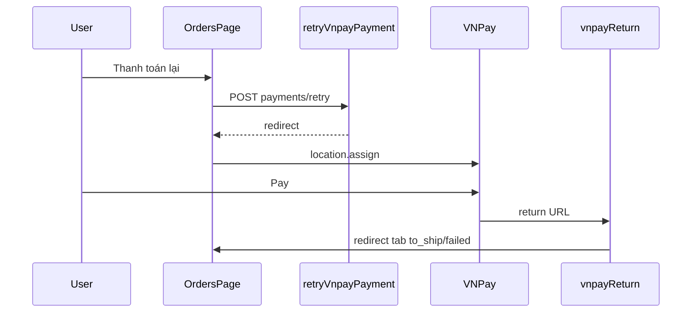

# Functional Requirement (FR) — Thanh toán lại VNPay (Retry VNPay Payment)

## 1. Feature Overview

Khách tạo **link thanh toán VNPay mới** cho đơn đã tồn tại (cùng provider VNPAY), khi đơn vẫn chờ thanh toán hoặc ở trạng thái failed:

```
POST /api/orders/:order_id/payments/retry
Authorization: Bearer <JWT>
Body: { "method": "VNPAYQR" | "VNBANK" | "INTCARD" }
```

**FE:** `useRetryVnpayPayment({ autoRedirect: true })` — `OrdersPage`, `OrderDetailPage`.  
**Khác** `changePaymentMethod`: retry **không** đổi COD↔VNPay, chỉ sinh `txn_ref` + URL mới.

---

## 2. Actors

| Actor | Mô tả |
|-------|-------|
| **Customer** | "Thanh toán ngay" / "Thanh toán lại" |
| **retryVnpayPayment** | Controller |
| **vnpayService.getPaymentUrl** | Build redirect |
| **vnpayReturn** | Xử lý sau khi user quay lại |

---

## 3. Scope

### In Scope

- Validate owner + VNPAY payment record.
- Điều kiện: `payment.pending` AND (`AWAITING_PAYMENT` OR `FAILED`).
- `txn_ref` mới: `{order_id}-{timestamp}`.
- Response `redirect`, `txn_ref`, `expires_at` (+15 phút metadata).
- FE auto `window.location.assign(redirect)` on success.

### Out of Scope

- Tạo đơn mới.
- IPN server-side.
- Gia hạn `reserve_expires_at` 24h trên order.
- Hiển thị countdown 15p từ `expires_at` (FE bỏ qua).

---

## 4. API Contract

### Request

```json
{ "method": "VNPAYQR" }
```

Default BE: `VNPAYQR` nếu omitted.  
`INSTALLMENT` có trong createOrder VALID nhưng retry comment chỉ liệt kê 3 method — vẫn pass nếu gửi.

### Response — 200

```json
{
  "redirect": "https://sandbox.vnpayment.vn/...",
  "order_id": 1,
  "txn_ref": "1-1710000000000",
  "expires_at": "2026-05-27T10:15:00.000Z"
}
```

`expires_at` = server `now + 15 minutes` — **gợi ý** hiển thị, không enforce gateway.

### Errors

| HTTP | Message |
|------|---------|
| 404 | `Order not found` |
| 400 | `Payment record not found or not VNPAY` |
| 400 | `Order not eligible for retry payment` |
| 500 | VNPay config / getPaymentUrl throw |

---

## 5. Backend Logic

```text
BEGIN TRANSACTION
1. Lock Order (user_id match)
2. Lock Payment where provider = VNPAY
3. allow = payment_status === "pending" AND status IN (AWAITING_PAYMENT, FAILED)
4. payment.update({ txn_ref: newTxnRef })
5. redirect = getPaymentUrl({ method, amount, txnRef, orderDesc, ipAddr })
6. COMMIT
return { redirect, order_id, txn_ref, expires_at }
```

| # | Rule |
|---|------|
| BR-01 | **Không** đổi `order.status` trong retry |
| BR-02 | **Không** reset `payment_status` nếu đang pending |
| BR-03 | `amount` = `payment.amount` hoặc `order.final_amount` |
| BR-04 | `INSTALLMENT` không block ở retry (khác changePaymentMethod VALID) |

---

## 6. Frontend — useRetryVnpayPayment

```javascript
mutationFn: async ({ orderId, method = "VNPAYQR" }) => {
  const { data } = await api.post(`/orders/${orderId}/payments/retry`, { method });
  return data;
},
onSuccess: (data, variables) => {
  qc.invalidateQueries(["orders"]);
  qc.invalidateQueries(["order", variables.orderId]);
  qc.invalidateQueries(["order-counters"]);
  if (data?.redirect && autoRedirect) {
    window.location.assign(data.redirect);
  }
},
```

---

## 7. UI Entry Points

### OrdersPage

Điều kiện hiện nút **"Thanh toán ngay"**:

```javascript
o.status === "AWAITING_PAYMENT" && o.payment?.provider === "VNPAY"
```

**Không** hiện trên tab `failed` dù BE cho phép `FAILED` — GAP.

Method: `o.payment?.payment_method || "VNPAYQR"`.

### OrderDetailPage

`canPayAgain`:

```javascript
(o.status === "AWAITING_PAYMENT" && pay.provider === "VNPAY" && pay.payment_status === "pending")
|| (o.status === "FAILED" && pay.provider === "VNPAY")
```

Nút **"Thanh toán lại"** — cover failed case trên detail.

---

## 8. Post-Payment — vnpayReturn

User quay về `GET /api/vnpay/return` → redirect FE:

| Result | Redirect |
|--------|----------|
| success | `/checkout/vnpay-return?status=success&orderId=` → immediate `/orders?tab=to_ship` |
| failed | `tab=failed` |

`vnpayReturn` cập nhật:

- success: `payment.completed`, `order.processing`
- failed: `payment.failed` only (**order status** thường vẫn AWAITING)

---

## 9. Sequence



---

## 10. Related FRs

| FR | Liên kết |
|----|----------|
| `FR_CreateOrder` | Tạo txn_ref lần đầu |
| `FR_ChangePaymentMethod` | Đổi COD→VNPay |
| `FR_OrderPaymentCountdownTimer` | 24h reserve vs 15p link |
| `FR_ViewUserOrders` | Nút list |

---

## 11. Source Files

| File | Vai trò |
|------|---------|
| `server/routes/orderRoutes.js` | Route |
| `server/controllers/orderController.js` | `retryVnpayPayment` |
| `server/services/vnpayService.js` | URL |
| `server/controllers/vnpayController.js` | Return |
| `client/app/hooks/useOrders.js` | Hook |
| `client/app/pages/OrdersPage.jsx` | CTA list |
| `client/app/pages/OrderDetailPage.jsx` | CTA detail |
| `client/app/pages/checkout/VnpayReturn.jsx` | Landing redirect |

---

## 12. Acceptance Criteria

- [ ] AWAITING + VNPAY pending → 200 + redirect URL mới.
- [ ] Mỗi retry đổi `txn_ref` trên payment.
- [ ] COD order → 400 not VNPAY.
- [ ] Delivered + pending impossible → 400 eligible.
- [ ] FE auto redirect khi `autoRedirect: true`.
- [ ] Detail: FAILED + VNPAY hiện nút; list có thể không.

---

## 13. Known Gaps

| # | Mô tả |
|---|--------|
| GAP-01 | **OrdersPage** không nút retry cho `FAILED` — chỉ detail. |
| GAP-02 | `expires_at` 15p không hiển thị UI. |
| GAP-03 | Tab `failed` FE redirect VnpayReturn nhưng order status có thể vẫn AWAITING — tab trống. |
| GAP-04 | Retry không gia hạn `reserve_expires_at` — cron có thể hủy đơn trong lúc user retry. |
| GAP-05 | `vnpayReturn` fail không set `order.FAILED` — retry eligibility trên detail dựa `FAILED` hiếm. |
| GAP-06 | Không có rate limit retry — spam link. |
