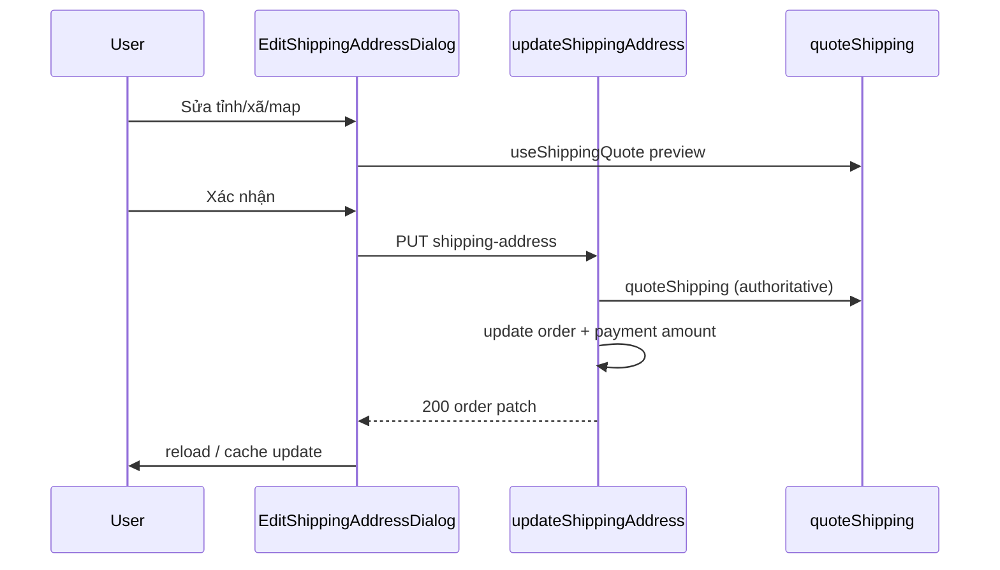

# Functional Requirement (FR) — Cập nhật địa chỉ giao hàng đơn (Update Order Shipping Address)

## 1. Feature Overview

Khách chỉnh **địa chỉ giao hàng** (và tọa độ) trên đơn **chưa giao / chưa hủy**, đồng thời **tính lại phí ship** và `final_amount`:

```
PUT /api/orders/:order_id/shipping-address
Authorization: Bearer <JWT>
Body: { shipping_name?, shipping_phone?, shipping_address?, province_id?, ward_id?, geo_lat?, geo_lng? }
```

**FE:** `OrderDetailPage` → `EditShippingAddressDialog` → `useUpdateShippingAddress`.

---

## 2. Actors

| Actor | Mô tả |
|-------|-------|
| **Customer** | Sửa địa chỉ trên detail |
| **updateShippingAddress** | Transaction + quoteShipping |
| **EditShippingAddressDialog** | Form + map + shipping quote preview |
| **useShippingQuote** | `GET /api/quote` hoặc tương đương |
| **emailService** | `sendOrderUpdateEmail` SHIPPING_ADDRESS |

---

## 3. Scope

### In Scope

- Partial update (field null → giữ giá trị cũ).
- Recalculate `shipping_fee`, `final_amount`.
- Sync `payment.amount` nếu payment chưa `completed`.
- Chặn đổi ship làm đổi tiền khi VNPAY đã completed.
- FE confirm khi phí ship thay đổi (dialog nội bộ).
- MapPicker + geocode Nominatim (giống checkout).

### Out of Scope

- Đổi địa chỉ sau `shipping` / `delivered` / `cancelled`.
- Admin sửa đơn (endpoint khác nếu có).
- Đổi danh sách sản phẩm đơn.

---

## 4. Preconditions

| # | Điều kiện |
|---|-----------|
| PRE-01 | JWT, `order.user_id` match |
| PRE-02 | `order.status` NOT IN (`shipping`, `delivered`, `cancelled`) |
| PRE-03 | `province_id` sau merge phải có (cũ hoặc mới) |
| PRE-04 | FE: không hiện nút nếu VNPAY completed hoặc status chặn |

### FE nút "Sửa địa chỉ"

```javascript
!["shipping", "delivered", "cancelled"].includes(o.status) &&
!(pay?.provider === "VNPAY" && pay?.payment_status === "completed")
```

---

## 5. API Contract

### Request (example)

```json
{
  "shipping_name": "Nguyễn Văn B",
  "shipping_phone": "0909999888",
  "shipping_address": "109 Hiệp Bình, Phường X, TP.HCM",
  "province_id": 79,
  "ward_id": 12345,
  "geo_lat": 10.82,
  "geo_lng": 106.72
}
```

Tất cả optional — merge với giá trị hiện tại.

### Response — 200

```json
{
  "message": "Shipping address updated",
  "order": {
    "order_id": 1,
    "shipping_name": "...",
    "shipping_phone": "...",
    "shipping_address": "...",
    "province_id": 79,
    "ward_id": 12345,
    "geo_lat": 10.82,
    "geo_lng": 106.72,
    "shipping_fee": 30000,
    "final_amount": 22530000
  }
}
```

### Errors

| HTTP | Message |
|------|---------|
| 404 | `Order not found` |
| 400 | `Cannot change shipping address in current state.` |
| 400 | `province_id is required (current or new)` |
| 400 | VNPAY completed + ship fee change (tiếng Việt, liên hệ hỗ trợ) |

---

## 6. Backend Business Rules

```javascript
newProvinceId = province_id ?? order.province_id
newWardId = ward_id ?? order.ward_id
subtotal = total_amount - discount_amount
{ shipping_fee: newShipFee } = await quoteShipping({ province_id, ward_id, subtotal })
willChangeAmount = newShipFee !== oldShipFee

if (VNPAY && payment.completed && willChangeAmount) → 400 rollback

patch = {
  shipping_name, shipping_phone, shipping_address,
  province_id, ward_id, geo_lat, geo_lng,
  shipping_fee: newShipFee,
  final_amount: max(0, subtotal + newShipFee),
}
order.update(patch)

if (payment && payment_status !== "completed") {
  payment.update({ amount: order.final_amount })
}
```

| # | Rule |
|---|------|
| BR-01 | **Không** recalc `total_amount` / `discount_amount` — chỉ ship + final |
| BR-02 | VNPAY đã trả tiền: cho sửa địa chỉ **nếu phí ship không đổi** |
| BR-03 | COD pending: cho phép đổi ship → đổi `payment.amount` |
| BR-04 | Email async `changeType: 'SHIPPING_ADDRESS'` |

### Debug logging

Controller `console.log` debug/success — nên tắt production.

---

## 7. Frontend — EditShippingAddressDialog

### Props

| Prop | Mô tả |
|------|-------|
| `initialValue` | shipping fields + geo từ order |
| `provincesData` | Preload từ `useProvinces()` parent |
| `currentShippingFee` | So sánh delta |
| `subtotal` | `final_amount - shipping_fee` từ parent |
| `onSubmit(payload)` | Gọi mutation |

### Shipping preview trong modal

`useShippingQuote({ provinceId, wardId, subtotal })` → `newShippingFee`, `reason`.

### Confirm khi đổi phí

State `confirmDialog` — hiện chênh lệch trước khi gọi `onSubmit` (xem file đầy đủ ~L150+).

### Map

- `MapPicker`, `locationConfirmed` bắt buộc trước submit (tương tự checkout).
- Geocode Nominatim on address blur.

### Payload submit (typical)

```javascript
{
  shipping_name, shipping_phone, shipping_address,
  province_id: Number(form.province_id),
  ward_id: Number(form.ward_id),
  geo_lat: locationLL.lat,
  geo_lng: locationLL.lng,
}
```

---

## 8. Frontend — OrderDetailPage onSuccess

```javascript
updateAddr.mutate({ orderId, payload }, {
  onSuccess: (data) => {
    setOpenEditShip(false);
    queryClient.setQueryData(["order", id], old => ({
      ...old, order: { ...old?.order, ...data.order }
    }));
    queryClient.invalidateQueries(["order", id]);
    queryClient.invalidateQueries(["orders"]);
    setTimeout(() => window.location.reload(), 500); // force reload
  },
  onError: (err) => alert(err?.response?.data?.message || "..."),
});
```

| # | Note |
|---|------|
| N-01 | `window.location.reload()` — workaround cache/UI |
| N-02 | `console.log` verbose trong hook |

---

## 9. Sequence



---

## 10. Related FRs

| FR | Liên kết |
|----|----------|
| `FR_CheckoutPageFlow` | Cùng geo/map pattern |
| `FR_ViewOrderDetailSlim` | Host page |
| `FR_CreateOrder` | Tạo địa chỉ lần đầu |
| Shipping service | `server/services/shippingService.js` |

---

## 11. Source Files

| File | Vai trò |
|------|---------|
| `server/routes/orderRoutes.js` | PUT route |
| `server/controllers/orderController.js` | `updateShippingAddress` |
| `server/services/shippingService.js` | `quoteShipping` |
| `client/app/components/EditShippingAddressDialog.jsx` | UI |
| `client/app/hooks/useOrders.js` | `useUpdateShippingAddress` |
| `client/app/hooks/useShippingQuote.js` | Quote FE |
| `client/app/pages/OrderDetailPage.jsx` | Integration |
| `server/services/emailService.js` | Notify |

---

## 12. Acceptance Criteria

- [ ] Đổi ward làm tăng ship → `final_amount` và `payment.amount` (pending) cập nhật.
- [ ] VNPAY completed + ship đổi → 400 message tiếng Việt.
- [ ] `shipping` status → 400.
- [ ] FE ẩn nút sửa khi VNPAY completed.
- [ ] Map bắt xác nhận vị trí trước submit dialog.

---

## 13. Known Gaps

| # | Mô tả |
|---|--------|
| GAP-01 | `window.location.reload()` sau success — UX giật, che lỗi cache. |
| GAP-02 | `order._previousDataValues` email có thể sai sau `update` trong cùng request. |
| GAP-03 | Không chặn `AWAITING_PAYMENT` / `FAILED` explicitly — chỉ 3 status; AWAITING vẫn sửa được. |
| GAP-04 | FE `subtotal = final_amount - shipping_fee` giả định không có phí khác. |
| GAP-05 | Debug `console.log` trong controller và hook. |
| GAP-06 | Slim response sau update merge manual — field thiếu vẫn có thể lệch đến reload. |
