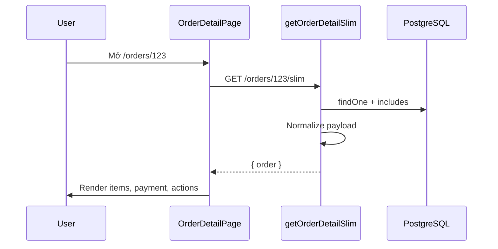

# Functional Requirement (FR) — Chi tiết đơn hàng (Slim) — View Order Detail Slim

## 1. Feature Overview

API chi tiết đơn **đã chuẩn hóa** cho frontend — giảm payload, số đã `Number()`:

```
GET /api/orders/:order_id/slim
Authorization: Bearer <JWT>
```

**FE:** `OrderDetailPage` → `useOrder(id)` → queryKey `["order", id]`.

Đây là **nguồn dữ liệu chính** cho timeline, sửa địa chỉ, đổi payment, hủy đơn, retry VNPay trên UI khách.

---

## 2. Actors

| Actor | Mô tả |
|-------|-------|
| **Customer** | `/orders/:id` |
| **OrderDetailPage** | Render + dialogs |
| **getOrderDetailSlim** | Map JSON |

---

## 3. Scope

### In Scope

- Order metadata + shipping + geo.
- `items[]` với product summary (thumb, slug, name).
- `payment` object chuẩn hóa.
- Sort items `order_item_id ASC`.

### Out of Scope

- Full variation specs / tags.
- Lịch sử audit trạng thái (chỉ UI timeline tĩnh).

---

## 4. API Response — 200

```json
{
  "order": {
    "order_id": 1,
    "order_code": "ORD-ABC",
    "status": "AWAITING_PAYMENT",
    "total_amount": 25000000,
    "discount_amount": 2500000,
    "final_amount": 22530000,
    "shipping_fee": 30000,
    "shipping_name": "Nguyễn Văn A",
    "shipping_phone": "0901234567",
    "shipping_address": "123..., Phường X, TP.HCM",
    "province_id": 79,
    "ward_id": 12345,
    "geo_lat": 10.776889,
    "geo_lng": 106.700806,
    "created_at": "2026-05-27T10:00:00.000Z",
    "payment": {
      "provider": "VNPAY",
      "payment_method": "VNPAYQR",
      "payment_status": "pending",
      "amount": 22530000,
      "txn_ref": "1-1710000000000",
      "paid_at": null
    },
    "items": [
      {
        "order_item_id": 1,
        "variation_id": 10,
        "quantity": 1,
        "price": 25000000,
        "discount_amount": 2500000,
        "subtotal": 22500000,
        "product": {
          "product_id": 5,
          "product_name": "Laptop X",
          "thumbnail_url": "https://...",
          "slug": "laptop-x"
        }
      }
    ]
  }
}
```

### Errors

| HTTP | Message |
|------|---------|
| 404 | `Order not found` |

---

## 5. Mapping Logic (Backend)

```javascript
// Thumbnail: product.images[0].image_url || product.thumbnail_url
// payment: pick provider, payment_method, payment_status, amount, txn_ref, paid_at
// geo_lat/lng: Number() hoặc null
```

**Thiếu so với DB model trong response:** `note`, `reserve_expires_at`, `updated_at` — không map vào payload slim hiện tại.

---

## 6. Frontend — OrderDetailPage

### Data loading

```javascript
const { data, isLoading, error } = useOrder(id);
const o = data?.order;
const pay = o.payment || {};
```

### Tính năng UI gắn data

| Tính năng | Điều kiện |
|-----------|-----------|
| `PaymentCountdown` | `o.status === AWAITING_PAYMENT` && `o.reserve_expires_at` — **BUG: slim không trả field** |
| Hủy đơn | `canCancel(o)` |
| Thanh toán lại | `canPayAgain` — AWAITING+pending VNPAY hoặc FAILED+VNPAY |
| Đổi sang VNPAY | COD + (`AWAITING_PAYMENT` \| `processing`) — dialog COD→VNPay only |
| Sửa địa chỉ | Không shipping/delivered/cancelled; không VNPAY completed |
| Timeline | Theo `o.status` + `pay.payment_status` |
| Hoàn tiền banner | `cancelled` && `payment_status === refunded` |

### Mutations sau action

- `useCancelOrder` → navigate `/orders?tab=cancelled`
- `useChangePaymentMethod` → auto redirect VNPay URL
- `useUpdateShippingAddress` → invalidate `["order", id]`
- `useRetryVnpayPayment` → redirect payment

### Dialogs

- `ChangePaymentMethodDialog` — chỉ flow **COD → VNPAY** (hardcoded UI).
- `EditShippingAddressDialog` — provinces/wards preload.

---

## 7. Sequence



---

## 8. Related FRs

| FR | Liên kết |
|----|----------|
| `FR_ViewOrderDetail` | Full raw variant |
| `FR_CancelOrder` | Actions |
| `FR_ChangePaymentMethod` | Dialog |
| `FR_ViewUserOrders` | Entry link |

---

## 9. Source Files

| Layer | File |
|-------|------|
| Route | `server/routes/orderRoutes.js` — `GET /:order_id/slim` |
| Controller | `orderController.js` — `getOrderDetailSlim` |
| FE Page | `client/app/pages/OrderDetailPage.jsx` |
| FE Hook | `client/app/hooks/useOrders.js` — `useOrder` |
| Components | `ChangePaymentMethodDialog.jsx`, `EditShippingAddressDialog.jsx` |
| Util | `orderCanCancel.js` |

---

## 10. Acceptance Criteria

- [ ] Slim chỉ trả đơn của user đăng nhập.
- [ ] `items` có thumb và giá số.
- [ ] `payment` null-safe trên FE.
- [ ] Sau cancel/retry/change PM, invalidate refetch detail.
- [ ] Route `/orders/:id` render khi có JWT.

---

## 11. Known Gaps

| # | Mô tả |
|---|--------|
| GAP-01 | **`reserve_expires_at` không có trong slim** — `PaymentCountdown` trên detail **không chạy** dù list có `CountdownBadge`. |
| GAP-02 | `note` đơn hàng không trả về slim — UI không hiển thị ghi chú khách. |
| GAP-03 | Nút "Đổi sang VNPAY" điều kiện có `AWAITING_PAYMENT` nhưng COD đơn thường là `processing` — điều kiện thừa/khó hiểu. |
| GAP-04 | `changePaymentMethod` BE cho phép cả VNPAY↔COD; FE dialog **chỉ** COD→VNPay. |
| GAP-05 | Spec route OrderDetail "Public*" vs API JWT required. |
| GAP-06 | `useOrder` không gắn `user_id` vào queryKey — đổi account nhanh có thể flash cache cũ (invalidate auth giúp phần nào). |
