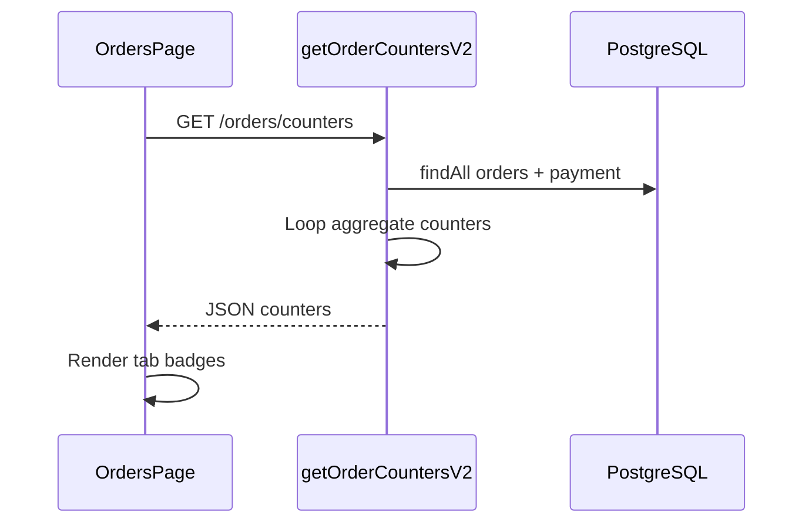

# Functional Requirement (FR) — Đếm đơn theo tab (View Order Tab Counters)

## 1. Feature Overview

API trả về **số lượng đơn** theo từng nhóm tab để hiển thị badge trên `OrdersPage` — không phân trang, load nhẹ hơn list:

```
GET /api/orders/counters
Authorization: Bearer <JWT>
```

**FE:** `useOrderCounters()` — `queryKey: ["order-counters", user_id]`, `staleTime: 30s`.

**Backend:** `getOrderCountersV2` (route mount V2; `getOrderCounters` legacy trong cùng file).

---

## 2. Actors

| Actor | Mô tả |
|-------|-------|
| **Authenticated Customer** | Xem badge tab |
| **OrdersPage** | `counterKeyMap` map tab UI → key response |
| **Mutations** | `useCreateOrder`, `useCancelOrder`, `useChangePaymentMethod`, … invalidate counters |

---

## 3. Scope

### In Scope

- Đếm trên **toàn bộ** đơn của user (không filter `q`).
- Keys: `all`, `awaiting_payment`, `processing`, `to_ship`, `shipping`, `delivered`, `cancelled`, `failed`.
- Logic payment-aware (V2) cho `to_ship` và `shipping`.

### Out of Scope

- Realtime WebSocket.
- Đếm cho admin dashboard (dùng analytics khác).

---

## 4. API Response — 200

```json
{
  "all": 15,
  "awaiting_payment": 2,
  "processing": 5,
  "to_ship": 4,
  "shipping": 1,
  "delivered": 6,
  "cancelled": 2,
  "failed": 0
}
```

| Key | Ý nghĩa UI (OrdersPage) |
|-----|-------------------------|
| `all` | Tab "Tất cả" |
| `awaiting_payment` | Chờ thanh toán VNPay |
| `to_ship` | Chờ giao (subset processing) |
| `processing` | BE native — **không** hiển thị tab riêng trên FE |
| `shipping` | Đang giao |
| `delivered` | Tab FE label "Hoàn thành" (`completed`) |
| `cancelled` | Gồm `cancelled` + `FAILED` |
| `failed` | Chỉ `order.status === FAILED` |

---

## 5. Business Rules — getOrderCountersV2

Với mỗi order (load `order_id`, `status` + include `payment`):

```text
all += 1

awaiting_payment:
  status === AWAITING_PAYMENT AND provider === VNPAY AND payment_status === pending

processing += 1 AND to_ship += 1 IF status === processing AND (
  (COD AND pending) OR (VNPAY AND completed)
)  // chỉ to_ship khi thỏa payment

shipping += 1 IF status === shipping AND (
  (COD AND pending) OR (VNPAY AND completed)
)

delivered += 1 IF status === delivered AND payment_status === completed

cancelled += 1 IF status IN (cancelled, FAILED)

failed += 1 IF status === FAILED
```

### Khác biệt V1 (`getOrderCounters`)

- V1: mọi `processing` đều `to_ship += 1` (không check payment).
- Route hiện tại dùng **V2**.

---

## 6. Frontend Integration

```javascript
// OrdersPage.jsx
const counterKeyMap = {
  all: "all",
  awaiting_payment: "awaiting_payment",
  to_ship: "to_ship",
  shipping: "shipping",
  completed: "delivered",  // ⚠️ tab key ≠ response key
  cancelled: "cancelled",
  failed: "failed",
};
const badge = counters?.[countKey] ?? 0;
```

### Invalidate triggers

| Hook / action | Invalidate |
|---------------|------------|
| `useCreateOrder` | `order-counters` |
| `useCancelOrder` | `order-counters` |
| `useChangePaymentMethod` | `order-counters` |
| `useUpdateShippingAddress` | `order-counters` |
| `useRetryVnpayPayment` | `order-counters` |
| User login đổi | `useEffect` on `user_id` |

---

## 7. Performance Note

- Load **tất cả** orders của user vào memory — OK với volume nhỏ; scale lớn nên chuyển `COUNT(*) GROUP BY` SQL.

---

## 8. Sequence



---

## 9. Route Order

`GET /counters` đăng ký **trước** `GET /:order_id` — tránh `order_id = "counters"` nhầm (quan trọng).

---

## 10. Related FRs

| FR | Liên kết |
|----|----------|
| `FR_ViewUserOrders` | Cùng taxonomy tab |
| `FR_CreateOrder` / `FR_CancelOrder` | Thay đổi số đếm |

---

## 11. Source Files

| Layer | File |
|-------|------|
| Route | `server/routes/orderRoutes.js` — `GET /counters` |
| Controller | `orderController.js` — `getOrderCountersV2`, `getOrderCounters` |
| FE Hook | `client/app/hooks/useOrders.js` — `useOrderCounters` |
| FE Page | `client/app/pages/OrdersPage.jsx` |

---

## 12. Acceptance Criteria

- [ ] Badge `to_ship` ≤ `processing` counter.
- [ ] Đơn VNPAY `AWAITING_PAYMENT` chỉ tăng `awaiting_payment`.
- [ ] Đơn `cancelled` tăng `cancelled`; nếu status `FAILED` tăng cả `failed`.
- [ ] Đổi user login → counters refetch theo `user_id`.
- [ ] Sau tạo/hủy đơn badge cập nhật (invalidate).

---

## 13. Known Gaps

| # | Mô tả |
|---|--------|
| GAP-01 | `processing` counter không có tab FE riêng — có thể gây nhầm khi debug API. |
| GAP-02 | `failed` thường = 0 do order status hiếm khi set FAILED. |
| GAP-03 | `cancelled` double-count với FAILED (cố ý: FAILED thuộc tab cancelled). |
| GAP-04 | Không đồng bộ với `q` search trên list — badge là tổng global. |
