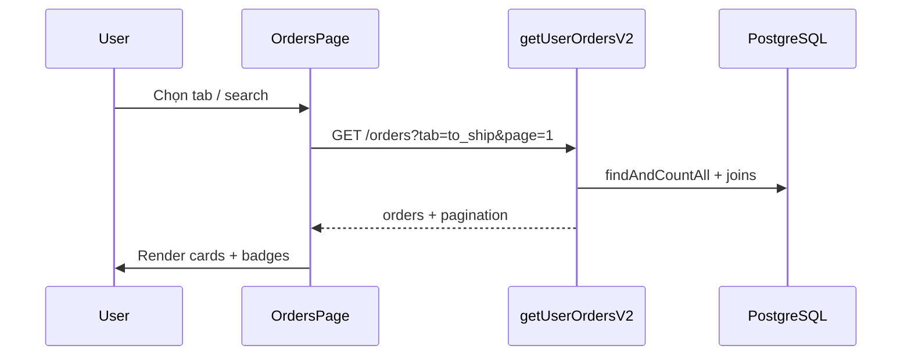

# Functional Requirement (FR) — Danh sách đơn hàng của user (View User Orders)

## 1. Feature Overview

Khách hàng xem **danh sách đơn của mình** có phân trang, lọc theo **tab trạng thái**, tìm kiếm và sắp xếp:

```
GET /api/orders?tab=&page=&limit=&q=&sort=
Authorization: Bearer <JWT>
```

**FE:** `OrdersPage` + `useOrders(params)`.  
**Backend active:** `getUserOrdersV2` (legacy `getUserOrders` không mount trên router).

---

## 2. Actors

| Actor | Mô tả |
|-------|-------|
| **Authenticated Customer** | Tabs, search, pagination |
| **OrdersPage** | Sync query string URL |
| **orderController.getUserOrdersV2** | Query + chuẩn hóa response |

---

## 3. Scope

### In Scope

- Tabs: `all`, `awaiting_payment`, `to_ship`, `shipping`, `completed`, `cancelled`, `failed`.
- Pagination: `page` (≥1), `limit` (1–100, default 10).
- Search `q`: mã đơn hoặc tên sản phẩm (SQL `iLike`).
- Sort: `created_at:desc` \| `created_at:asc` (chỉ field này).
- Mỗi đơn: `items_preview` (tối đa 2), `items_count`, `payment`, `reserve_expires_at`.
- Deep link: `/orders?tab=to_ship&page=2&q=ORD-`.

### Out of Scope

- Admin list (`GET /api/admin/orders`).
- Export CSV.
- Lọc theo ngày / khoảng giá.

---

## 4. Query Parameters

| Param | Default | Mô tả |
|-------|---------|-------|
| `tab` | `all` | Xem bảng tab mapping §6 |
| `page` | `1` | Trang hiện tại |
| `limit` | `10` | Max 100 |
| `q` | `""` | Tìm kiếm |
| `sort` | `created_at:desc` | `field:dir` — chỉ `created_at` |

---

## 5. Response — 200

```json
{
  "orders": [
    {
      "order_id": 1,
      "order_code": "ORD-ABC-1234",
      "status": "processing",
      "final_amount": 22530000,
      "shipping_fee": 30000,
      "created_at": "2026-05-27T10:00:00.000Z",
      "reserve_expires_at": null,
      "payment": {
        "provider": "COD",
        "payment_method": "COD",
        "payment_status": "pending",
        "txn_ref": null
      },
      "items_preview": [
        {
          "variation_id": 10,
          "quantity": 1,
          "product_name": "Laptop X",
          "thumbnail_url": "https://..."
        }
      ],
      "items_count": 3
    }
  ],
  "pagination": {
    "total": 25,
    "page": 1,
    "limit": 10,
    "totalPages": 3
  }
}
```

---

## 6. Tab → SQL Filter (getUserOrdersV2)

| Tab | `orders.status` | `payments` (include) |
|-----|-----------------|------------------------|
| `all` | (mọi) | optional |
| `awaiting_payment` | `AWAITING_PAYMENT` | required: VNPAY + pending |
| `to_ship` | `processing` | required: (COD+pending) OR (VNPAY+completed) |
| `shipping` | `shipping` | required: (COD+pending) OR (VNPAY+completed) |
| `completed` | `delivered` | required: payment_status completed |
| `cancelled` | IN (`cancelled`, `FAILED`) | optional |
| `failed` | `FAILED` | optional |

**Search (`q` non-empty):**

```javascript
where[Op.or] = [
  { order_code: { [Op.iLike]: `%${q}%` } },
  { "$items.variation.product.product_name$": { [Op.iLike]: `%${q}%` } },
];
```

`findAndCountAll` với `distinct: true`, `subQuery: false`, `OrderItem` **required: true** (đơn không có item bị loại).

### items_preview

- Lấy `items.slice(0, 2)`.
- `thumbnail_url`: `product.images[0].image_url` hoặc `product.thumbnail_url`.

---

## 7. Frontend — OrdersPage

### URL state

```javascript
const [searchParams, setSearchParams] = useSearchParams();
// tab, page, q ↔ useEffect sync vào URL (replace)
```

### Hooks

```javascript
useOrders({ tab, page, limit: 10, q, sort: "created_at:desc" });
useOrderCounters(); // badge số trên tab — xem FR_ViewOrderTabCounters
```

### UI actions

| Action | Điều kiện |
|--------|-----------|
| Link chi tiết | `/orders/${order_id}` |
| `CountdownBadge` | `status === AWAITING_PAYMENT` && `reserve_expires_at` |
| Hủy đơn | `canCancel(o)` — `orderCanCancel.js` |
| Thanh toán lại | `useRetryVnpayPayment` — awaiting/failed VNPAY |

### counterKeyMap (FE)

Tab `completed` map badge → `counters.delivered` (BE key `delivered`, không phải `completed`).

---

## 8. Sequence



---

## 9. Related FRs

| FR | Liên kết |
|----|----------|
| `FR_ViewOrderTabCounters` | Số badge tab |
| `FR_ViewOrderDetailSlim` | Chi tiết từ list |
| `FR_CancelOrder` | Nút hủy trên list |
| `FR_CreateOrder` | Nguồn đơn mới |

---

## 10. Source Files

| Layer | File |
|-------|------|
| Route | `server/routes/orderRoutes.js` — `GET /` |
| Controller | `orderController.js` — `getUserOrdersV2`, `getUserOrders` (legacy) |
| FE Page | `client/app/pages/OrdersPage.jsx` |
| FE Hook | `client/app/hooks/useOrders.js` — `useOrders` |
| Util | `client/app/utils/orderCanCancel.js` |
| API legacy | `client/app/services/api.js` — `getOrders()` không params (ít dùng) |

---

## 11. Acceptance Criteria

- [ ] User chỉ thấy đơn `user_id` của mình.
- [ ] Tab `to_ship` không hiện đơn VNPAY processing chưa completed payment.
- [ ] `q` tìm theo mã đơn và tên SP.
- [ ] Pagination `totalPages` đúng khi nhiều item/đơn.
- [ ] Đổi tab reset `page` về 1 trên FE.
- [ ] `items_preview` tối đa 2; `+N sản phẩm` khi `items_count > 2`.

---

## 12. Known Gaps

| # | Mô tả |
|---|--------|
| GAP-01 | Legacy `getUserOrders` lọc `to_ship` kém chính xác (OR payment không trong SQL). |
| GAP-02 | Tab `failed` ít khi có data vì VNPay fail không set `order.FAILED`. |
| GAP-03 | `OrderDetailPage` route có thể **public** trong spec — list vẫn cần login API. |
| GAP-04 | `required: true` trên OrderItem loại đơn corrupt không có dòng. |
| GAP-05 | `api.getOrders()` cũ không truyền tab — dùng hook mới thay thế. |
