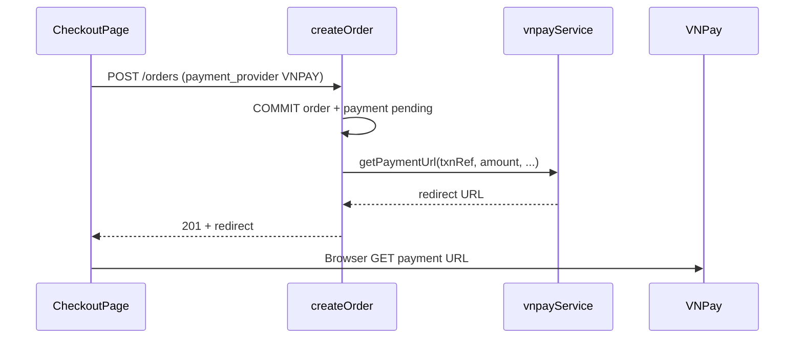

# Functional Requirement (FR) — Tạo URL thanh toán VNPay (Create VNPay Payment URL)

## 1. Feature Overview

Hệ thống sinh **URL redirect** tới cổng VNPay Sandbox/Production thông qua hàm lõi `vnpayService.getPaymentUrl`. URL được tạo tại:

| # | Điểm gọi | Khi nào |
|---|----------|---------|
| A | `orderController.createOrder` | Sau commit transaction — trả `redirect` trong response 201 |
| B | `orderController.changePaymentMethod` | COD → VNPAY |
| C | `orderController.retryVnpayPayment` | Thanh toán lại |
| D | `vnpayController.createPayment` | API độc lập `POST /api/vnpay/create_payment_url` |

Tài liệu này mô tả **cơ chế sinh URL** (service + API D) và cách các điểm A–C truyền tham số.

**File lõi:** `server/services/vnpayService.js`.

---

## 2. Actors

| Actor | Mô tả |
|-------|-------|
| **vnpayService** | Build query + HMAC-SHA512 |
| **VNPay Gateway** | `vnpUrl` nhận GET redirect |
| **createPayment** | Endpoint standalone (ít dùng FE) |
| **orderController** | Luồng đơn hàng chính |
| **Browser** | `window.location.href` / `assign` |

---

## 3. Scope

### In Scope

- Tham số VNPay v2.1.0: `pay`, VND, `vnp_Amount` × 100.
- `vnp_ReturnUrl` trỏ **backend** `GET /api/vnpay/return`.
- Chữ ký `vnp_SecureHash` (SHA512).
- `txnRef` format `{order_id}-{timestamp}`.
- IP client `vnp_IpAddr`.

### Out of Scope

- IPN server-to-server (`POST /vnpay/ipn` — **chưa có**).
- Ép `vnp_BankCode` theo `payment_method` (code comment — **đã tắt**).
- Lưu `raw_return` lúc tạo URL.

---

## 4. Configuration (Environment)

### vnpayService đọc thực tế

```javascript
const config = {
  tmnCode: process.env.VNPAY_TMN_CODE || "XGEX2VEC",
  secretKey: process.env.VNPAY_SECRET_KEY || "I78VLL6L131O3IPSOCKOZ0POZU8QJL47",
  vnpUrl: process.env.VNPAY_URL || "https://sandbox.vnpayment.vn/paymentv2/vpcpay.html",
  returnUrl: process.env.VNPAY_RETURN_URL || "http://localhost:5000/api/vnpay/return",
};
```

### createOrder / changePaymentMethod kiểm tra ENV **khác tên**

```javascript
const requiredEnv = ["VNP_TMN_CODE", "VNP_HASHSECRET", "VNP_RETURNURL", "VNP_PAYURL"];
```

| Biến check (createOrder) | Biến service dùng | Ghi chú |
|--------------------------|-------------------|---------|
| `VNP_TMN_CODE` | `VNPAY_TMN_CODE` | **Không đồng nhất** |
| `VNP_HASHSECRET` | `VNPAY_SECRET_KEY` | **Không đồng nhất** |
| `VNP_RETURNURL` | `VNPAY_RETURN_URL` | **Không đồng nhất** |
| `VNP_PAYURL` | `VNPAY_URL` | **Không đồng nhất** |

Hệ quả: có thể pass check `VNP_*` nhưng URL vẫn build bằng default sandbox `VNPAY_*` fallback — hoặc ngược lại fail 502 dù `VNPAY_*` đã set.

---

## 5. Function Signature — `getPaymentUrl`

```javascript
exports.getPaymentUrl = async ({
  method,      // VNPAYQR | VNBANK | ... — hiện KHÔNG map sang vnp_BankCode
  amount,      // VND integer/decimal — nhân 100 trong params
  txnRef,      // unique per attempt
  orderDesc,   // vnp_OrderInfo
  ipAddr,      // vnp_IpAddr
}) => string URL
```

### vnp_Params built

| Param | Giá trị |
|-------|---------|
| `vnp_Version` | `2.1.0` |
| `vnp_Command` | `pay` |
| `vnp_TmnCode` | config.tmnCode |
| `vnp_Locale` | `vn` |
| `vnp_CurrCode` | `VND` |
| `vnp_TxnRef` | txnRef |
| `vnp_OrderInfo` | orderDesc |
| `vnp_OrderType` | `other` |
| `vnp_Amount` | `Math.round(Number(amount) * 100)` |
| `vnp_ReturnUrl` | config.returnUrl (**backend**) |
| `vnp_IpAddr` | ipAddr \|\| `127.0.0.1` |
| `vnp_CreateDate` | `yyyyMMddHHmmss` UTC slice |

### Signing algorithm

```text
1. sortObject(params) — keys alphabetically, encodeURIComponent values
2. signData = qs.stringify(sortedParams, { encode: false })
3. vnp_SecureHash = HMAC-SHA512(secretKey, signData).hex
4. return vnpUrl + "?" + qs.stringify(vnp_Params including hash)
```

---

## 6. Standalone API — `POST /api/vnpay/create_payment_url`

**Route:** `server/routes/vnpayRoutes.js` → mount `app.use("/api", vnpayRoutes)`.

**Auth:** **Không** có `authenticateToken` — endpoint **public** (GAP bảo mật).

### Request

```json
{
  "orderId": "123",
  "amount": 22530000
}
```

| Field | Bắt buộc |
|-------|----------|
| `orderId` | Có |
| `amount` | Có |
| `method` | Không — comment trong controller không truyền |

### Response — 200

```json
{ "url": "https://sandbox.vnpayment.vn/paymentv2/vpcpay.html?..." }
```

### Logic `createPayment`

```javascript
const txnRef = `${orderId}-${Date.now()}`;
const url = await getPaymentUrl({
  amount,
  txnRef,
  orderDesc: `Thanh toan don hang #${orderId}`,
  ipAddr, // x-forwarded-for hoặc socket
});
```

**Không** validate order tồn tại, amount khớp `payments.amount`, hay user sở hữu đơn.

### Errors

| HTTP | Message |
|------|---------|
| 400 | `Thiếu orderId hoặc amount` |
| 500 | `Lỗi tạo link thanh toán` |

---

## 7. Call Sites trong Order Flow

### createOrder (sau khi tạo Order + Payment)

```javascript
txnRef = `${order.order_id}-${Date.now()}`;
redirect = await getPaymentUrl({
  method: payment_method,
  amount: finalAmount,
  txnRef,
  orderDesc: `Thanh toan don hang ${order.order_code}`,
  ipAddr: req.headers["x-forwarded-for"] || req.socket.remoteAddress,
});
// Response 201: { order, redirect }
```

### retryVnpayPayment

- Cập nhật `payment.txn_ref` mới trước khi gọi URL.
- Trả `{ redirect, txn_ref, expires_at }`.

### changePaymentMethod → VNPAY

- `newTxnRef` + `getPaymentUrl` tương tự create.

---

## 8. Frontend Consumption

| Luồng | Cách dùng URL |
|-------|----------------|
| Checkout VNPay | `window.location.href = res.redirect` |
| Retry / đổi PM | `window.location.assign(data.redirect)` |

**Không** có FE gọi `POST /api/vnpay/create_payment_url` trong codebase hiện tại.

---

## 9. Sequence — Sinh URL lúc tạo đơn



---

## 10. Related FRs

| FR | Liên kết |
|----|----------|
| `FR_VNPayPaymentInCreateOrder` | Gọi URL trong create |
| `FR_ProcessVNPayReturn` | Return URL sau thanh toán |
| `FR_RetryVNPayPayment` | Tạo URL lại |
| `FR_ChangePaymentMethod` | COD→VNPay URL |

---

## 11. Source Files

| File | Vai trò |
|------|---------|
| `server/services/vnpayService.js` | `getPaymentUrl`, `verifyReturnUrl` |
| `server/controllers/vnpayController.js` | `createPayment` |
| `server/routes/vnpayRoutes.js` | Routes |
| `server/controllers/orderController.js` | create / retry / changePM |
| `server/server.js` | Mount `/api` vnpay |
| `READMEAPI.md` | API doc |
| `docs/master_specification.md` §9.6 | Catalog |

---

## 12. Acceptance Criteria

- [ ] URL chứa `vnp_SecureHash`, `vnp_TxnRef`, `vnp_Amount` = final×100.
- [ ] `vnp_ReturnUrl` host trỏ `.../api/vnpay/return`.
- [ ] Mỗi lần retry/đổi PM có `txnRef` timestamp mới.
- [ ] createOrder thiếu `VNP_*` env → 502 rollback (không tạo đơn).
- [ ] Standalone POST trả `{ url }` khi body hợp lệ.

---

## 13. Known Gaps

| # | Mô tả |
|---|--------|
| GAP-01 | **Hai bộ tên ENV** `VNP_*` vs `VNPAY_*` — dễ cấu hình sai production. |
| GAP-02 | `method` / `payment_method` **không** ảnh hưởng `vnp_BankCode` — user chọn VNBANK vẫn thấy màn hình chọn VNPay chung. |
| GAP-03 | `create_payment_url` **không auth**, không verify amount/order — lộ vector lạm dụng. |
| GAP-04 | Hardcoded sandbox default secret trong repo — rủi ro nếu deploy quên ENV. |
| GAP-05 | FE không dùng standalone API — dead path trừ Postman/integration. |
| GAP-06 | `ipAddr` từ createOrder có thể là IPv6/raw socket chuỗi dài — VNPay có thể reject (cần test). |
