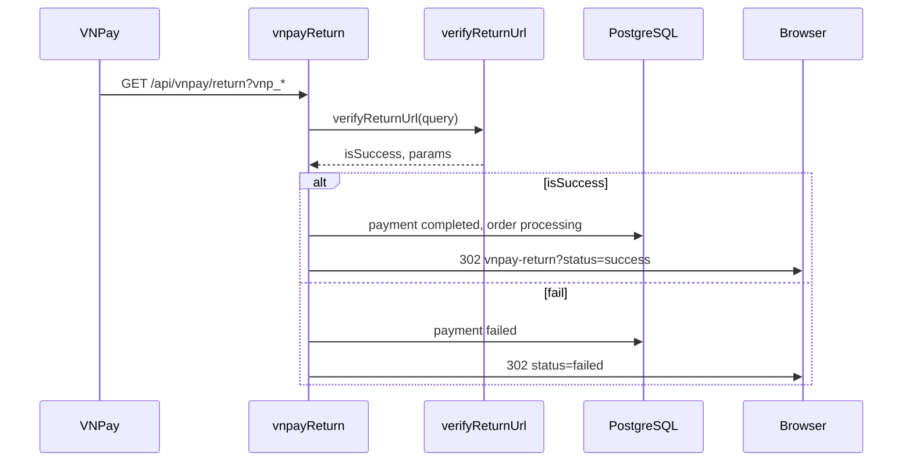

# Functional Requirement (FR) — Xử lý VNPay Return URL (Process VNPay Return)

## 1. Feature Overview

Sau khi khách thanh toán trên cổng VNPay, trình duyệt được redirect về **backend** (không phải React trực tiếp):

```
GET /api/vnpay/return?vnp_Amount=...&vnp_TxnRef=...&vnp_ResponseCode=...&vnp_SecureHash=...
Handler: vnpayController.vnpayReturn
```

Luồng:

1. **Xác minh chữ ký** HMAC-SHA512 (`verifyReturnUrl`).
2. Parse `order_id` từ `vnp_TxnRef`.
3. **Cập nhật** `payments` + `orders` trong DB (nếu thành công).
4. **HTTP 302** redirect sang frontend `FE_APP_URL` + query `status` + `orderId`.

**Không có IPN** — đây là nguồn sự thật duy nhất cho trạng thái paid trong MVP.

---

## 2. Actors

| Actor | Mô tả |
|-------|-------|
| **VNPay Gateway** | Gọi Return URL (browser redirect) |
| **vnpayService.verifyReturnUrl** | Validate hash + response code |
| **vnpayController.vnpayReturn** | DB update + redirect FE |
| **Order / Payment models** | Persistence |

---

## 3. Scope

### In Scope

- GET query params toàn bộ `vnp_*`.
- Success: `vnp_ResponseCode === "00"` **và** secure hash khớp.
- Cập nhật `payment_status`, `txn_ref`, `transaction_id`, `paid_at`.
- Order → `processing` khi success.
- Fail: `payment.payment_status = failed` (order status **giữ** AWAITING thường).
- Redirect FE `/checkout/vnpay-return?status=...&orderId=...`.

### Out of Scope

- Lưu `raw_return` / `raw_ipn` JSONB (field có trên model nhưng **không** gán).
- Idempotency key / transaction log table.
- IPN `POST /vnpay/ipn`.
- Auth middleware (public callback — expected).
- Admin notification realtime.

---

## 4. Verify Signature — `verifyReturnUrl`

```javascript
exports.verifyReturnUrl = (vnp_Params) => {
  const params = { ...vnp_Params };
  const secureHash = params["vnp_SecureHash"];
  delete params["vnp_SecureHash"];
  delete params["vnp_SecureHashType"];

  const sortedParams = sortObject(params);
  const signData = qs.stringify(sortedParams, { encode: false });
  const signed = HMAC-SHA512(secretKey, signData).hex;

  return {
    isSuccess: secureHash === signed && params["vnp_ResponseCode"] === "00",
    vnp_Params: params,
  };
};
```

| # | Rule |
|---|------|
| BR-01 | Chỉ `vnp_ResponseCode === "00"` là success |
| BR-02 | Không kiểm tra `vnp_Amount` khớp `payments.amount` |
| BR-03 | Không kiểm tra `vnp_TmnCode` khớp config |

---

## 5. Parse Order ID

```javascript
const txnRef = vnp_Params["vnp_TxnRef"] || "";
const orderId = txnRef.split("-")[0];
```

| Format txnRef | Ví dụ | orderId |
|---------------|-------|---------|
| `{order_id}-{timestamp}` | `42-1710000000000` | `42` |

**Giả định:** `order_id` là integer không chứa dấu `-`.

---

## 6. Success Branch

```javascript
if (isSuccess) {
  const order = await Order.findByPk(orderId);
  const payment = await Payment.findOne({ where: { order_id: orderId } });

  if (order && payment) {
    if (payment.payment_status !== "completed") {
      payment.payment_status = "completed";
      payment.txn_ref = txnRef;
      payment.transaction_id = vnp_Params["vnp_TransactionNo"] || null;
      payment.paid_at = new Date();
      await payment.save();

      order.status = "processing";
      await order.save();
    }
  }

  return res.redirect(
    `${frontendUrl}/checkout/vnpay-return?status=success&orderId=${encodeURIComponent(orderId)}`
  );
}
```

| # | Rule |
|---|------|
| BR-04 | Idempotent-ish: nếu đã `completed` → skip update nhưng vẫn redirect success |
| BR-05 | **Không** set `order.status = PAID` (enum có nhưng không dùng) → `processing` |
| BR-06 | **Không** clear `reserve_expires_at` |
| BR-07 | **Không** transaction wrap — race với cron cancel có thể xảy ra |

### Thiếu order/payment

Vẫn redirect `status=success` nếu `isSuccess` — DB có thể không đổi (GAP).

---

## 7. Failure Branch

```javascript
else {
  const payment = await Payment.findOne({ where: { order_id: orderId } });
  if (payment) {
    payment.payment_status = "failed";
    await payment.save();
  }
  return res.redirect(
    `${frontendUrl}/checkout/vnpay-return?status=failed&orderId=${encodeURIComponent(orderId)}`
  );
}
```

| # | Rule |
|---|------|
| BR-08 | `order.status` **không** đổi → thường vẫn `AWAITING_PAYMENT` |
| BR-09 | Tab FE `failed` filter `order.FAILED` — **mismatch** → tab có thể trống |
| BR-10 | Kho **vẫn** đã trừ — user phải hủy hoặc chờ cron 24h |

Hash invalid cũng vào nhánh `else` (`isSuccess === false`).

---

## 8. Error Handler

```javascript
catch (error) {
  console.error("VNPAY Return Error:", error);
  return res.redirect(`${frontendUrl}/orders?error=unknown`);
}
```

Không qua `VnpayReturn` — user vào list đơn với query `error=unknown`.

---

## 9. Frontend URL

```javascript
const frontendUrl = process.env.FE_APP_URL || "http://localhost:3000";
```

| Kết quả | Redirect |
|---------|----------|
| Success | `/checkout/vnpay-return?status=success&orderId={id}` |
| Fail | `/checkout/vnpay-return?status=failed&orderId={id}` |
| No orderId | `.../failed&orderId=unknown` |
| Exception | `/orders?error=unknown` |

---

## 10. Sequence Diagram



---

## 11. Interaction với Cron / User Cancel

| Sự kiện | order | payment | stock |
|---------|-------|---------|-------|
| Return success | processing | completed | Giữ trừ |
| Return fail | AWAITING (thường) | failed | Giữ trừ |
| Cron expire | cancelled | failed | Hoàn |
| User cancel awaiting | cancelled | failed | Hoàn |

Race: cron hủy trước khi user trả xong → return success có thể revive? (không — cron set cancelled; return có thể set processing nếu payment chưa completed — **cần QA**).

---

## 12. Related FRs

| FR | Liên kết |
|----|----------|
| `FR_CreateVNPayPaymentUrl` | Return URL config |
| `FR_VNPayPaymentInCreateOrder` | Trạng thái trước return |
| `FR_VNPayReturnPage` | FE sau redirect |
| `FR_RetryVNPayPayment` | txnRef mới, cùng return handler |

---

## 13. Source Files

| File | Vai trò |
|------|---------|
| `server/controllers/vnpayController.js` | `vnpayReturn` |
| `server/services/vnpayService.js` | `verifyReturnUrl` |
| `server/routes/vnpayRoutes.js` | `GET /vnpay/return` |
| `server/models/Payment.js` | `completed`, `transaction_id` |
| `server/models/Order.js` | status enum |
| `docs/master_specification.md` §10.4, gap IPN | |

---

## 14. Acceptance Criteria

- [ ] `vnp_ResponseCode=00` + hash đúng → payment `completed`, order `processing`.
- [ ] Hash sai hoặc code khác 00 → payment `failed`.
- [ ] Gọi return lần 2 khi đã completed → không corrupt (skip update).
- [ ] Redirect FE đúng `status` và `orderId`.
- [ ] `vnp_TransactionNo` lưu vào `transaction_id`.

---

## 15. Known Gaps

| # | Mô tả |
|---|--------|
| GAP-01 | **Không IPN** — đóng tab trước redirect có thể lệch trạng thái. |
| GAP-02 | Fail không set `order.FAILED` — tab FE `failed` trống. |
| GAP-03 | Không verify amount / tmnCode. |
| GAP-04 | Không lưu `raw_return` để audit. |
| GAP-05 | Success khi `order`/`payment` null vẫn redirect success. |
| GAP-06 | Không clear `reserve_expires_at` sau paid. |
| GAP-07 | Master spec nói `PAID` / payment `success` — code `processing` / `completed`. |
| GAP-08 | Race cron 24h vs return muộn. |
