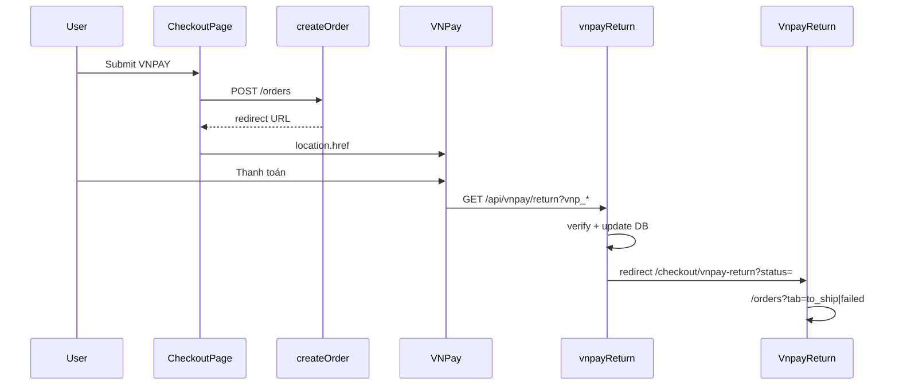

# Functional Requirement (FR) — Thanh toán VNPay khi tạo đơn (VNPay Payment in Create Order)

## 1. Feature Overview

Khi khách chọn **VNPAY** trên checkout và gọi `POST /api/orders`, backend tạo đơn ở trạng thái **chờ thanh toán**, **giữ kho 24h**, ghi `Payment` pending, rồi trả **`redirect`** (URL VNPay) để browser chuyển sang cổng thanh toán — **trong cùng transaction** trước commit (trừ bước redirect build fail → rollback).

**Khác COD:** không vào `/checkout/success`; FE `window.location.href = redirect`.

---

## 2. Actors

| Actor | Mô tả |
|-------|-------|
| **CheckoutPage** | `payment_provider: "VNPAY"`, `payment_method` (default `VNPAYQR`) |
| **PaymentOptions** | Toggle COD / VNPAY |
| **createOrder** | Transaction orchestration |
| **releaseReservations** | Hủy nếu quá 24h chưa trả |
| **vnpayReturn** | Cập nhật sau khi user trả tiền |

---

## 3. Scope

### In Scope

- Validation `payment_provider === "VNPAY"` + method ∈ VALID.
- Order `status: AWAITING_PAYMENT`, `reserve_expires_at: now + 24h`.
- Reserve stock ngay (giống COD).
- `Payment`: provider `VNPAY`, `payment_status: pending`, `txn_ref`, `amount: final_amount`.
- Response `redirect` + `order` summary.
- Email xác nhận đơn (async) — gửi cả khi VNPay (trước khi user trả tiền).

### Out of Scope

- Xác nhận thanh toán trong request create (xảy ra ở Return URL).
- IPN webhook.
- Trang success FE cho VNPay.

---

## 4. Request Contract (phần VNPay)

```json
{
  "payment_provider": "VNPAY",
  "payment_method": "VNPAYQR",
  "shipping_address": "...",
  "shipping_phone": "...",
  "shipping_name": "...",
  "province_id": 79,
  "ward_id": 12345,
  "geo_lat": 10.77,
  "geo_lng": 106.70,
  "items": [{ "variation_id": 10, "quantity": 1 }]
}
```

### VALID map

```javascript
VNPAY: ["VNPAYQR", "VNBANK", "INTCARD", "INSTALLMENT"]
```

### FE — PaymentOptions

- User chọn VNPAY → `payment_method` mặc định `VNPAYQR`.
- UI **ẩn** chọn method con (QR/Bank/…) — user không đổi trên checkout.

---

## 5. Backend Steps (VNPay branch)

```text
isVnpay = payment_provider === "VNPAY"

1. Validate địa chỉ + items + stock (chung COD)
2. quoteShipping → finalAmount
3. Order.create({
     status: "AWAITING_PAYMENT",
     reserve_expires_at: now + 24h,
     ...shipping, amounts
   })
4. txnRef = `${order_id}-${Date.now()}`
5. Reserve stock + OrderItem (chung)
6. Payment.create({
     provider: "VNPAY",
     payment_method,
     payment_status: "pending",
     amount: finalAmount,
     txn_ref: txnRef,
   })
7. Clear cart items (chung)
8. getPaymentUrl({ method, amount: finalAmount, txnRef, orderDesc, ipAddr })
   - Fail → rollback 502 "VNPAY configuration error"
9. COMMIT
10. sendOrderConfirmationEmail (async)
11. res 201 { order, redirect }
```

---

## 6. Response — 201 (VNPay)

```json
{
  "message": "Order created successfully",
  "order": {
    "order_id": 1,
    "order_code": "ORD-...",
    "final_amount": 22530000,
    "status": "AWAITING_PAYMENT",
    "shipping_fee": 30000,
    "items_breakdown": [ ... ]
  },
  "redirect": "https://sandbox.vnpayment.vn/paymentv2/vpcpay.html?..."
}
```

---

## 7. Frontend — CheckoutPage

```javascript
const res = await createOrder.mutateAsync(orderData);

if (res?.redirect) {
  window.location.href = res.redirect;
  return; // không xóa Redux cart, không /checkout/success
}
```

| # | Hành vi |
|---|---------|
| BR-01 | Full page leave — mất React state checkout |
| BR-02 | Server cart đã xóa items trong transaction |
| BR-03 | Redux cart **không** `removeMany` — có thể lệch đến khi refetch cart |

---

## 8. State After Create (chưa thanh toán)

| Entity | Giá trị |
|--------|---------|
| `orders.status` | `AWAITING_PAYMENT` |
| `orders.reserve_expires_at` | ~24h |
| `product_variations.stock` | Đã trừ |
| `payments.provider` | `VNPAY` |
| `payments.payment_status` | `pending` |
| `payments.txn_ref` | `{order_id}-{ts}` |

User có thể: **Hủy đơn** (`canCancel`), **Retry pay**, xem tab **Chờ thanh toán**.

---

## 9. Post-Payment (tóm tắt — chi tiết FR_ProcessVNPayReturn)



---

## 10. Hết hạn 24h (Cron)

`releaseReservations.js`:

- `AWAITING_PAYMENT` + `reserve_expires_at < now`
- Hoàn kho, `payment.failed`, `order.cancelled`

User có thể đã rời VNPay chưa thanh toán — đơn bị hủy tự động.

---

## 11. Related FRs

| FR | Liên kết |
|----|----------|
| `FR_CreateOrder` | Toàn bộ create |
| `FR_CreateVNPayPaymentUrl` | `getPaymentUrl` |
| `FR_ProcessVNPayReturn` | Cập nhật paid |
| `FR_VNPayReturnPage` | FE landing |
| `FR_ReserveInventoryOnOrder` | Trừ kho |
| `FR_CheckoutPageFlow` | UI checkout |
| `FR_OrderPaymentCountdownTimer` | 24h UI |

---

## 12. Source Files

| File | Vai trò |
|------|---------|
| `server/controllers/orderController.js` | `createOrder` |
| `server/services/vnpayService.js` | URL |
| `client/app/pages/CheckoutPage.jsx` | Redirect |
| `client/app/components/PaymentOptions.jsx` | Chọn VNPAY |
| `client/app/hooks/useOrders.js` | `useCreateOrder` |
| `server/jobs/releaseReservations.js` | Expire |
| `server/controllers/vnpayController.js` | Return |

---

## 13. Acceptance Criteria

- [ ] Checkout VNPAY → 201 + `redirect` hợp lệ, order `AWAITING_PAYMENT`.
- [ ] Stock giảm ngay; `reserve_expires_at` ~24h.
- [ ] Fail ENV → 502, không có order trong DB.
- [ ] FE không vào `/checkout/success`.
- [ ] Sau return success → `processing` + `payment.completed` (xem Process FR).
- [ ] Quá 24h chưa trả → cron cancelled + hoàn kho.

---

## 14. Known Gaps

| # | Mô tả |
|---|--------|
| GAP-01 | Email xác nhận gửi **trước** khi thanh toán thành công — có thể gây hiểu nhầm. |
| GAP-02 | Redux cart không sync sau VNPay redirect. |
| GAP-03 | `payment_method` lưu DB nhưng URL không ép bank code. |
| GAP-04 | Master spec §10.4 ghi Payment `success` — code dùng `completed`. |
| GAP-05 | Không gia hạn `reserve_expires_at` khi user ở cổng VNPay lâu. |
| GAP-06 | ENV check `VNP_*` vs service `VNPAY_*` — xem FR_CreateVNPayPaymentUrl. |
