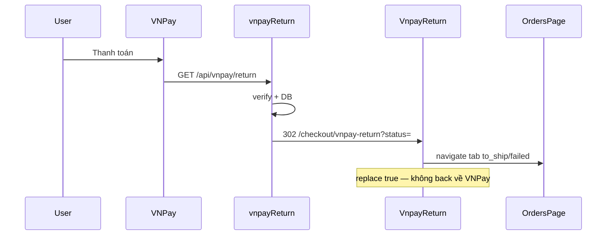

# Functional Requirement (FR) — Trang kết quả VNPay (VNPay Return Page)

## 1. Feature Overview

Trang React **trung gian** sau khi backend xử lý Return URL và redirect browser về frontend:

```
Route: /checkout/vnpay-return
Component: client/app/pages/checkout/VnpayReturn.jsx
Query: ?status=success|failed&orderId={id}
```

Trang **không** gọi API, **không** verify chữ ký — comment trong code: *"Backend đã verify chữ ký + update DB rồi mới redirect về đây"*. Nhiệm vụ: **điều hướng nhanh** tới tab đơn hàng phù hợp.

**Khác `CheckoutSuccessPage`:** VNPay dùng trang này; COD dùng `/checkout/success`.

---

## 2. Actors

| Actor | Mô tả |
|-------|-------|
| **vnpayReturn (BE)** | 302 tới URL này |
| **VnpayReturn.jsx** | Parse query + navigate |
| **OrdersPage** | Đích `tab=to_ship` hoặc `failed` |
| **User** | Thấy spinner ngắn (hoặc flash redirect) |

---

## 3. Scope

### In Scope

- Đọc `status`, `orderId` từ query string.
- `status=success` → `/orders?tab=to_ship` replace.
- `status=failed` → `/orders?tab=failed` replace.
- Fallback thiếu `status`: countdown 5s → `/orders`.
- UI loading: OrderId, Status, spinner.

### Out of Scope

- Hiển thị chi tiết đơn / mã đơn thành công.
- Gọi lại BE confirm payment.
- Protected route (trang **public**).
- Invalidate React Query (list refetch khi vào Orders).

---

## 4. Routing

```jsx
// App.jsx — không bọc ProtectedRoute
<Route path="checkout/vnpay-return" element={<VnpayReturn />} />
```

| Route | Auth |
|-------|------|
| `/checkout` | Protected |
| `/checkout/success` | Public |
| `/checkout/vnpay-return` | Public |

User thường **đã login** (đã tạo đơn trước redirect VNPay) nhưng route không ép JWT.

---

## 5. Query Parameters

| Param | Giá trị | Nguồn BE |
|-------|---------|----------|
| `status` | `success` \| `failed` | `vnpayReturn` sau verify |
| `orderId` | string PK | parse từ `vnp_TxnRef` |

Ví dụ:

```
/checkout/vnpay-return?status=success&orderId=42
/checkout/vnpay-return?status=failed&orderId=42
/checkout/vnpay-return?status=failed&orderId=unknown
```

**Không** truyền: `order_code`, `vnp_TransactionNo`, message lỗi VNPay.

---

## 6. Component Logic

```javascript
const qp = useMemo(() => new URLSearchParams(search), [search]);
const status = qp.get("status");
const orderId = qp.get("orderId");

useEffect(() => {
  if (status === "success") {
    navigate("/orders?tab=to_ship", { replace: true });
    return;
  }
  if (status === "failed") {
    navigate("/orders?tab=failed", { replace: true });
    return;
  }
  const t = setInterval(() => setCountdown(c => Math.max(0, c - 1)), 1000);
  return () => clearInterval(t);
}, [status, navigate]);

useEffect(() => {
  if (countdown === 0) navigate("/orders", { replace: true });
}, [countdown, navigate]);
```

| # | Rule |
|---|------|
| BR-01 | Redirect **ngay** trong `useEffect` — user có thể **không kịp đọc** UI |
| BR-02 | `orderId` hiển thị nhưng **không** dùng để deep-link `/orders/{id}` |
| BR-03 | Tab `to_ship` sau success — đơn VNPay paid có `order.processing` + `payment.completed` (khớp filter V2) |
| BR-04 | Tab `failed` — nhiều đơn vẫn `AWAITING_PAYMENT` (BE không set FAILED) → tab **có thể trống** |

---

## 7. UI States

### Render mặc định (trước khi navigate unmount)

- Tiêu đề: "Đang xử lý kết quả thanh toán".
- Dòng debug: `OrderId`, `Status`.
- Nếu `!status`: text countdown về `/orders`.
- `LoadingSpinner` + "Đang điều hướng…".

### Trường hợp BE lỗi

Redirect thẳng `/orders?error=unknown` — **không** qua component này.

---

## 8. End-to-End Flow



---

## 9. Comparison — Success Pages

| | CheckoutSuccessPage | VnpayReturn |
|--|---------------------|-------------|
| Path | `/checkout/success` | `/checkout/vnpay-return` |
| Payment | COD | VNPay |
| Data | `location.state` | Query `status` |
| UX | Thank you + order_code | Flash redirect |
| Protected | No | No |
| Đích | `/orders` link | Auto tab |

---

## 10. Related FRs

| FR | Liên kết |
|----|----------|
| `FR_ProcessVNPayReturn` | BE tạo query params |
| `FR_VNPayPaymentInCreateOrder` | Điểm bắt đầu |
| `FR_ViewUserOrders` | Tab đích |
| `FR_RetryVNPayPayment` | Fail → retry từ detail |
| `FR_CheckoutSuccessPage` | COD tương đương |

---

## 11. Source Files

| File | Vai trò |
|------|---------|
| `client/app/pages/checkout/VnpayReturn.jsx` | Component |
| `client/app/App.jsx` | Route |
| `server/controllers/vnpayController.js` | Redirect URL builder |
| `client/app/pages/OrdersPage.jsx` | Tab targets |
| `docs/master_specification.md` §836 | Route table |

---

## 12. Acceptance Criteria

- [ ] BE success redirect → user cuối cùng ở `/orders?tab=to_ship`.
- [ ] BE fail redirect → navigate `tab=failed` (dù list có thể rỗng).
- [ ] URL thiếu `status` → sau ≤5s về `/orders`.
- [ ] `replace: true` — nút Back không về VNPay.
- [ ] Không gọi API từ trang này.

---

## 13. Known Gaps / UX

| # | Mô tả |
|---|--------|
| GAP-01 | Redirect quá nhanh — UI "Đang xử lý" gần như vô hình. |
| GAP-02 | Không thông báo thành công/thất bại rõ ràng (toast/message). |
| GAP-03 | `orderId` không dùng — không mở thẳng chi tiết đơn. |
| GAP-04 | Tab `failed` mismatch với BE — user thấy "Không có đơn". |
| GAP-05 | Route public — có thể bookmark URL fake `status=success` (DB không đổi; chỉ UX misleading). |
| GAP-06 | Không invalidate `order-counters` / `orders` query — phụ thuộc OrdersPage mount refetch. |
| GAP-07 | Không xử lý `error=unknown` từ BE catch — user vào `/orders` không có banner lỗi. |
