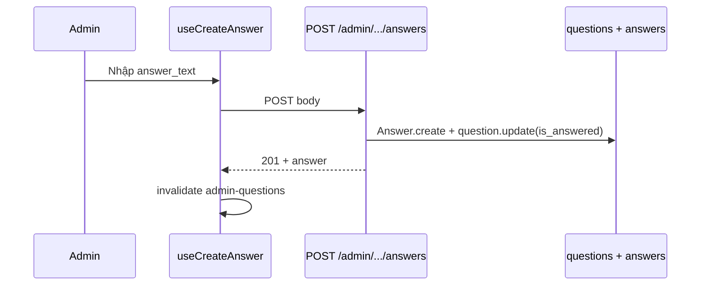

# Functional Requirement (FR) — Admin: Tạo câu trả lời (Admin Create Answer)

## 1. Feature Overview

Admin hoặc Manager **tạo câu trả lời** cho một câu hỏi (global hoặc gắn sản phẩm) qua API admin. Sau khi tạo, hệ thống đặt `questions.is_answered = true`.

```
POST /api/admin/questions/:question_id/answers
Authorization: Bearer JWT
Role: admin | manager
Body: { "answer_text": "..." }
```

**Khác** luồng PDP: `POST /api/products/questions/:question_id/answers` (staff/admin, **tối đa 1 answer** — xem §10).

**FE:** `useCreateAnswer()` — `AdminQuestions` (modal), `AdminQuestionDetail` (form).

---

## 2. Actors

| Actor | Mô tả |
|-------|-------|
| **Admin / Manager** | Trả lời từ panel |
| **questionsController.createAnswer** | Handler admin |
| **productController.createAnswer** | Handler PDP (so sánh) |
| **Customer** | Nhận câu trả lời khi xem PDP / global Q&A |

---

## 3. Scope

### In Scope

- Validate `answer_text` non-empty.
- Gắn `user_id` = admin đang đăng nhập.
- Cập nhật `is_answered`.
- Response 201 kèm answer + user.

### Out of Scope

- Gửi email/push thông báo.
- Markdown / rich text answer.
- Phân quyền theo từng sản phẩm category.

---

## 4. API Contract — Admin

### Request

```http
POST /api/admin/questions/42/answers
Content-Type: application/json
Authorization: Bearer <token>

{
  "answer_text": "Sản phẩm hỗ trợ RAM tối đa 32GB."
}
```

### Response — 201

```json
{
  "message": "Answer created successfully",
  "answer": {
    "answer_id": 10,
    "question_id": 42,
    "user_id": 1,
    "answer_text": "Sản phẩm hỗ trợ RAM tối đa 32GB.",
    "created_at": "2026-05-27T10:00:00.000Z",
    "updated_at": "2026-05-27T10:00:00.000Z",
    "user": {
      "user_id": 1,
      "username": "admin",
      "full_name": "Quản trị viên"
    }
  }
}
```

### Errors

| HTTP | Message / điều kiện |
|------|---------------------|
| 400 | `Answer text is required` |
| 404 | `Question not found` |
| 401 | Token thiếu / invalid |
| 403 | Không phải admin/manager |

---

## 5. Backend Logic — `questionsController.createAnswer`

```javascript
const question = await Question.findByPk(question_id);
if (!question) return 404;

const answer = await Answer.create({
  question_id,
  user_id: adminUser.user_id,
  answer_text: answer_text.trim(),
});

await question.update({ is_answered: true });
```

| # | Business rule |
|---|----------------|
| BR-01 | **Không** kiểm tra answer đã tồn tại — có thể tạo **nhiều** answer trên cùng question (DB cho phép) |
| BR-02 | Luôn set `is_answered: true` kể cả khi đã true |
| BR-03 | Không validate độ dài tối đa `answer_text` |
| BR-04 | Không chặn trả lời câu **follow-up** (`parent_question_id` ≠ null) |
| BR-05 | Middleware: `authorizeRoles("admin", "manager")` — **manager** được trả lời; **staff** không dùng route này |

---

## 6. So sánh — Product PDP `createAnswer`

| Tiêu chí | Admin API | Product API |
|----------|-----------|-------------|
| Path | `/api/admin/questions/:id/answers` | `/api/products/questions/:id/answers` |
| Role | admin, manager | admin, **staff** (trong controller) |
| Max answers | Không giới hạn (code) | **1** — 409 nếu đã có |
| `is_answered` | Luôn update true | Update nếu chưa true |
| FE | Admin panel + hooks | `ProductDetailPage` raw `fetch` |

```javascript
// productController — excerpt
const isStaff = roles.includes("admin") || roles.includes("staff");
const existed = await Answer.findOne({ where: { question_id } });
if (existed) return res.status(409).json({ message: "This question already has an answer" });
```

**Hệ quả:** Manager trả lời qua admin; Staff trả lời trên PDP — hai kênh khác nhau.

---

## 7. Frontend

### Hook — `useCreateAnswer`

```javascript
api.post(`/admin/questions/${questionId}/answers`, { answer_text: answerText })
onSuccess: invalidateQueries(["admin-questions"], ["admin-question"])
```

### AdminQuestions — modal

- Nút MessageSquare chỉ khi `!question.is_answered`.
- Submit → `handleCreateAnswer` → đóng modal.

### AdminQuestionDetail

- Form "Gửi trả lời" chỉ khi `!question.is_answered`.
- Sau success → query refetch → form ẩn (vì `is_answered` true).

**GAP UX:** API vẫn cho phép POST thêm answer khi đã answered; UI admin **ẩn** form thứ hai.

---

## 8. Sequence Diagram



---

## 9. Data Model

**`answers`** (liên kết `questions`, `users`):

| Cột | Ghi chú |
|-----|---------|
| `answer_id` | PK |
| `question_id` | FK |
| `user_id` | Người trả lời (admin/manager/staff) |
| `answer_text` | TEXT |

**`questions.is_answered`:** denormalized flag; reset `false` khi xóa hết answers (`deleteAnswer` — route chưa mount).

---

## 10. Related FRs

| FR | Liên kết |
|----|----------|
| `FR_AdminListQuestions` | Entry + modal |
| `FR_AdminViewQuestionDetail` | Form detail |
| `FR_AdminUpdateAnswer` | Sửa sau khi tạo |
| `FR_AdminDeleteAnswer` | Xóa + reset flag |
| `FR_UpdateDeleteProductQuestion` | Câu hỏi phía user |

---

## 11. Source Files

| File | Vai trò |
|------|---------|
| `server/controllers/questionsController.js` | `createAnswer` |
| `server/routes/adminRoutes.js` | `POST /questions/:question_id/answers` |
| `client/app/hooks/useQuestions.js` | `useCreateAnswer` |
| `client/app/pages/admin/AdminQuestions.jsx` | Modal |
| `client/app/pages/admin/AdminQuestionDetail.jsx` | Form |
| `server/controllers/productController.js` | PDP `createAnswer` (đối chiếu) |
| `docs/master_specification.md` §9.5, §10.6 | Spec tổng |

---

## 12. Acceptance Criteria

- [ ] Admin/manager POST hợp lệ → 201, `is_answered` true trên DB.
- [ ] `answer_text` rỗng → 400.
- [ ] `question_id` không tồn tại → 404.
- [ ] Customer token → 403 trên `/api/admin/*`.
- [ ] FE modal + detail refresh list/detail sau success.
- [ ] Staff **không** gọi được admin route (403) — dùng PDP nếu có quyền staff.

---

## 13. Known Gaps

| # | Mô tả |
|---|--------|
| GAP-01 | Admin API không giới hạn 1 answer; spec PDP nói 1 answer — **không thống nhất**. |
| GAP-02 | Không thông báo cho user khi có answer mới. |
| GAP-03 | `staff` / `manager` không đồng nhất giữa admin route vs product route. |
| GAP-04 | Follow-up question: admin có thể trả lời parent và child riêng — FE PDP logic phức tạp hơn. |
