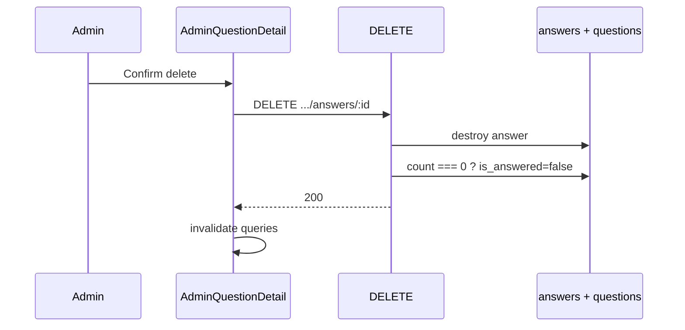

# Functional Requirement (FR) — Admin: Xóa câu trả lời (Admin Delete Answer)

## 1. Feature Overview

Admin/Manager **xóa** một câu trả lời. Nếu question **không còn** answer nào, hệ thống đặt lại `questions.is_answered = false` (cho phép trả lời lại trên UI admin).

```
DELETE /api/admin/questions/:question_id/answers/:answer_id   ← FE kỳ vọng
```

**Controller:** `questionsController.deleteAnswer` — **có code**.  
**Route:** **chưa mount** → FE **404**.

**FE:** `AdminQuestionDetail` (nút Trash); `AdminQuestions` import `useDeleteAnswer` + `handleDeleteAnswer` nhưng **không gắn UI** trên list.

---

## 2. Actors

| Actor | Mô tả |
|-------|-------|
| **Admin / Manager** | Xóa trả lời |
| **deleteAnswer** | Handler |
| **Customer** | Thấy answer biến mất khi reload PDP |

---

## 3. Scope

### In Scope

- Hard delete row `answers`.
- Recount answers → reset `is_answered` nếu count = 0.
- Confirm dialog trên FE.

### Out of Scope

- Soft delete / archive.
- Cascade xóa question.
- Xóa answer từ PDP (không API).

---

## 4. API Contract (intended)

### Request

```http
DELETE /api/admin/questions/42/answers/10
Authorization: Bearer <token>
```

### Response — 200

```json
{
  "message": "Answer deleted successfully"
}
```

### Errors

| HTTP | Message |
|------|---------|
| 404 | `Answer not found` |
| 401/403 | Auth |
| **404** | Route chưa đăng ký (Express) |

---

## 5. Backend Logic

```javascript
exports.deleteAnswer = async (req, res, next) => {
  const { question_id, answer_id } = req.params;

  const answer = await Answer.findOne({
    where: { answer_id, question_id },
  });
  if (!answer) return res.status(404).json({ message: 'Answer not found' });

  await answer.destroy();

  const remainingAnswers = await Answer.count({ where: { question_id } });
  if (remainingAnswers === 0) {
    await Question.update(
      { is_answered: false },
      { where: { question_id } }
    );
  }

  res.json({ message: 'Answer deleted successfully' });
};
```

| # | Business rule |
|---|----------------|
| BR-01 | Xóa **một** answer; các answer khác (nếu admin đã tạo nhiều) vẫn giữ `is_answered` true |
| BR-02 | Chỉ khi **count = 0** mới `is_answered: false` |
| BR-03 | Không xóa question / children follow-up |
| BR-04 | Không kiểm tra "chỉ người tạo answer mới được xóa" |

### Scenario — nhiều answers (admin path)

| Trước | Hành động | Sau |
|-------|-----------|-----|
| 2 answers, `is_answered=true` | DELETE 1 answer | `is_answered` **vẫn true**, còn 1 answer |
| 1 answer | DELETE answer cuối | `is_answered=false`, form thêm hiện lại |

---

## 6. Route Gap

**Cần thêm vào `adminRoutes.js`:**

```javascript
router.delete(
  "/questions/:question_id/answers/:answer_id",
  questionsController.deleteAnswer
);
```

Thứ tự route: path cụ thể `/questions/:question_id/answers/:answer_id` sau GET list, trước hoặc sau POST answers — không conflict với `GET /questions/:question_id`.

---

## 7. Frontend

### Hook — `useDeleteAnswer`

```javascript
api.delete(`/admin/questions/${questionId}/answers/${answerId}`)
onSuccess: invalidate admin-questions + admin-question
```

### AdminQuestionDetail

```javascript
if (!confirm('Bạn có chắc muốn xóa câu trả lời này?')) return;
await deleteAnswer.mutateAsync({ questionId: question_id, answerId });
```

### AdminQuestions

- Import `useDeleteAnswer` và `handleDeleteAnswer` — **dead code** trên list (GAP).
- List chỉ tạo answer qua modal, không xóa inline.

---

## 8. Tương tác với PDP

| Kênh | Sau khi xóa admin |
|------|-------------------|
| Admin panel | `is_answered` false nếu hết answer → modal/detail cho phép trả lời lại |
| PDP `createAnswer` | Cho phép POST answer mới (409 chỉ khi còn row answer) |
| Global Home Q&A | Reload hiển thị không còn answer trong include |

---

## 9. Sequence



---

## 10. Related FRs

| FR | Liên kết |
|----|----------|
| `FR_AdminCreateAnswer` | Tạo lại sau xóa hết |
| `FR_AdminUpdateAnswer` | Sửa thay vì xóa |
| `FR_UpdateDeleteProductQuestion` | Xóa cả question (+ answers) — API khác, chưa route |

---

## 11. Source Files

| File | Vai trò |
|------|---------|
| `server/controllers/questionsController.js` | `deleteAnswer` |
| `server/routes/adminRoutes.js` | Route missing |
| `client/app/hooks/useQuestions.js` | Hook |
| `client/app/pages/admin/AdminQuestionDetail.jsx` | UI delete |
| `client/app/pages/admin/AdminQuestions.jsx` | Unused handler |

---

## 12. Acceptance Criteria

**Sau khi mount route:**

- [ ] DELETE hợp lệ → 200, row biến mất.
- [ ] Xóa answer cuối → `is_answered` false.
- [ ] Xóa 1 trong nhiều answer → `is_answered` true nếu còn answer khác.
- [ ] FE detail/list refresh.
- [ ] Sai `answer_id` → 404.

**Hiện tại:**

- [ ] Detail nút Trash → fail (404 route).

---

## 13. Known Gaps

| # | Mô tả |
|---|--------|
| GAP-01 | **DELETE route not mounted** |
| GAP-02 | List page không expose delete dù có handler |
| GAP-03 | Admin có thể tạo nhiều answer nhưng UI ẩn form khi `is_answered` — xóa 1 answer có thể vẫn còn answer khác, form vẫn ẩn |
| GAP-04 | `productController.deleteQuestion` xóa tất cả answers của question — khác DELETE từng answer admin |
