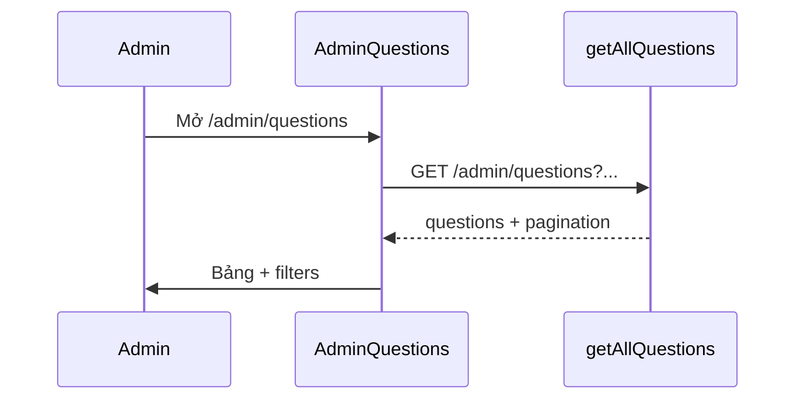

# Functional Requirement (FR) — Admin: Danh sách câu hỏi (Admin List Questions)

## 1. Feature Overview

Admin/Manager xem **danh sách câu hỏi** từ khách (global và theo sản phẩm), lọc, sắp xếp, phân trang, trả lời nhanh qua modal hoặc mở chi tiết.

```
GET /api/admin/questions
Authorization: Bearer JWT
Role: admin | manager
```

**FE:** `AdminQuestions.jsx` + `useAdminQuestions()`.

---

## 2. Actors

| Actor | Mô tả |
|-------|-------|
| **Admin / Manager** | Truy cập `/admin/questions` |
| **questionsController.getAllQuestions** | API list |
| **AdminRoute** | Bảo vệ route FE |

---

## 3. Scope

### In Scope

- Query: `page`, `limit`, `answered`, `has_product`, `sort_by`, `sort_order`.
- Include: `user`, `product` (optional), `answers` (+ user trả lời).
- Bảng UI: câu hỏi, khách, SP, thời gian, trạng thái, thao tác.
- Modal trả lời nhanh (`POST .../answers`).
- Navigate `/admin/questions/:question_id`.

### Out of Scope

- Sửa/xóa câu hỏi trên list (chưa có API/FE — xem `FR_UpdateDeleteProductQuestion`).
- Xóa câu hỏi admin.
- Export CSV.

---

## 4. API Contract

### Request

```
GET /api/admin/questions?page=1&limit=20&answered=true|false&has_product=true|false&sort_by=created_at&sort_order=DESC
```

| Param | Default | Mô tả |
|-------|---------|-------|
| `page` | 1 | Trang |
| `limit` | 20 | Page size |
| `answered` | — | `true` / `false` filter `is_answered` |
| `has_product` | — | `true` → `product_id IS NOT NULL`; `false` → global Q&A |
| `sort_by` | `created_at` | `created_at` \| `updated_at` \| `question_id` |
| `sort_order` | `DESC` | `ASC` \| `DESC` |

### Response — 200

```json
{
  "questions": [
    {
      "question_id": 1,
      "question_text": "...",
      "is_answered": false,
      "product_id": 5,
      "created_at": "...",
      "user": { "user_id", "username", "full_name", "email" },
      "product": { "product_id", "product_name" },
      "answers": [
        {
          "answer_id": 10,
          "answer_text": "...",
          "created_at": "...",
          "user": { "user_id", "username", "full_name" }
        }
      ]
    }
  ],
  "pagination": {
    "total": 100,
    "page": 1,
    "limit": 20,
    "totalPages": 5
  }
}
```

**Lưu ý:** List include **tất cả** answers nested — không giới hạn 1 answer.

---

## 5. Backend Logic

```javascript
const where = {};
if (answered === 'true') where.is_answered = true;
else if (answered === 'false') where.is_answered = false;
if (has_product === 'true') where.product_id = { [Op.ne]: null };
else if (has_product === 'false') where.product_id = null;

Question.findAndCountAll({
  where,
  include: [User, Product (required: false), Answer+User (required: false)],
  limit, offset,
  order: [[sortField, sortOrder], ['created_at', 'DESC']],
});
```

| # | Rule |
|---|------|
| BR-01 | Không lọc `parent_question_id` — **follow-up** vẫn xuất hiện trong list |
| BR-02 | `authorizeRoles("admin", "manager")` trên toàn `adminRoutes` |
| BR-03 | Sort field whitelist — chống SQLi |

---

## 6. Frontend — AdminQuestions

### State

```javascript
page, answeredFilter ('all'|'true'|'false'), productFilter ('all'|'true'|'false')
sortBy, sortOrder, showFilters, answerModal
```

### useAdminQuestions

```javascript
api.get(`/admin/questions?${params}`)
queryKey: ["admin-questions", page, limit, answered, has_product, sort_by, sort_order]
staleTime: 0
```

### UI actions

| Action | Hành vi |
|--------|---------|
| Eye | `navigate(/admin/questions/:id)` |
| MessageSquare | Mở modal trả lời (chỉ `!is_answered`) |
| CheckCircle | Đã trả lời — không modal |
| Làm mới | `refetch()` |
| Sort cột Thời gian | Toggle ASC/DESC `created_at` |

### Modal trả lời nhanh

`useCreateAnswer` → `POST /admin/questions/:id/answers` → đóng modal, invalidate queries.

**Không** xóa/sửa answer trên list page (chỉ trên detail).

---

## 7. Sequence



---

## 8. Related FRs

| FR | Liên kết |
|----|----------|
| `FR_AdminViewQuestionDetail` | Chi tiết |
| `FR_AdminCreateAnswer` | Modal + detail |
| `FR_UpdateDeleteProductQuestion` | User questions (khác admin list) |

---

## 9. Source Files

| File | Vai trò |
|------|---------|
| `server/routes/adminRoutes.js` | `GET /questions` |
| `server/controllers/questionsController.js` | `getAllQuestions` |
| `client/app/pages/admin/AdminQuestions.jsx` | UI |
| `client/app/hooks/useQuestions.js` | `useAdminQuestions` |
| `client/app/App.jsx` | Route + AdminRoute |
| `docs/master_specification.md` §9.5, §11 | Spec |

---

## 10. Acceptance Criteria

- [ ] Admin/manager vào được trang; customer 403.
- [ ] Filter answered / has_product hoạt động.
- [ ] Pagination đúng `totalPages`.
- [ ] Sort `created_at` toggle ASC/DESC.
- [ ] Modal tạo answer → list/detail refresh.

---

## 11. Known Gaps

| # | Mô tả |
|---|--------|
| GAP-01 | List không ẩn câu hỏi con (`parent_question_id`) — có thể trùng logic PDP. |
| GAP-02 | `handleDeleteAnswer` import trên list nhưng **không dùng** trong JSX. |
| GAP-03 | Role `staff` không vào admin panel nhưng có thể trả lời trên PDP API. |
| GAP-04 | N+1 / payload lớn khi mỗi question nhiều answers. |
