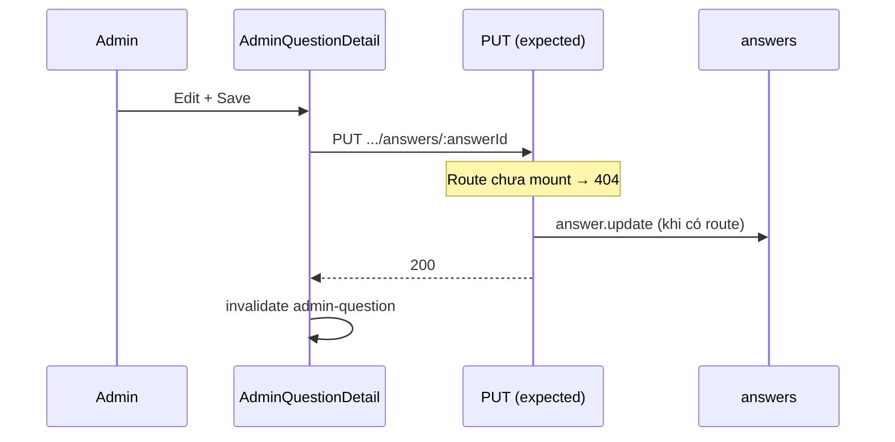

# Functional Requirement (FR) — Admin: Cập nhật câu trả lời (Admin Update Answer)

## 1. Feature Overview

Admin/Manager **sửa nội dung** câu trả lời đã tồn tại. Logic controller **đã implement**; route Express **chưa đăng ký** → FE gọi API hiện **404**.

```
PUT /api/admin/questions/:question_id/answers/:answer_id   ← FE kỳ vọng
Body: { "answer_text": "..." }
```

**FE:** `AdminQuestionDetail.jsx` inline edit + `useUpdateAnswer()`.

---

## 2. Actors

| Actor | Mô tả |
|-------|-------|
| **Admin / Manager** | Sửa trả lời trên detail page |
| **questionsController.updateAnswer** | Handler (có code) |
| **adminRoutes.js** | **Thiếu** `router.put(...)` |

---

## 3. Scope

### In Scope

- Đổi `answer_text` (trim).
- Ràng buộc `answer_id` thuộc `question_id` trong URL.
- Không đổi `user_id` / `created_at`.

### Out of Scope

- Sửa answer qua PDP API (không có PUT product).
- Audit log lịch sử chỉnh sửa.
- Versioning / soft delete.

---

## 4. API Contract (intended — theo controller)

### Request

```http
PUT /api/admin/questions/42/answers/10
Content-Type: application/json
Authorization: Bearer <token>

{
  "answer_text": "Nội dung đã chỉnh sửa."
}
```

### Response — 200 (khi route được mount)

```json
{
  "message": "Answer updated successfully",
  "answer": {
    "answer_id": 10,
    "question_id": 42,
    "user_id": 1,
    "answer_text": "Nội dung đã chỉnh sửa.",
    "created_at": "...",
    "updated_at": "..."
  }
}
```

**Lưu ý:** Response `answer` là instance Sequelize sau `update` — **không** re-include `user` như create.

### Errors

| HTTP | Message |
|------|---------|
| 400 | `Answer text is required` |
| 404 | `Answer not found` (sai `answer_id` hoặc không thuộc `question_id`) |
| 401/403 | Auth / role |
| **404** | **Hiện tại:** Express không match route → Cannot PUT |

---

## 5. Backend Logic

```javascript
exports.updateAnswer = async (req, res, next) => {
  const { question_id, answer_id } = req.params;
  const { answer_text } = req.body;

  if (!answer_text || answer_text.trim().length === 0) {
    return res.status(400).json({ message: 'Answer text is required' });
  }

  const answer = await Answer.findOne({
    where: { answer_id, question_id },
  });
  if (!answer) return res.status(404).json({ message: 'Answer not found' });

  await answer.update({ answer_text: answer_text.trim() });
  res.json({ message: 'Answer updated successfully', answer });
};
```

| # | Rule |
|---|------|
| BR-01 | Không kiểm tra quyền sở hữu answer — mọi admin/manager sửa được mọi answer |
| BR-02 | **Không** thay đổi `questions.is_answered` |
| BR-03 | Composite lookup `(answer_id, question_id)` — chống sửa answer của question khác |
| BR-04 | Không validate max length |

---

## 6. Route Gap (critical)

**`adminRoutes.js` hiện tại:**

```javascript
router.get("/questions", questionsController.getAllQuestions)
router.get("/questions/:question_id", questionsController.getQuestionDetail)
router.post("/questions/:question_id/answers", questionsController.createAnswer)
// THIẾU:
// router.put("/questions/:question_id/answers/:answer_id", questionsController.updateAnswer)
```

**Cần thêm** (đề xuất triển khai — ngoài phạm vi FR):

```javascript
router.put(
  "/questions/:question_id/answers/:answer_id",
  questionsController.updateAnswer
);
```

Mount path phải khớp FE: `/api/admin` + path trên.

---

## 7. Frontend — AdminQuestionDetail

### State

```javascript
const [editingAnswer, setEditingAnswer] = useState({ id: null, text: '' });
```

### Flow

1. Click Edit (icon) → `setEditingAnswer({ id: answer.answer_id, text: answer.answer_text })`.
2. Textarea hiển thị; Save → `handleUpdateAnswer(answerId)`.
3. `useUpdateAnswer.mutateAsync({ questionId, answerId, answerText })`.
4. Success → clear editing state; React Query invalidate.

### Error handling

```javascript
catch { alert('Có lỗi khi cập nhật câu trả lời') }
```

Không phân biệt 404 route vs 400 validation.

---

## 8. Sequence



---

## 9. Related FRs

| FR | Liên kết |
|----|----------|
| `FR_AdminCreateAnswer` | Tạo trước khi sửa |
| `FR_AdminDeleteAnswer` | Xóa answer |
| `FR_AdminViewQuestionDetail` | UI host |

---

## 10. Source Files

| File | Vai trò |
|------|---------|
| `server/controllers/questionsController.js` | `updateAnswer` ✅ |
| `server/routes/adminRoutes.js` | Route ❌ |
| `client/app/hooks/useQuestions.js` | `useUpdateAnswer` ✅ |
| `client/app/pages/admin/AdminQuestionDetail.jsx` | UI ✅ |

---

## 11. Acceptance Criteria

**Khi route đã mount:**

- [ ] PUT hợp lệ → 200, `answer_text` đổi trên DB, `updated_at` tăng.
- [ ] `answer_id` không thuộc `question_id` → 404.
- [ ] Body rỗng → 400.
- [ ] FE detail refresh sau success.

**Hiện trạng code:**

- [ ] FE hiển thị nút Edit — user click → **404** (documented gap).

---

## 12. Known Gaps

| # | Mô tả | Đề xuất |
|---|--------|---------|
| GAP-01 | **PUT route not mounted** | Thêm 1 dòng `adminRoutes.js` |
| GAP-02 | Response không include `user` | FE label vẫn "Admin" — OK |
| GAP-03 | Không có PUT trên product API | Staff sửa answer chỉ qua admin (sau fix route) |
| GAP-04 | `master_specification.md` §9.5 chỉ liệt kê GET + POST | Cập nhật spec khi mount PUT |
