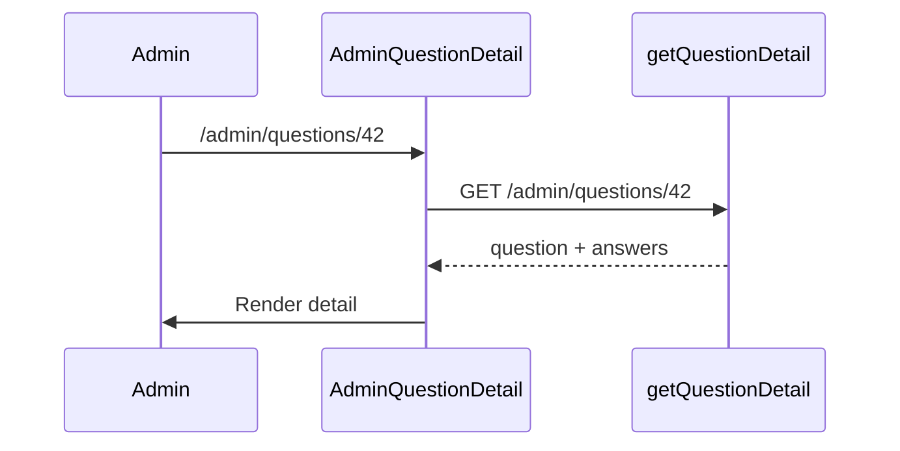

# Functional Requirement (FR) — Admin: Chi tiết câu hỏi (Admin View Question Detail)

## 1. Feature Overview

Admin/Manager xem **một câu hỏi** đầy đủ: nội dung, khách hàng, sản phẩm liên quan, danh sách câu trả lời, thêm/sửa/xóa trả lời (FE gọi API; một số route **chưa mount** — xem GAP).

```
GET /api/admin/questions/:question_id
```

**FE:** `/admin/questions/:question_id` → `AdminQuestionDetail.jsx` + `useAdminQuestionDetail(questionId)`.

---

## 2. Actors

| Actor | Mô tả |
|-------|-------|
| **Admin / Manager** | Xem & quản lý trả lời |
| **getQuestionDetail** | Load question + answers |
| **useCreateAnswer / Update / Delete** | Mutations |

---

## 3. Scope

### In Scope

- Hiển thị metadata: `is_answered`, `created_at`, user email, product.
- Liệt kê answers (ASC `created_at` trong include).
- Inline edit answer (UI).
- Form thêm answer khi `!is_answered`.
- Nút quay lại list.

### Out of Scope

- Sửa `question_text` trên admin (không UI; API product `updateQuestion` chưa route).
- Thread children follow-up (detail **không** load `children` include).
- Thông báo email cho khách khi có answer.

---

## 4. API Contract

### Request

```
GET /api/admin/questions/:question_id
```

### Response — 200

```json
{
  "question": {
    "question_id": 1,
    "question_text": "...",
    "is_answered": true,
    "product_id": 5,
    "parent_question_id": null,
    "created_at": "...",
    "updated_at": "...",
    "user": {
      "user_id": 2,
      "username": "user1",
      "full_name": "Nguyễn Văn A",
      "email": "a@example.com"
    },
    "product": {
      "product_id": 5,
      "product_name": "Laptop X"
    },
    "answers": [
      {
        "answer_id": 10,
        "answer_text": "...",
        "created_at": "...",
        "updated_at": "...",
        "user": { "user_id", "username", "full_name" }
      }
    ]
  }
}
```

### Errors

| HTTP | Message |
|------|---------|
| 404 | `Question not found` |
| 401/403 | Auth / role |

---

## 5. Backend — getQuestionDetail

```javascript
Question.findByPk(question_id, {
  include: [
    { model: User, as: 'user', attributes: [...] },
    { model: Product, as: 'product', attributes: ['product_id', 'product_name'] },
    {
      model: Answer, as: 'answers',
      include: [{ model: User, as: 'user', ... }],
      order: [['created_at', 'ASC']],
    },
  ],
});
```

| # | Rule |
|---|------|
| BR-01 | `product` include không `required: false` — câu global (`product_id` null) vẫn OK, `product` null |
| BR-02 | **Không** include `children` questions |
| BR-03 | Order answers trong nested include (Sequelize v4/v6 behavior — verify in production) |

---

## 6. Frontend — AdminQuestionDetail

### Data

```javascript
const { data, isLoading, error } = useAdminQuestionDetail(question_id);
const { question } = data || {};
```

### Hiển thị

- Badge Đã trả lời / Chưa trả lời.
- Khối sản phẩm (nếu có).
- Khối thông tin khách (`full_name`, `email`; `phone_number` hiển thị nếu có trên object — **BE không select phone** → thường undefined).

### Answers section

Mỗi answer: Edit → textarea inline; Delete → confirm + `useDeleteAnswer`.

**Label cứng:** "Admin • {date}" — không phân biệt manager vs admin user.

### Thêm answer

```javascript
{!question.is_answered && (
  // textarea + Gửi trả lời → useCreateAnswer
)}
```

| # | UX rule |
|---|---------|
| BR-04 | Sau khi có ≥1 answer, `is_answered` true → **ẩn** form thêm (dù API admin cho phép nhiều answer) |
| BR-05 | Nếu chỉ xóa hết answers (delete) → `is_answered` false → form hiện lại |

---

## 7. Mutations (expected endpoints)

| Hook | Method | Path (FE gọi) | Mounted adminRoutes? |
|------|--------|---------------|----------------------|
| useCreateAnswer | POST | `/admin/questions/:id/answers` | ✅ |
| useUpdateAnswer | PUT | `/admin/questions/:id/answers/:answerId` | ❌ **GAP** |
| useDeleteAnswer | DELETE | `/admin/questions/:id/answers/:answerId` | ❌ **GAP** |

Controller `updateAnswer` / `deleteAnswer` **tồn tại** trong `questionsController.js` nhưng **chưa** `router.put/delete` trong `adminRoutes.js`.

---

## 8. Sequence



---

## 9. Related FRs

| FR | Liên kết |
|----|----------|
| `FR_AdminListQuestions` | Entry |
| `FR_AdminCreateAnswer` | POST answer |
| `FR_AdminUpdateAnswer` | PUT answer |
| `FR_AdminDeleteAnswer` | DELETE answer |

---

## 10. Source Files

| File | Vai trò |
|------|---------|
| `server/controllers/questionsController.js` | `getQuestionDetail` |
| `server/routes/adminRoutes.js` | GET only (+ POST answer) |
| `client/app/pages/admin/AdminQuestionDetail.jsx` | UI |
| `client/app/hooks/useQuestions.js` | Hooks |

---

## 11. Acceptance Criteria

- [ ] GET hợp lệ trả question + answers.
- [ ] 404 → UI "Không tìm thấy".
- [ ] Create answer từ detail → refresh list (`invalidateQueries`).
- [ ] Update/delete answer **chỉ pass khi routes được mount** (hiện fail 404).

---

## 12. Known Gaps

| # | Mô tả |
|---|--------|
| GAP-01 | **PUT/DELETE answer routes missing** — UI có nhưng API 404. |
| GAP-02 | Không load follow-up `children` — admin không thấy thread đầy đủ như PDP. |
| GAP-03 | `user.phone_number` không được BE trả về. |
| GAP-04 | Hiển thị "Admin" cố định cho mọi answer user. |
