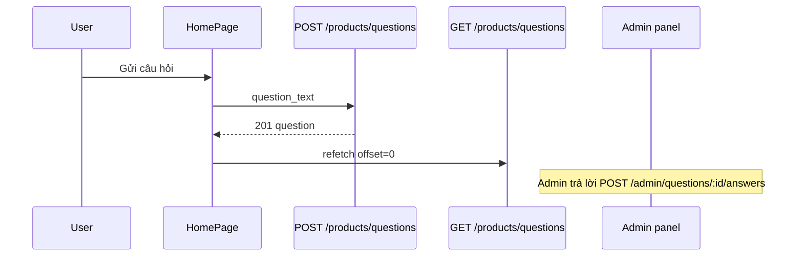

# Functional Requirement (FR) — Tạo câu hỏi toàn cục (Create Global Question)

## 1. Feature Overview

User đã đăng nhập gửi câu hỏi **không gắn sản phẩm** (`product_id = NULL`) từ trang chủ. Câu hỏi xuất hiện trong feed `GET /api/products/questions` và admin panel (`has_product=false`).

```
POST /api/products/questions
Authorization: Bearer JWT
Body: { "question_text": "..." }
```

**FE:** `HomePage.postGlobalQuestion` — `fetch` + refetch list (không reload trang).

---

## 2. Actors

| Actor | Mô tả |
|-------|-------|
| **Authenticated customer** | Tạo câu hỏi |
| **Guest** | Bị chặn UI + 401 API |
| **createGlobalQuestion** | Handler |
| **Admin / Manager** | Trả lời sau qua `/api/admin/questions/...` |

---

## 3. Scope

### In Scope

- Validate `question_text` non-empty (trim).
- `user_id` = `req.user.user_id`.
- `parent_question_id = null` (cố định).
- Response 201 + question kèm user.

### Out of Scope

- Follow-up trên global (chỉ PDP có `parent_question_id`).
- Rate limit / spam filter.
- Moderation trước khi hiển thị.

---

## 4. API Contract

### Request

```http
POST /api/products/questions
Content-Type: application/json
Authorization: Bearer <token>

{
  "question_text": "Cửa hàng có hỗ trợ trả góp không?"
}
```

### Response — 201

```json
{
  "question": {
    "question_id": 99,
    "product_id": null,
    "question_text": "Cửa hàng có hỗ trợ trả góp không?",
    "is_answered": false,
    "created_at": "2026-05-27T10:00:00.000Z",
    "parent_question_id": null,
    "user": {
      "user_id": 5,
      "username": "khach1",
      "full_name": "Trần B"
    }
  }
}
```

### Errors

| HTTP | Message |
|------|---------|
| 400 | `question_text is required` |
| 401 | `Access token required` / invalid token |
| 403 | User inactive |

---

## 5. Backend Logic

```javascript
const q = await Question.create({
  product_id: null,
  user_id: req.user.user_id,
  question_text: question_text.trim(),
  is_answered: false,
  parent_question_id: null,
});
```

| # | Rule |
|---|------|
| BR-01 | Middleware `authenticateToken` trên route |
| BR-02 | Không nhận `product_id` / `parent_question_id` từ body — luôn null |
| BR-03 | Mọi role đăng nhập đều tạo được (customer, staff, admin…) |
| BR-04 | Không set `is_answered` true lúc tạo |

---

## 6. Frontend — HomePage

```javascript
const postGlobalQuestion = async () => {
  const text = (qaText || "").trim();
  if (!text || !isAuthed) return;
  const resp = await fetch(`/api/products/questions`, {
    method: "POST",
    headers: { "Content-Type": "application/json", Authorization: `Bearer ${token}` },
    body: JSON.stringify({ question_text: text }),
  });
  // on success: clear qaText, refetch offset=0 limit=3
};
```

| # | UX |
|---|-----|
| BR-05 | Nút disabled khi chưa login hoặc text rỗng hoặc `qaPosting` |
| BR-06 | Lỗi: `alert(e.message)` từ JSON body |
| BR-07 | Sau success **refetch** list — không `window.location.reload()` |

### Auth detection

```javascript
const token = localStorage.getItem("token");
const isAuthed = !!token; // (pattern tương tự PDP)
```

---

## 7. Luồng sau khi tạo



---

## 8. Related FRs

| FR | Liên kết |
|----|----------|
| `FR_ListGlobalQuestions` | Hiển thị sau tạo |
| `FR_CreateProductQuestion` | Cùng bảng `questions`, khác `product_id` |
| `FR_AdminCreateAnswer` | Trả lời global từ admin |
| `FR_StaffAnswerOnProductPage` | **Không** dùng cho global (không form PDP) |

---

## 9. Source Files

| File | Vai trò |
|------|---------|
| `server/controllers/productController.js` | `createGlobalQuestion` |
| `server/routes/productRoutes.js` | `POST /questions` + `authenticateToken` |
| `client/app/pages/HomePage.jsx` | Form + POST |
| `server/middleware/auth.js` | JWT |

---

## 10. Acceptance Criteria

- [ ] User có token POST hợp lệ → 201, `product_id` null.
- [ ] Guest → UI disabled; POST → 401.
- [ ] Text rỗng → 400.
- [ ] List trang chủ refresh thấy câu mới (đầu feed nếu sort DESC).
- [ ] Admin list filter `has_product=false` thấy câu.

---

## 11. Known Gaps

| # | Mô tả |
|---|--------|
| GAP-01 | Staff/Admin cũng tạo global như customer — không tách role |
| GAP-02 | Không validate độ dài tối đa `question_text` |
| GAP-03 | Trang chủ không redirect login — chỉ disable nút |
| GAP-04 | Global question sau khi trả lời admin vẫn nằm chung feed với product questions |
