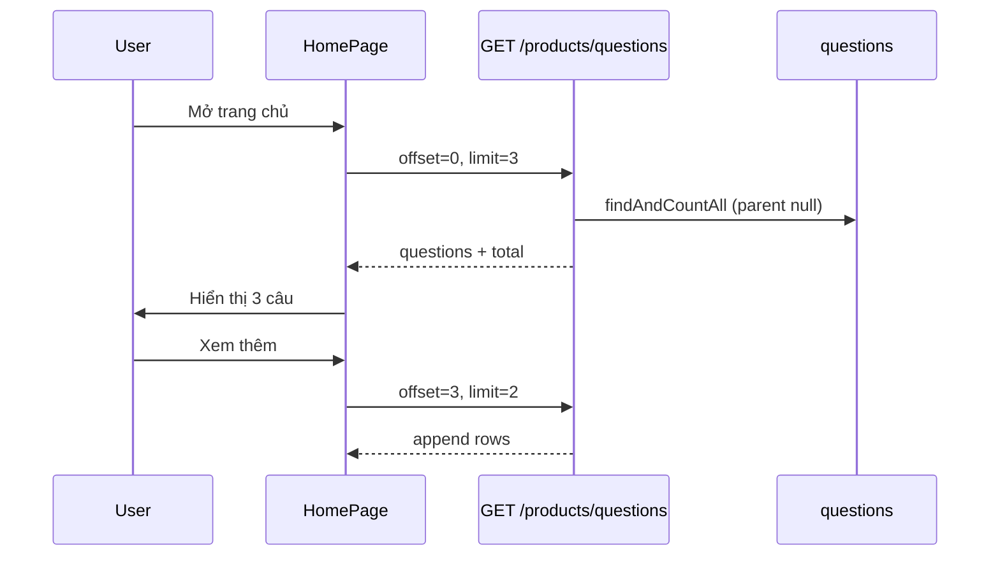

# Functional Requirement (FR) — Danh sách câu hỏi toàn cục (List Global Questions)

## 1. Feature Overview

API **công khai** trả về danh sách câu hỏi **gốc** (`parent_question_id IS NULL`) trên toàn hệ thống — gồm cả câu hỏi **global** (`product_id = NULL`) và câu hỏi **gắn sản phẩm** (đặt từ PDP nhưng hiển thị trên trang chủ nếu là câu gốc). Dùng cho khối **Hỏi & đáp** cuối `HomePage.jsx`.

```
GET /api/products/questions
Query: page | limit | offset
Auth: không bắt buộc
```

**FE:** `fetchGlobalQuestions` — `fetch` thuần, không React Query; load ban đầu `limit=3`, “Xem thêm” `limit=2` + `offset`.

---

## 2. Actors

| Actor | Mô tả |
|-------|-------|
| **Guest / User** | Xem danh sách |
| **getGlobalQuestions** | `productController.getGlobalQuestions` |
| **HomePage** | UI list + load more |

---

## 3. Scope

### In Scope

- Phân trang qua `offset` + `limit` hoặc `page` + `limit`.
- Include: `user`, `product` (optional), `answers` + user trả lời.
- Chỉ câu hỏi **root** (không include `children` follow-up).
- `distinct: true` với `findAndCountAll`.

### Out of Scope

- Follow-up nested (chỉ thấy trên PDP embedded).
- Staff trả lời trên HomePage (không UI — trả lời qua admin hoặc PDP).
- Filter theo `product_id`, `answered`, search text.

---

## 4. API Contract

### Request examples

```http
GET /api/products/questions?offset=0&limit=3
GET /api/products/questions?page=1&limit=10
```

| Param | Default | Mô tả |
|-------|---------|-------|
| `page` | 1 | Dùng khi **không** truyền `offset` |
| `limit` | 3 | Min 1, max **50** |
| `offset` | `(page-1)*limit` | Nếu có → **ưu tiên** thay cho page-based offset |

### Response — 200

```json
{
  "questions": [
    {
      "question_id": 1,
      "product_id": null,
      "question_text": "Shop có giao nhanh không?",
      "is_answered": true,
      "created_at": "2026-05-27T08:00:00.000Z",
      "parent_question_id": null,
      "user": { "user_id": 2, "username": "user1", "full_name": "Nguyễn A" },
      "product": null,
      "answers": [
        {
          "answer_id": 5,
          "answer_text": "Có, 1–2 ngày nội thành.",
          "created_at": "...",
          "user": { "user_id": 1, "username": "admin", "full_name": "QTV" }
        }
      ]
    },
    {
      "question_id": 2,
      "product_id": 10,
      "question_text": "Laptop này pin bao lâu?",
      "product": { "product_id": 10, "product_name": "...", "slug": "..." },
      "answers": []
    }
  ],
  "total": 42,
  "page": 1,
  "limit": 3,
  "offset": 0,
  "totalPages": 14
}
```

Header: `Content-Type: application/json; charset=utf-8`.

### Errors

| HTTP | Nguyên nhân |
|------|-------------|
| 500 | DB / Sequelize (qua `next(err)`) |

---

## 5. Backend Logic

```javascript
const where = { parent_question_id: null };

Question.findAndCountAll({
  where,
  include: [User, Product (required: false), Answer+User],
  order: [
    ["created_at", "DESC"],
    [{ model: Answer, as: "answers" }, "created_at", "ASC"],
  ],
  limit,
  offset,
  distinct: true,
});
```

| # | Business rule |
|---|----------------|
| BR-01 | **Không** lọc `product_id IS NULL` — list “global feed” = mọi câu **gốc**, kể cả hỏi từ PDP |
| BR-02 | Follow-up (`parent_question_id` ≠ null) **không** xuất hiện |
| BR-03 | Một question có thể có **nhiều** answers trong DB; API trả tất cả (admin path có thể tạo nhiều; PDP thường 1) |
| BR-04 | `total` = count câu gốc thỏa `where` |
| BR-05 | Route đặt **trước** `GET /:id` trong `productRoutes.js` — tránh nhầm `questions` là slug |

---

## 6. Frontend — HomePage

### State

```javascript
qaItems, qaOffset, qaHasMore, qaLoading, openQaReplies
```

### Initial load

```javascript
useEffect(() => {
  fetchGlobalQuestions({ offset: 0, limit: 3, append: false });
  setQaOffset(0);
}, []);
```

### Load more

```javascript
loadMoreQuestions → fetchGlobalQuestions({ offset: qaOffset, limit: 2, append: true });
qaHasMore = (nextOffset < total);
```

### UI behavior

| Element | Hành vi |
|---------|---------|
| Card câu hỏi | Avatar, tên, `timeAgo`, `product_name` nếu `product_id` |
| Chưa có answer | Text “Chưa có phản hồi.” |
| Có answer | Nút “Xem phản hồi” / “Thu gọn” |
| Answer block | Badge **QTV**, icon Store — luôn style admin |
| Cuối list | “Xem thêm” hoặc “Đã hết câu hỏi” |

**Không** có form trả lời trên HomePage.

---

## 7. So sánh với list embedded PDP

| Tiêu chí | `GET /products/questions` | `GET /products/:id` (embedded) |
|----------|---------------------------|--------------------------------|
| Phạm vi | Mọi câu gốc hệ thống | Một sản phẩm |
| Follow-up children | Không | Có (nested `children`) |
| Pagination | Server `offset/limit` | Client `qaVisibleCount` slice |
| Product filter | Không | Theo `product_id` implicit |

---

## 8. Sequence



---

## 9. Related FRs

| FR | Liên kết |
|----|----------|
| `FR_CreateGlobalQuestion` | Tạo câu `product_id` null |
| `FR_CreateProductQuestion` | Câu gốc PDP cũng có thể lên feed |
| `FR_StaffAnswerOnProductPage` | Trả lời PDP; sau đó hiện answer ở đây |
| `FR_ListProductQuestionsEmbedded` | Cùng data model, khác API |

---

## 10. Source Files

| File | Vai trò |
|------|---------|
| `server/controllers/productController.js` | `getGlobalQuestions` |
| `server/routes/productRoutes.js` | `GET /questions` |
| `client/app/pages/HomePage.jsx` | UI + fetch |
| `docs/master_specification.md` §10.6 | Q&A global |

---

## 11. Acceptance Criteria

- [ ] GET không cần token → 200.
- [ ] Chỉ câu `parent_question_id = null`.
- [ ] `offset` + `limit` append đúng trên FE (`qaHasMore`).
- [ ] Câu global và câu product (gốc) đều có thể xuất hiện.
- [ ] Câu có `product` include tên SP khi `product_id` set.

---

## 12. Known Gaps

| # | Mô tả |
|---|--------|
| GAP-01 | Feed trộn global + product questions — có thể gây nhầm “chỉ hỏi chung” |
| GAP-02 | Không hiển thị follow-up dù PDP có thread |
| GAP-03 | Không link sang `/products/:slug` từ tên SP (chỉ text) |
| GAP-04 | `page` trong response khi FE chỉ dùng `offset` — có thể lệch semantics |
| GAP-05 | Nhiều answers / question — UI list tất cả, không giới hạn 1 |
