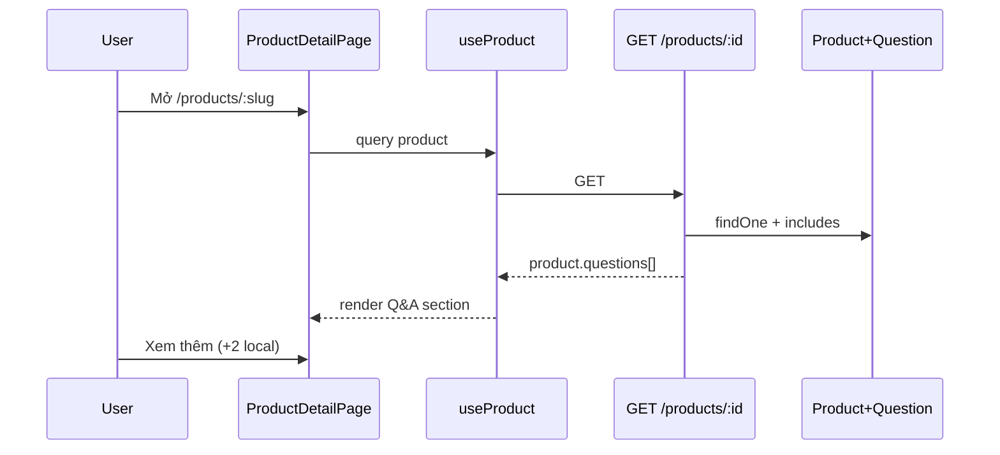

# Functional Requirement (FR) — Danh sách Q&A nhúng trong chi tiết SP (List Product Questions — Embedded)

## 1. Feature Overview

Khi client gọi **`GET /api/products/:id`**, response `product` chứa mảng **`questions`** đã join sẵn: câu hỏi **gốc**, `answers`, và **children** (follow-up). Đây là nguồn dữ liệu chính cho khối **Hỏi & Đáp** trên `ProductDetailPage` — **không** gọi API list Q&A riêng.

```
GET /api/products/:id   →  { product: { ..., questions: [...] } }
```

**FE:** `useProduct(id)` → `api.get('/products/${id}')` → render `product.questions`.

---

## 2. Actors

| Actor | Mô tả |
|-------|-------|
| **Guest / User** | Xem Q&A trên PDP |
| **getProductDetail** | Include Sequelize |
| **useProduct** | React Query cache key `["product", id]` |

---

## 3. Scope

### In Scope

- Include chỉ câu **`parent_question_id: null`** (gốc).
- Nested `children` + `answers` cho gốc và children.
- Sort: gốc DESC `created_at`; answers ASC; children ASC.
- FE sort lại + **client pagination** (`qaVisibleCount`, mặc định 3, +2 mỗi lần).

### Out of Scope

- Server-side pagination Q&A trong `getProductDetail`.
- Load Q&A khi chưa load product (luôn bundle).
- `GET getProductQuestions` standalone (xem `FR_GetProductQuestionsStandalone`).

---

## 4. API — cấu trúc `product.questions[]`

### Question gốc (root)

```json
{
  "question_id": 10,
  "question_text": "Có tặng chuột không?",
  "is_answered": true,
  "created_at": "2026-05-20T...",
  "parent_question_id": null,
  "user": { "user_id": 3, "username": "u1", "full_name": "Khách" },
  "answers": [
    {
      "answer_id": 7,
      "answer_text": "Có, chuột không dây.",
      "created_at": "...",
      "user": { "user_id": 1, "username": "admin", "full_name": "QTV" }
    }
  ],
  "children": [
    {
      "question_id": 11,
      "question_text": "Bảo hành chuột bao lâu?",
      "is_answered": false,
      "created_at": "...",
      "parent_question_id": 10,
      "user": { ... },
      "answers": []
    }
  ]
}
```

**Lưu ý:** `product_id` không nằm trong `attributes` của include question — FE dùng `q.product_id` trong map có thể undefined; tên SP lấy từ `product.product_name`.

---

## 5. Backend — `getProductDetail` include

```javascript
{
  model: Question,
  as: "questions",
  attributes: [
    "question_id", "question_text", "is_answered",
    "created_at", "parent_question_id",
  ],
  where: { parent_question_id: null },
  required: false,
  include: [
    { model: User, as: "user", attributes: ["user_id", "username", "full_name"] },
    { model: Answer, as: "answers", ... include User },
    {
      model: Question,
      as: "children",
      attributes: [...],
      include: [User, Answer+User],
    },
  ],
}
```

### Order clause

| Target | Sort |
|--------|------|
| Root questions | `created_at` DESC |
| Root → answers | `created_at` ASC |
| Root → children | `created_at` ASC |
| Children → answers | `created_at` ASC |

| # | Rule |
|---|------|
| BR-01 | Follow-up **không** xuất hiện như phần tử top-level — chỉ trong `children` |
| BR-02 | `required: false` — product không có câu hỏi vẫn 200 |
| BR-03 | Kèm theo variations, images, category, brand, tags — payload lớn |

---

## 6. Frontend — ProductDetailPage

### Load product

```javascript
const { data: productData } = useProduct(id);
const product = productData?.product;
```

### Chuẩn hóa list

```javascript
const allQuestions = Array.isArray(product?.questions) ? product.questions : [];
const sortedQuestions = [...allQuestions].sort(
  (a, b) => new Date(b.created_at) - new Date(a.created_at)
);
const visibleQuestions = sortedQuestions.slice(0, qaVisibleCount);
const qaHasMore = qaVisibleCount < sortedQuestions.length;
```

| # | UX |
|---|-----|
| BR-04 | “Xem thêm câu hỏi” tăng `qaVisibleCount` +2 — **không** gọi API |
| BR-05 | Mỗi card: collapse “Xem phản hồi” (`openReplies`) |
| BR-06 | Hiển thị answers + children + form staff + form follow-up |

### Sau POST question / answer

`window.location.reload()` — tải lại **toàn bộ** `getProductDetail`.

---

## 7. So sánh Embedded vs Standalone

| | Embedded (`getProductDetail`) | Standalone (`getProductQuestions`) |
|--|-------------------------------|-------------------------------------|
| Route | ✅ `GET /products/:id` | ❌ **Chưa mount** |
| Root only in top-level | ✅ `where parent null` | ❌ Tất cả rows (kể cả follow-up flat) |
| `children` nested | ✅ | ❌ |
| Pagination | Client slice | Server page/limit |
| Kích thước response | Lớn (full PDP) | Chỉ Q&A |

---

## 8. Sequence



---

## 9. Related FRs

| FR | Liên kết |
|----|----------|
| `FR_CreateProductQuestion` | Thêm câu → reload embedded |
| `FR_StaffAnswerOnProductPage` | Answer trong `q.answers` |
| `FR_GetProductQuestionsStandalone` | Thay thế / bổ sung nếu mount route |
| `FR_ListGlobalQuestions` | Feed khác, không dùng embedded |

---

## 10. Source Files

| File | Vai trò |
|------|---------|
| `server/controllers/productController.js` | `getProductDetail` (L341–498) |
| `server/models/index.js` | `Question` associations `children`, `answers` |
| `client/app/hooks/useProducts.js` | `useProduct` |
| `client/app/pages/ProductDetailPage.jsx` | Q&A UI L994+ |

---

## 11. Acceptance Criteria

- [ ] GET product trả `questions` chỉ câu gốc.
- [ ] Mỗi gốc có `children` tối đa 1 (business) nếu user đã follow-up.
- [ ] Answers nested đúng thứ tự thời gian.
- [ ] PDP “Xem thêm” chỉ hiện khi còn câu trong `sortedQuestions`.
- [ ] Product không có Q&A → “Chưa có câu hỏi nào.”

---

## 12. Known Gaps

| # | Mô tả |
|---|--------|
| GAP-01 | Sort FE trùng sort BE — redundant |
| GAP-02 | Reload page thay vì patch cache React Query |
| GAP-03 | Follow-up child có `answers` include nhưng UI children block **không** render answers của child — chỉ `question_text` |
| GAP-04 | Payload PDP phình to khi nhiều Q&A |
| GAP-05 | `getProductQuestions` duplicate logic nhưng không dùng |
