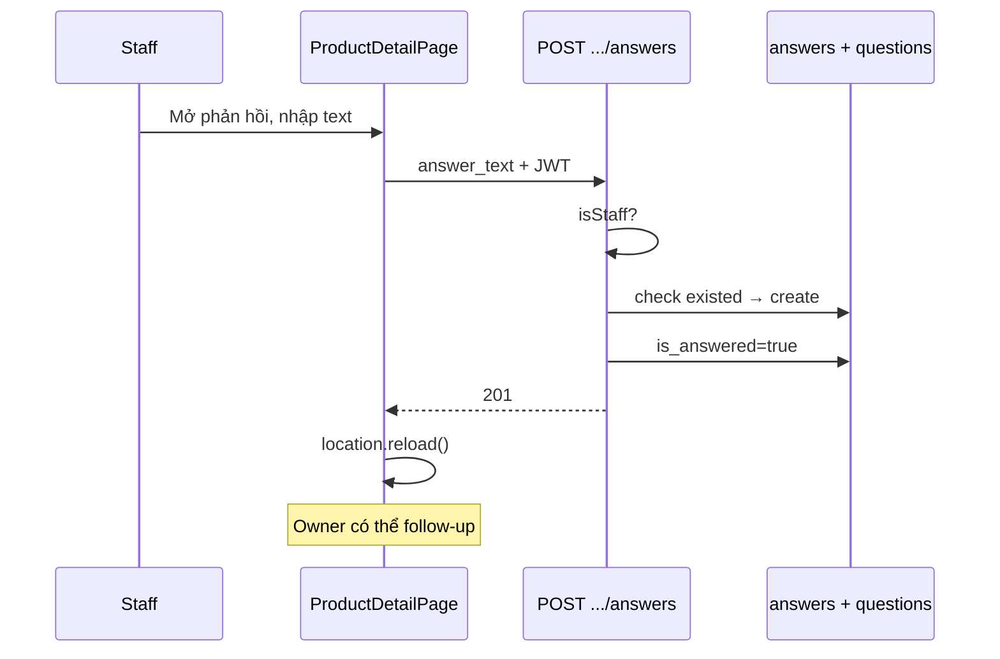

# Functional Requirement (FR) — Staff/Admin trả lời trên trang sản phẩm (Staff Answer on Product Page)

## 1. Feature Overview

Nhân viên **`admin`** hoặc **`staff`** trả lời câu hỏi **trực tiếp trên PDP** qua API product (không qua admin panel). Mỗi câu hỏi tối đa **một** câu trả lời; trùng → **409**.

```
POST /api/products/questions/:question_id/answers
Authorization: Bearer JWT
Body: { "answer_text": "..." }
Role (BE): admin | staff
Role (FE): localStorage roles includes admin | staff
```

**FE:** `ProductDetailPage.postAnswer` + form textarea trong khối “Xem phản hồi”.

**Khác** `POST /api/admin/questions/:id/answers` — manager được admin route; PDP **không** có manager; admin route cho phép **nhiều** answers.

---

## 2. Actors

| Actor | Mô tả |
|-------|-------|
| **Admin / Staff** | Gửi trả lời trên PDP |
| **Manager** | Có admin panel nhưng **không** pass `isStaff` trên API product |
| **Customer** | Chỉ xem; không thấy form trả lời |
| **productController.createAnswer** | Handler |

---

## 3. Scope

### In Scope

- Validate `answer_text`.
- Kiểm tra role trong controller.
- Một answer / question_id (app-level + optional DB unique).
- Set `is_answered: true`.
- Form chỉ khi `canAnswer` (FE).

### Out of Scope

- Sửa/xóa answer trên PDP (không API product PUT/DELETE).
- Trả lời global question trên HomePage (không UI).
- Manager trả lời trên PDP.

---

## 4. API Contract

### Request

```http
POST /api/products/questions/42/answers
Content-Type: application/json
Authorization: Bearer <token>

{
  "answer_text": "Sản phẩm bảo hành 12 tháng chính hãng."
}
```

`question_id` có thể là câu **product** hoặc **global** (cùng bảng `questions`) — API không kiểm tra `product_id`.

### Response — 201

```json
{
  "answer": {
    "answer_id": 20,
    "answer_text": "Sản phẩm bảo hành 12 tháng chính hãng.",
    "created_at": "2026-05-27T11:00:00.000Z",
    "user": {
      "user_id": 1,
      "username": "staff1",
      "full_name": "Nhân viên A"
    }
  }
}
```

### Errors

| HTTP | Message |
|------|---------|
| 400 | `answer_text is required` |
| 403 | `Only staff can answer` |
| 404 | `Question not found` |
| 409 | `This question already has an answer` |
| 401 | JWT |

---

## 5. Backend Logic

```javascript
const roles = (req.user.Roles || []).map((r) => r.role_name);
const isStaff = roles.includes("admin") || roles.includes("staff");
if (!isStaff) return res.status(403).json({ message: "Only staff can answer" });

const existed = await Answer.findOne({ where: { question_id: q.question_id } });
if (existed) return res.status(409).json({ message: "This question already has an answer" });

await Answer.create({ question_id, user_id: req.user.user_id, answer_text: trim });
if (!q.is_answered) await q.update({ is_answered: true });
```

| # | Rule |
|---|------|
| BR-01 | **Không** include `manager` trong `isStaff` |
| BR-02 | Answer áp dụng cho **mọi** question_id hợp lệ (kể cả global) nếu biết id |
| BR-03 | Không gán `question.product_id` khi trả lời |
| BR-04 | SequelizeUniqueConstraintError → 409 (nếu DB unique) |

---

## 6. Frontend — ProductDetailPage

### Quyền hiển thị form

```javascript
const roles = JSON.parse(localStorage.getItem("roles") || "[]");
const canAnswer = roles.includes("admin") || roles.includes("staff");
```

| # | UX |
|---|-----|
| BR-05 | Form trong panel “Xem phản hồi”, `placeholder="Nhập câu trả lời…"` |
| BR-06 | Nút “Gửi trả lời” gọi `postAnswer(q.question_id)` |
| BR-07 | **Form vẫn hiện** khi `canAnswer` ngay cả nếu đã có answer — API 409, không ẩn form |
| BR-08 | Success: clear draft + `window.location.reload()` |
| BR-09 | Fail: `alert("Gửi trả lời thất bại")` — không parse message 409 |

### Hiển thị answer đã có

```javascript
const isAdmin =
  roles.includes("admin") ||
  roles.includes("staff") ||
  /quản trị|admin|staff/i.test(replier);
// → AdminAvatar + AdminBadge
```

### postAnswer implementation

```javascript
const resp = await fetch(`/api/products/questions/${question_id}/answers`, {
  method: "POST",
  headers: {
    "Content-Type": "application/json",
    Authorization: `Bearer ${token}`,
  },
  body: JSON.stringify({ answer_text }),
});
```

---

## 7. Tương tác nghiệp vụ

### Sau khi staff trả lời câu gốc

1. `is_answered = true` → owner thấy form **follow-up** (`FR_CreateProductQuestion`).
2. Answer hiển thị trong `q.answers[]` sau reload.
3. Global feed / admin list cập nhật `is_answered`.

### Trả lời follow-up child

- Form staff gắn `q.question_id` của **câu gốc** trong map `visibleQuestions` — child nằm trong `children` **không** có form answer riêng trong UI hiện tại.
- Staff muốn trả lời follow-up: cần biết `child.question_id` — **UI không expose** → gap.

### Manager workflow

- Trả lời qua **Admin** `POST /api/admin/questions/:id/answers` (không giới hạn 1 answer trên code admin).

---

## 8. So sánh Admin vs PDP answer

| | PDP `createAnswer` | Admin `createAnswer` |
|--|-------------------|----------------------|
| Path | `/api/products/questions/:id/answers` | `/api/admin/questions/:id/answers` |
| Roles | admin, staff | admin, manager |
| Max answers | 1 | Không check (code) |
| FE | ProductDetailPage | AdminQuestions / Detail |
| 409 duplicate | Có | Không |

---

## 9. Sequence



---

## 10. Related FRs

| FR | Liên kết |
|----|----------|
| `FR_ListProductQuestionsEmbedded` | Hiển thị answer |
| `FR_CreateProductQuestion` | Follow-up sau answered |
| `FR_AdminCreateAnswer` | Kênh admin thay thế |
| `FR_ListGlobalQuestions` | Hiển thị answer global trên Home |

---

## 11. Source Files

| File | Vai trò |
|------|---------|
| `server/controllers/productController.js` | `createAnswer` L987–1043 |
| `server/routes/productRoutes.js` | `POST /questions/:question_id/answers` |
| `client/app/pages/ProductDetailPage.jsx` | `canAnswer`, `postAnswer`, form |
| `server/middleware/auth.js` | `authenticateToken` (không authorizeRoles trên route) |

---

## 12. Acceptance Criteria

- [ ] Staff token POST lần 1 → 201, `is_answered` true.
- [ ] POST lần 2 cùng question → 409.
- [ ] Customer token → 403.
- [ ] Guest không thấy form; POST → 401.
- [ ] Sau reload PDP hiển thị answer + badge admin.
- [ ] Owner thấy follow-up form khi đủ điều kiện.

---

## 13. Known Gaps

| # | Mô tả |
|---|--------|
| GAP-01 | **Manager** không trả lời được trên PDP |
| GAP-02 | Form staff không ẩn sau khi đã answered → UX 409 |
| GAP-03 | **Không trả lời follow-up child** trên UI (chỉ câu gốc trong loop) |
| GAP-04 | `roles` từ localStorage có thể lệch JWT/session |
| GAP-05 | Reload thay vì optimistic update |
| GAP-06 | Admin panel có thể thêm answer thứ 2; PDP 409 — data không đồng nhất |
| GAP-07 | Có thể POST answer cho global question bằng id (không có UI PDP) |
