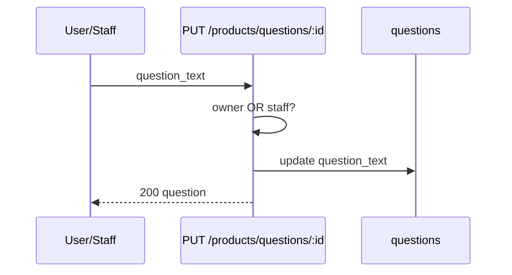

# Functional Requirement (FR) — User: Cập nhật & xóa câu hỏi sản phẩm (Update / Delete Product Question)

## 1. Feature Overview

Tính năng cho phép **chủ câu hỏi** hoặc **admin/staff** sửa / xóa câu hỏi Q&A (theo sản phẩm hoặc global). Logic nằm trong `productController.updateQuestion` và `productController.deleteQuestion`.

**Trạng thái triển khai:** Controller **đã viết**; **không có route** trong `productRoutes.js`; **không có UI** gọi PUT/DELETE. Đây là FR mô tả **hành vi đã code** + **khoảng trống** so với luồng đang chạy (POST question, POST answer).

Liên quan:

- Tạo câu hỏi: `POST /api/products/:id/questions`, `POST /api/products/questions` (global).
- Trả lời: admin (`FR_AdminCreateAnswer`) hoặc PDP (`POST /api/products/questions/:id/answers`).

---

## 2. Actors

| Actor | Mô tả |
|-------|-------|
| **Customer (owner)** | Sửa/xóa câu hỏi của mình |
| **Admin / Staff** | Sửa/xóa mọi câu hỏi (theo controller) |
| **Manager** | **Không** nằm trong check `isStaff` của update/delete — chỉ admin+staff |
| **Guest** | Không tạo/sửa/xóa |

---

## 3. Scope

### In Scope (logic controller)

- `PUT` — đổi `question_text` (trim).
- `DELETE` — xóa question + **tất cả** answers của question đó.
- Phân quyền owner OR staff (admin|staff).

### Out of Scope (chưa có / khác module)

- Admin panel sửa/xóa question text (không UI).
- Sửa/xóa **answer** user — dùng `FR_AdminUpdateAnswer` / `FR_AdminDeleteAnswer`.
- Xóa cascade **children** follow-up tự động (DB FK behavior tùy migration — model có self-ref).

### In Scope (luồng đang chạy — tham chiếu)

| API | Mounted | Mô tả |
|-----|---------|-------|
| `POST /:id/questions` | ✅ | Tạo Q product + follow-up |
| `POST /questions` | ✅ | Global question |
| `GET /questions` | ✅ | Global list homepage |
| `POST /questions/:id/answers` | ✅ | Staff answer PDP |
| `PUT /questions/:question_id` | ❌ | updateQuestion |
| `DELETE /questions/:question_id` | ❌ | deleteQuestion |

---

## 4. API Contract (intended — chưa expose)

### 4.1 Update Question

```http
PUT /api/products/questions/:question_id
Authorization: Bearer <token>
Content-Type: application/json

{
  "question_text": "Câu hỏi đã chỉnh sửa"
}
```

**Gợi ý path** (chưa có trong repo — cần thống nhất khi implement):

- `PUT /api/products/questions/:question_id` — tránh conflict `GET /questions` (global list).

### Response — 200

```json
{
  "question": {
    "question_id": 5,
    "product_id": 10,
    "user_id": 2,
    "question_text": "Câu hỏi đã chỉnh sửa",
    "is_answered": false,
    "parent_question_id": null,
    "created_at": "...",
    "updated_at": "..."
  }
}
```

### 4.2 Delete Question

```http
DELETE /api/products/questions/:question_id
Authorization: Bearer <token>
```

### Response — 200

```json
{
  "ok": true
}
```

### Errors (cả hai)

| HTTP | Message |
|------|---------|
| 400 | `question_text is required` (update) |
| 404 | `Question not found` |
| 403 | `Insufficient permissions` (không phải owner và không staff) |
| 401 | Thiếu JWT |

---

## 5. Backend Logic

### 5.1 `updateQuestion`

```javascript
const q = await Question.findByPk(question_id);
const isOwner = q.user_id === req.user.user_id;
const isStaff = userRoles.includes("admin") || userRoles.includes("staff");
if (!isOwner && !isStaff) {
  return res.status(403).json({ message: "Insufficient permissions" });
}
await q.update({ question_text: question_text.trim() });
res.json({ question: q });
```

| # | Rule |
|---|------|
| BR-01 | Không chặn sửa khi đã có answer |
| BR-02 | Không chặn sửa follow-up vs root |
| BR-03 | **Manager** không được coi là staff — không sửa được câu người khác (trừ khi là owner) |
| BR-04 | Admin Q&A panel dùng role **manager** — **không** dùng `updateQuestion` này |

### 5.2 `deleteQuestion`

```javascript
await Answer.destroy({ where: { question_id: q.question_id } });
await q.destroy();
res.json({ ok: true });
```

| # | Rule |
|---|------|
| BR-05 | Xóa **hard** answers trước, rồi question |
| BR-06 | Không reset `is_answered` — xóa hẳn row |
| BR-07 | Không xóa explicit **children** follow-up — nếu DB không `ON DELETE CASCADE` trên `parent_question_id`, child có thể orphan (verify DB) |

---

## 6. Luồng tạo câu hỏi (context — đang hoạt động)

### `POST /api/products/:id/questions`

**FE:** `ProductDetailPage.postQuestion` — raw fetch, reload trang.

| Field | Rule |
|-------|------|
| `question_text` | Bắt buộc |
| `parent_question_id` | Optional follow-up |
| Auth | JWT (`authenticateToken` trên route) |

**Follow-up rules (`createQuestion`):**

```mermaid
flowchart TD
  A[POST with parent_question_id] --> B{Parent exists?}
  B -->|No| E404
  B -->|Yes| C{Parent is root?}
  C -->|No| E400 one level only
  C -->|Yes| D{Same product?}
  D -->|No| E400
  D -->|Yes| F{Parent has answer?}
  F -->|No| E400 must be answered
  F -->|Yes| G[Create child]
  G --> H{Unique per parent?}
  H -->|Duplicate| E409 follow-up exists
```

| # | Rule |
|---|------|
| BR-08 | Chỉ **1 cấp** follow-up (`parent` phải là root) |
| BR-09 | Parent phải **đã có answer** (bất kỳ row trong `answers`) |
| BR-10 | 409 nếu vi phạm unique constraint một follow-up / parent |
| BR-11 | Comment code: có thể giới hạn chỉ owner parent follow-up — **đang tắt** |

### Global question

`POST /api/products/questions` — `product_id: null`, không follow-up.

---

## 7. Frontend hiện tại

### ProductDetailPage

- Tạo câu hỏi: ✅ `POST /api/products/${id}/questions`.
- Trả lời (staff): ✅ `POST /api/products/questions/${question_id}/answers`.
- **Không** có nút Edit/Delete question.
- `canAnswer = roles.includes("admin") || roles.includes("staff")` — **không** có manager.

### Admin panel

- Quản lý **answers**, không sửa `question_text`.
- Manager truy cập `/admin/questions` nhưng không dùng `updateQuestion` controller.

---

## 8. So sánh xóa question vs xóa answer

| Hành động | API (intended) | Phạm vi |
|-----------|----------------|---------|
| Xóa answer | Admin DELETE answer | 1 row answer; có thể còn question |
| Xóa question | Product DELETE question | Question + **all** answers của question đó |

---

## 9. Data Model

**`questions`**

| Cột | Ghi chú |
|-----|---------|
| `question_id` | PK |
| `product_id` | NULL = global |
| `user_id` | Chủ câu hỏi |
| `question_text` | Nội dung |
| `is_answered` | Flag |
| `parent_question_id` | Self-FK, follow-up |

**Associations** (`models/index.js`):

- `Question.hasMany(Answer)`
- `Question.hasMany(Question, { as: "children", foreignKey: "parent_question_id" })`

---

## 10. Sequence — Update (khi có route)



---

## 11. Related FRs

| FR | Liên kết |
|----|----------|
| `FR_AdminListQuestions` | Admin thấy question, không sửa text |
| `FR_AdminCreateAnswer` | Trả lời trước khi user follow-up |
| `FR_AdminDeleteAnswer` | Xóa từng answer, không xóa question |

---

## 12. Source Files

| File | Vai trò |
|------|---------|
| `server/controllers/productController.js` | `createQuestion`, `updateQuestion`, `deleteQuestion`, `createAnswer` |
| `server/routes/productRoutes.js` | Chỉ POST/GET — **thiếu PUT/DELETE** |
| `client/app/pages/ProductDetailPage.jsx` | POST question/answer |
| `server/models/Question.js` | Schema |
| `docs/master_specification.md` §10.6 | Q&A tổng quan |

---

## 13. Acceptance Criteria

**Hiện trạng (documented):**

- [ ] Gọi PUT/DELETE `/api/products/questions/:id` từ client → **404** (route không tồn tại).
- [ ] POST tạo question + follow-up rules hoạt động trên PDP.

**Khi triển khai đầy đủ:**

- [ ] Owner sửa được `question_text` của mình.
- [ ] Admin/staff sửa/xóa được mọi question.
- [ ] Customer khác → 403.
- [ ] DELETE xóa answers + question.
- [ ] FE có UX edit/delete (hoặc admin moderation).
- [ ] Mount route không conflict `GET /questions` global.

---

## 14. Known Gaps & đề xuất triển khai

| # | Gap | Đề xuất |
|---|-----|---------|
| GAP-01 | **PUT/DELETE question routes missing** | Thêm vào `productRoutes.js` sau block global `GET/POST /questions` |
| GAP-02 | **Không có FE** | PDP: menu "Sửa/Xóa" cho owner; hoặc admin detail |
| GAP-03 | **Manager** không trong `isStaff` của product controller | Thống nhất với `authorizeRoles("admin","manager")` nếu cần |
| GAP-04 | Xóa parent question không xử lý children trong code | CASCADE DB hoặc `destroy` children trong transaction |
| GAP-05 | `updateQuestion` trả object chưa reload associations | FE có thể cần refetch |
| GAP-06 | Spec master §10.6 không đề cập update/delete question | Bổ sung khi implement |

### Route snippet đề xuất

```javascript
// productRoutes.js — sau router.post("/questions", ...)
router.put(
  "/questions/:question_id",
  authenticateToken,
  productController.updateQuestion
);
router.delete(
  "/questions/:question_id",
  authenticateToken,
  productController.deleteQuestion
);
```

**Lưu ý thứ tự:** Đặt **trước** `router.get("/:id", ...)` nếu dùng path tĩnh `/questions/:question_id` — hiện `/:id` chỉ là GET detail product; POST `/:id/questions` khác pattern nên ít conflict.
