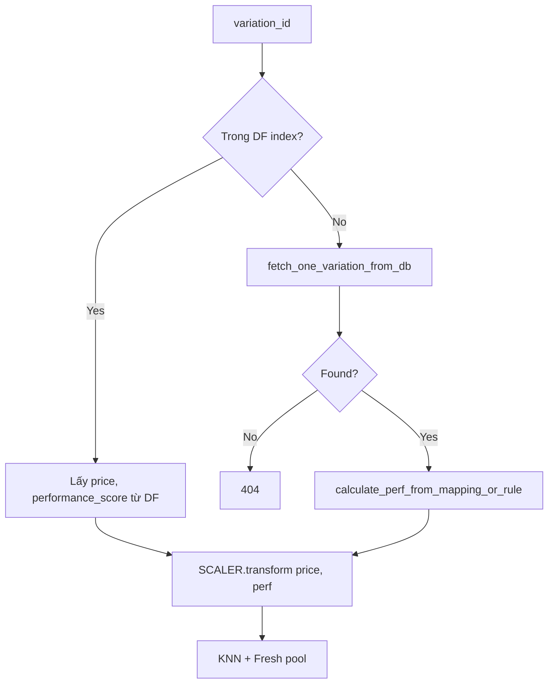

# Functional Requirement (FR) — ML Service: Endpoint gợi ý (ML Service Recommend Endpoint)

## 1. Feature Overview

Microservice **Python Flask** (`recommendation_service/`) expose HTTP API tính gợi ý laptop **tương tự** theo `variation_id`, dùng **KNN thủ công (numpy)** trên không gian 2D đã scale: **(price, performance_score)**.

```
GET /health
GET /recommend?variation_id={int}
GET /recommend/{variation_id}
```

**Runtime:** Load artifacts tại import-time (`products_df_from_db.pkl`, `scaler.joblib`, `knn_X_all.npy`, `knn_variation_ids.npy`). Variation **không có trong index** → query DB realtime + **fresh pool**.

**Consumer chính:** Node proxy (`FR_ProxyRecommendationsFromBackend`).

---

## 2. Actors

| Actor | Mô tả |
|-------|-------|
| **recommend_core** | `core/recommend.py` — logic chính |
| **Flask app** | `app.py` — routing |
| **PostgreSQL** | Variations + products (fresh / cold query) |
| **Artifacts** | Kết quả `train_recommend.py` |

---

## 3. Scope

### In Scope

- Health check metadata index.
- Recommend bằng `variation_id`.
- Indexed neighbors + fresh candidates (60 ngày).
- Dedupe `product_id`, loại trừ sản phẩm gốc.
- Trả tối đa `TOPK` items (default 10).
- CORS enabled (`flask-cors`).

### Out of Scope

- REST CRUD sản phẩm.
- Collaborative filtering theo user/order.
- Authentication API key.
- Batch recommend nhiều id.

---

## 4. API Contract

### 4.1 Health

```http
GET /health
```

**Response 200:**

```json
{
  "ok": true,
  "items": 150,
  "x_all_shape": [150, 2]
}
```

| Field | Ý nghĩa |
|-------|---------|
| `items` | Số dòng trong `DF` (indexed variations) |
| `x_all_shape` | Shape ma trận `X_ALL` |

**Startup failure:** Nếu thiếu artifacts → import `recommend.py` **crash** (FileNotFoundError) — container không healthy.

---

### 4.2 Recommend (query)

```http
GET /recommend?variation_id=42
```

| Param | Bắt buộc | Mô tả |
|-------|----------|--------|
| `variation_id` | Có | Integer |

**Missing param → 400:**

```json
{ "error": "variation_id is required" }
```

---

### 4.3 Recommend (path)

```http
GET /recommend/42
```

Cùng logic `recommend_core(42)`.

---

### 4.4 Success — 200

**Hiện trạng code:** Flask `jsonify(out)` với `out` là **mảng JSON** (không bọc `{ "items": ... }`).

```json
[
  {
    "variation_id": 45,
    "product_id": 12,
    "product_name": "Laptop XYZ",
    "price": 22000000.0,
    "performance_score": 82.5,
    "cpu_source": "json-exact",
    "gpu_source": "json-contains",
    "score_source": "cpu:json-exact,gpu:json-contains",
    "source": "indexed"
  },
  {
    "variation_id": 88,
    "product_id": 20,
    "product_name": "Laptop ABC",
    "price": 18500000.0,
    "performance_score": 79.1,
    "cpu_source": "rule",
    "gpu_source": "rule",
    "score_source": "fresh:rule",
    "source": "fresh"
  }
]
```

| Field | Mô tả |
|-------|--------|
| `source` | `"indexed"` — từ pickle index; `"fresh"` — query DB gần đây, chưa index |
| `performance_score` | 0–100 weighted CPU/GPU/RAM/SSD |
| `cpu_source` / `gpu_source` | `json-exact`, `json-contains`, `rule`, … |
| `score_source` | Chuỗi giải thích scoring |

**Không có** field `score` / `similarity` trong response — Node map `performance_score` làm `score`.

---

### 4.5 Not found — 404

```json
{ "error": "variation_id not found" }
```

Khi: `variation_id` không trong index **và** `fetch_one_variation_from_db` trả rỗng.

---

## 5. Algorithm — `recommend_core`

### 5.1 Load artifacts (import-time)

```python
DF = pd.read_pickle(DF_PATH)
SCALER = joblib.load(SCALER_PATH)
X_ALL = np.load(XALL_PATH)      # shape (N, 2)
VAR_IDS = np.load(VARIDS_PATH)  # (N,)
```

| # | Rule |
|---|------|
| BR-01 | Index chỉ gồm `product_variations` **đã train** (`is_available = true` lúc train) |
| BR-02 | Variation mới sau train → nhánh **fresh** |

### 5.2 Query vector



### 5.3 Performance score (runtime API)

`core/features.py` — `calculate_perf_from_mapping_or_rule`:

```
performance_score = 0.40×CPU + 0.35×GPU + 0.15×RAM + 0.10×Storage
```

| Thành phần | Nguồn |
|------------|--------|
| CPU/GPU | `core/bench.py` lookup JSON benchmark + scale P5–P95 |
| Fallback | `core/rules.py` keyword rules |
| RAM/Storage | `ram_100`, `sto_100` rules |

**Lưu ý:** `train_recommend.py` có logic matching **riêng** (Jaccard, `SCALE_METHOD`) — training và API runtime **gần giống** nhưng không share 100% code → có thể lệch score sau retrain.

### 5.4 Pool 1 — Indexed KNN

`core/knn_numpy.py`:

```python
d = sqrt(ALPHA * (q0-x0)² + BETA * (q1-x1)²)
sim = 1 / (1e-6 + d * (1 + price_jump_pen))
```

| Env | Default | Ý nghĩa |
|-----|---------|---------|
| `RECS_ALPHA_PRICE` | 0.6 | Trọng số trục giá (scaled) |
| `RECS_BETA_PERF` | 0.4 | Trọng số hiệu năng |
| `RECS_PRICE_JUMP_LAMBDA` | 0.6 | Penalty khi giá neighbor > giá gốc |
| `RECS_TOPK` | 10 | Số item trả về |

`n_neighbors = min(TOPK + 15, len(DF))` — loại neighbor trùng `variation_id` gốc.

### 5.5 Pool 2 — Fresh

`core/db.py` → `fetch_fresh_items_from_db`:

- `is_available = true`
- `GREATEST(updated_at, created_at) >= NOW() - FRESH_WINDOW_DAYS`
- `LIMIT FRESH_LIMIT` (200)
- Loại variation đã có trong index (`mask_new`)
- `score_fresh_candidates` + **recency boost** (`core/recency.py`)

| Env | Default |
|-----|---------|
| `RECS_FRESH_WINDOW_DAYS` | 60 |
| `RECS_FRESH_LIMIT` | 200 |
| `RECS_RECENCY_GAMMA` | 0.12 |
| `RECS_RECENCY_HALFLIFE` | 21 |

### 5.6 Merge & dedupe

1. `pool = cand_knn + cand_fresh`, sort `sim` giảm dần.
2. `seen_product_ids = { base_product_id }` — **không gợi ý cùng sản phẩm**.
3. Dừng khi `len(out) >= TOPK`.

| # | Rule |
|---|------|
| BR-03 | Một `product_id` tối đa **1** variation trong kết quả |
| BR-04 | Không trả variation đang xem (đã lọc ở KNN; fresh exclude id) |

---

## 6. Database Dependencies

### Runtime SQL (SQLAlchemy `ENGINE`)

| Function | Mục đích |
|----------|----------|
| `fetch_one_variation_from_db` | Cold-start query vector |
| `fetch_fresh_items_from_db` | Pool biến thể mới |

**Env:** `DATABASE_URL` bắt buộc cho fresh/cold. Thiếu → `ENGINE is None` → fresh pool rỗng, cold 404 nếu không trong index.

### Benchmark data files

| File | Mô tả |
|------|--------|
| `data/cpu_benchmark.json` | PassMark-style CPU scores |
| `data/gpu_benchmark.json` | GPU scores |

---

## 7. Deployment

### Local dev

```bash
cd recommendation_service
pip install -r requirements.txt
python train_recommend.py   # tạo artifacts/ trước
PORT=5001 python app.py
```

### Docker

- `Dockerfile` EXPOSE **5001**, HEALTHCHECK `localhost:5001/health`.
- `CMD ["python", "app.py"]` — cần `environment: PORT=5001` (hiện **thiếu** trong `docker-compose.yml`).

### Nginx (production profile)

`master_specification`: `/recommend/*` → `recommendation:5001` (optional direct access — FE vẫn qua Node).

---

## 8. Flask App Structure

```python
@app.get("/health")
def health(): return jsonify(health_info())

@app.get("/recommend/<int:variation_id>")
def recommend_path(variation_id): ...

@app.get("/recommend")
def recommend_query():
    var_id = request.args.get("variation_id", type=int)
```

| # | Rule |
|---|------|
| BR-05 | `debug=True` khi `python app.py` — không dùng gunicorn trong Dockerfile |
| BR-06 | CORS all origins — phù hợp dev; production nên giới hạn |

---

## 9. Related FRs

| FR | Liên kết |
|----|----------|
| `FR_ProxyRecommendationsFromBackend.md` | Consumer + enrich |
| `FR_TrainRecommendationModelOffline.md` | Sinh artifacts |
| `FR_ViewKNNRecommendationsOnProduct.md` | UX |

---

## 10. Source Files

| File | Vai trò |
|------|---------|
| `recommendation_service/app.py` | Routes |
| `recommendation_service/core/recommend.py` | `recommend_core`, `health_info` |
| `recommendation_service/core/knn_numpy.py` | Distance / KNN |
| `recommendation_service/core/recency.py` | Fresh scoring |
| `recommendation_service/core/features.py` | Runtime perf |
| `recommendation_service/core/bench.py` | Benchmark lookup |
| `recommendation_service/core/rules.py` | Fallback rules |
| `recommendation_service/core/db.py` | SQL |
| `recommendation_service/core/config.py` | Env hyperparameters |
| `recommendation_service/data/*.json` | Benchmarks |

---

## 11. Acceptance Criteria

- [ ] `/health` → `ok: true`, `items > 0` sau train.
- [ ] `/recommend?variation_id=` hợp lệ trong index → 200, mảng ≤ TOPK, không chứa `product_id` gốc.
- [ ] `variation_id` không tồn tại → 404 JSON error.
- [ ] Thiếu query param → 400.
- [ ] Variation mới trong DB (không index) vẫn 200 nếu `fetch_one` OK và có neighbors.
- [ ] Node proxy parse được mảng JSON thuần.

---

## 12. Known Gaps

| # | Mô tả |
|---|--------|
| GAP-01 | Response không bọc `{ items, generated_at }` — Node phải hỗ trợ array |
| GAP-02 | Không trả similarity score — FE sort theo `performance_score` |
| GAP-03 | `train_recommend.py` vs `features.py` — duplicate scoring logic |
| GAP-04 | Artifacts không commit — deploy mới phải train |
| GAP-05 | `app.py` port 8000 vs Docker 5001 |
| GAP-06 | Không auth — endpoint public trong network nội bộ |
| GAP-07 | `backup/` folder — phiên bản cũ, không dùng production |
| GAP-08 | Follow-up child questions irrelevant — chỉ variation-level |
