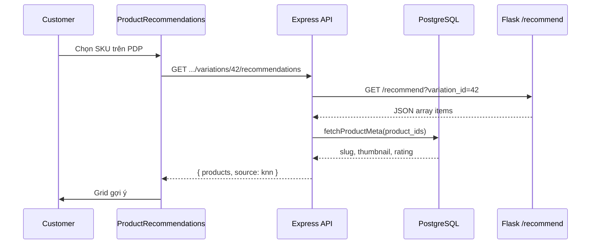

# Functional Requirement (FR) — Proxy gợi ý từ Backend Node (Proxy Recommendations From Backend)

## 1. Feature Overview

Backend Express đóng vai **BFF / adapter**: nhận request từ frontend, gọi **Recommendation Service** (Flask), chuẩn hóa payload, **bổ sung metadata** từ PostgreSQL (ảnh, slug, tên, rating), trả JSON thống nhất cho UI.

```
GET /api/products/variations/:variation_id/recommendations
        │
        ▼
axios GET ${RECO_API_BASE}/recommend?variation_id={id}
        │
        ▼
fetchProductMeta(product_ids) → enrich
        │
        ▼
{ products[], basedOn, generated_at, source: "knn" }
```

**FE:** `useRecommendedByVariation` → `ProductRecommendations` trên `ProductDetailPage`.

**Không** gọi Flask trực tiếp từ browser (trừ biến `VITE_RECOMMENDATION_BASE_URL` — hiện **không dùng** cho block gợi ý chính).

---

## 2. Actors

| Actor | Mô tả |
|-------|-------|
| **Customer** | Xem gợi ý trên PDP |
| **productController.getRecommendedByVariation** | Proxy + enrich |
| **fetchProductMeta** | Helper query `products` + `images` |
| **Recommendation service** | Upstream HTTP |
| **ProductRecommendations.jsx** | Consumer |

---

## 3. Scope

### In Scope

- Public endpoint (không JWT).
- Validate `variation_id` số hợp lệ.
- Axios timeout, `validateStatus: () => true` để đọc body 4xx/5xx.
- Hỗ trợ nhiều shape upstream: `{ items }`, `{ debug }`, **mảng JSON thuần** (Flask hiện tại).
- Dedupe theo `product_id` giữ score cao nhất.
- Map field FE: `id`, `variation_id`, `name`, `image`, `slug`, `price`, `score`, `rating_average`, `explain`.
- Lỗi upstream → **502** với `products: []` (graceful degradation).

### Out of Scope

- Logic KNN / training (xem FR ML + Train).
- Cache Redis cho recommendations.
- Gợi ý theo `product_id` (legacy `getRecommendedProducts` đã comment).

---

## 4. Environment Variables

| Biến (code thực tế) | Default trong code | Mô tả |
|---------------------|-------------------|--------|
| `RECO_API_BASE` | `http://127.0.0.1:8000` | Base URL Flask |
| `RECO_TIMEOUT_MS` | `7000` | Timeout ms |

| Biến khác trong repo (không đọc bởi controller) | Ghi chú |
|--------------------------------------------------|---------|
| `RECOMMENDATION_SERVICE_URL` | `docker-compose.yml` server — **GAP: không map** |
| `RECOMMENDATION_BASE_URL` | `env-example.txt` — **GAP** |
| `VITE_RECOMMENDATION_BASE_URL` | Client — optional, không dùng hook reco |

**Docker:** Service `recommendation` expose `5001`; `app.py` default `PORT=8000` nếu không set — cần `RECO_API_BASE=http://recommendation:5001` **và** `PORT=5001` trên container Flask.

---

## 5. API Contract — Node

### Request

```http
GET /api/products/variations/42/recommendations
```

**Auth:** không.

### Success — 200

```json
{
  "products": [
    {
      "id": 12,
      "variation_id": 45,
      "name": "Laptop XYZ",
      "image": "https://res.cloudinary.com/.../thumb.jpg",
      "slug": "laptop-xyz",
      "price": 22000000,
      "score": 87.5,
      "rating_average": 4.5,
      "explain": {
        "source": "indexed",
        "score_source": "cpu:json-exact,gpu:json-contains",
        "cpu_source": "json-exact",
        "gpu_source": "json-contains"
      }
    }
  ],
  "basedOn": { "variationId": 42 },
  "generated_at": "2026-05-27T10:00:00.000Z",
  "source": "knn"
}
```

### Client error — 400

```json
{
  "products": [],
  "error": "invalid variation_id"
}
```

### Upstream / adapter error — 502

```json
{
  "products": [],
  "basedOn": { "variationId": 42 },
  "source": "knn",
  "error": "upstream_404",
  "upstream": { "error": "variation_id not found" }
}
```

Hoặc:

```json
{
  "error": "adapter_exception",
  "detail": { "message": "connect ECONNREFUSED", "code": "ECONNREFUSED", "base": "http://127.0.0.1:8000" }
}
```

**UX:** FE hiển thị “Chưa có gợi ý phù hợp.” khi `products` rỗng — không phân biệt 502 vs không có neighbor.

---

## 6. Backend Logic — từng bước

### 6.1 Gọi upstream

```javascript
const BASE = process.env.RECO_API_BASE || "http://127.0.0.1:8000";
const TIMEOUT = +(process.env.RECO_TIMEOUT_MS || 7000);

const resp = await axios.get(`${BASE}/recommend`, {
  params: { variation_id: variationId },
  timeout: TIMEOUT,
  validateStatus: () => true,
});
```

| # | Rule |
|---|------|
| BR-01 | Path query `?variation_id=` — khớp Flask `recommend_query()` |
| BR-02 | `variation_id` = `Number(req.params.variation_id)` — NaN/0 → 400 |

### 6.2 Parse payload

```javascript
let raw = Array.isArray(payload?.items) ? payload.items
  : Array.isArray(payload?.debug) ? payload.debug
  : Array.isArray(payload) ? payload
  : [];
```

| # | Rule |
|---|------|
| BR-03 | Flask `recommend_core` hiện trả **JSON array** trực tiếp — nhánh thứ 3 |
| BR-04 | Hỗ trợ `debug` cho chế độ dev tương lai |

### 6.3 Dedupe theo product

```javascript
const score = it.score ?? it.performance_score ?? it.rank_score ?? 0;
// Map product_id → item có score cao nhất
```

| # | Rule |
|---|------|
| BR-05 | Trùng `product_id` nhiều SKU → giữ variation score cao nhất |
| BR-06 | Flask đã dedupe `seen_product_ids` — bước Node là **lớp phòng thủ thứ hai** |

### 6.4 Enrich — `fetchProductMeta`

Query `Product` + `ProductImage` (primary first):

| Field output | Nguồn |
|--------------|--------|
| `product_name` | DB |
| `slug` | DB |
| `thumbnail_url` | `products.thumbnail_url` |
| `image` | thumbnail hoặc ảnh primary |
| `rating_average` | DB |

Map sang card:

```javascript
{
  id: it.product_id,
  variation_id: it.variation_id,
  name: meta.product_name || it.product_name,
  image: meta.thumbnail_url,  // ưu tiên DB — ổn định hơn Flask
  slug: meta.slug,
  price: it.price,
  score: it.score ?? it.performance_score ?? null,
  rating_average: meta.rating_average,
  explain: { source, score_source, cpu_source, gpu_source },
}
```

| # | Rule |
|---|------|
| BR-07 | Sort `products` theo `score` giảm dần |
| BR-08 | `generated_at` lấy từ upstream nếu có, else `new Date().toISOString()` |
| BR-09 | Product inactive vẫn có thể gợi ý nếu còn trong ML index |

---

## 7. Frontend Integration

### Hook — `useRecommendedByVariation`

```javascript
queryKey: ["reco-by-variation", variationId ?? "none"]
GET /products/variations/${variationId}/recommendations
enabled: !!variationId
keepPreviousData: true
staleTime: 60_000
```

| # | Behavior |
|---|----------|
| BR-10 | Đổi variation trên PDP → refetch (queryKey đổi) |
| BR-11 | `variationId` null → skip API, trả `{ products: [] }` |

### `ProductDetailPage`

```javascript
const { data: recommendations } = useRecommendedByVariation(selectedVariation?.variation_id);
// ...
<ProductRecommendations variationId={currentVariationId} />
```

`currentVariationId` = variation đang chọn hoặc variation đầu tiên.

### `ProductRecommendations`

- `limit = 5` (slice client).
- Grid 2 cột mobile / 5 desktop.
- `RecoCard` link `/products/{slug}?v={variation_id}`.
- Add to cart Redux `addItem` — **không** sync server cart (gap chung giỏ).

---

## 8. Sequence Diagram



---

## 9. Route & Security

**File:** `server/routes/productRoutes.js`

```javascript
router.get("/variations/:variation_id/recommendations", productController.getRecommendedByVariation);
```

| # | Rule |
|---|------|
| BR-12 | Đặt **trước** `GET /:id` — path `variations` không conflict |
| BR-13 | Public — không rate limit trong code |

---

## 10. Related FRs

| FR | Liên kết |
|----|----------|
| `FR_MLServiceRecommendEndpoint.md` | Upstream contract |
| `FR_TrainRecommendationModelOffline.md` | Artifacts cần có trước khi indexed KNN hoạt động |
| `FR_ViewKNNRecommendationsOnProduct.md` | UI end-to-end (catalog folder) |
| `FR_SelectProductVariation.md` | Input `variationId` |

---

## 11. Source Files

| File | Vai trò |
|------|---------|
| `server/controllers/productController.js` | `getRecommendedByVariation`, `fetchProductMeta` L18–19, L613–753 |
| `server/routes/productRoutes.js` | Route mount |
| `client/app/hooks/useProducts.js` | `useRecommendedByVariation` |
| `client/app/components/ProductRecommendations.jsx` | UI |
| `client/app/pages/ProductDetailPage.jsx` | Mount component |
| `docs/master_specification.md` §9.8, §12.6 | Spec tổng |
| `docs/engineering_rules/api-standard.md` §13.3 | API chuẩn |

---

## 12. Acceptance Criteria

- [ ] `variation_id` hợp lệ + ML service up → 200, `products.length > 0` (khi DB đủ neighbor).
- [ ] ML down / connection refused → 502, FE không crash.
- [ ] Upstream 404 → 502 `upstream_404`, `products: []`.
- [ ] Đổi variation → gợi ý đổi (refetch).
- [ ] Card có `slug`, `image` từ DB khi product tồn tại.
- [ ] Không trả về chính `product_id` của variation gốc (dedupe Flask + enrich).

---

## 13. Known Gaps

| # | Mô tả | Đề xuất |
|---|--------|---------|
| GAP-01 | `RECOMMENDATION_SERVICE_URL` ≠ `RECO_API_BASE` | Thống nhất env hoặc `RECO_API_BASE = process.env.RECOMMENDATION_SERVICE_URL \|\| ...` |
| GAP-02 | Docker Flask `PORT` default 8000 vs expose 5001 | Set `PORT=5001` trong `docker-compose` recommendation |
| GAP-03 | FE không hiển thị lỗi 502 vs empty | Toast / retry |
| GAP-04 | `?v=` trên RecoCard chưa auto-select variation PDP | Đọc search param `v` |
| GAP-05 | `discount_percentage` không enrich từ DB — card reco luôn 0% | Join product discount nếu cần |
| GAP-06 | `generated_at` upstream không set — Node tự sinh | Flask thêm field |
| GAP-07 | Legacy commented `getRecommendedProducts` — dead code | Xóa hoặc tách FR riêng |
