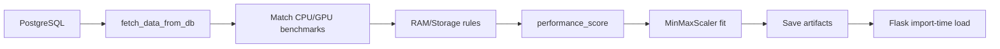

# Functional Requirement (FR) — Huấn luyện mô hình gợi ý offline (Train Recommendation Model Offline)

## 1. Feature Overview

Script **`train_recommend.py`** chạy **offline** (không qua HTTP): đọc toàn bộ biến thể laptop **đang bán** từ PostgreSQL, tính **performance_score**, fit **MinMaxScaler** trên `(price, performance_score)`, lưu **artifacts** để Flask service load lúc runtime.

```bash
cd recommendation_service
# .env có DATABASE_URL
python train_recommend.py
```

**Output:** `artifacts/scaler.joblib`, `products_df_from_db.pkl`, `knn_X_all.npy`, `knn_variation_ids.npy`.

**Không** train model sklearn `KNeighborsClassifier` — KNN inference là **numpy brute-force** (`knn_kneighbors_numpy`) trên ma trận đã lưu.

---

## 2. Actors

| Actor | Mô tả |
|-------|-------|
| **DevOps / Developer** | Chạy train sau khi seed/import sản phẩm |
| **train_recommend.py** | Entry script |
| **PostgreSQL** | Nguồn dữ liệu |
| **Benchmark JSON** | `data/cpu_benchmark.json`, `data/gpu_benchmark.json` |
| **Flask service** | Consumer artifacts |

---

## 3. Scope

### In Scope

- Query variations `is_available = true`.
- CPU/GPU scoring: benchmark JSON + fuzzy Jaccard + rule fallback.
- RAM/Storage rule scores.
- Weighted `performance_score`.
- MinMaxScaler fit + export numpy matrices.
- Pickle DataFrame đầy đủ metadata cho indexed search.

### Out of Scope

- Incremental / online learning.
- Versioning artifacts trong DB.
- Tự động train trong CI (chưa bắt buộc — master spec ghi gap).
- Train từ order history / collaborative filtering.

---

## 4. Prerequisites

### 4.1 Environment

| Biến | Bắt buộc | Mô tả |
|------|----------|--------|
| `DATABASE_URL` | **Có** | PostgreSQL connection string |
| `ARTIFACTS_DIR` | Không | Default `artifacts` |
| `DATA_DIR` | Không | Default `data` |
| `SCALE_METHOD` | Không | `log_p99` (default), `p99`, `quantile` |

**File `.env`:** đặt trong `recommendation_service/` ( `load_dotenv()` ).

### 4.2 Dữ liệu

- Bảng `product_variations`, `products` có dữ liệu thật.
- Cột: `processor`, `ram`, `storage`, `graphics_card`, `price`, `is_available`.
- File benchmark JSON tồn tại (kích thước lớn — commit trong repo `data/`).

### 4.3 Python dependencies

`requirements.txt`: pandas, numpy, scikit-learn, joblib, psycopg2-binary, python-dotenv.

---

## 5. Pipeline — từng bước



### 5.1 Extract — `fetch_data_from_db()`

```sql
SELECT pv.variation_id, pv.product_id, p.product_name,
       pv.processor, pv.ram, pv.storage, pv.graphics_card, pv.price
FROM product_variations pv
LEFT JOIN products p ON pv.product_id = p.product_id
WHERE pv.is_available = true;
```

| # | Rule |
|---|------|
| BR-01 | Chỉ variations **available** — hết hàng/is_available false **không** vào index |
| BR-02 | Dùng `psycopg2` trực tiếp (không SQLAlchemy) — khác runtime `db.py` |

### 5.2 CPU / GPU scoring

**Load benchmarks:**

```python
cpu_bench = load_benchmarks(CPU_JSON_PATH, is_cpu=True)
gpu_bench = load_benchmarks(GPU_JSON_PATH, is_cpu=False)
```

**Matching (`best_match_score`):**

1. Chuẩn hóa tên (`simplify_cpu_name` / `simplify_gpu_name`).
2. Exact match trên `simple` key.
3. Variant strings (bỏ "laptop", "mobile", …).
4. Fuzzy **Jaccard** ≥ `FUZZY_THRESHOLD` (0.60) → `json-contains`.
5. Fallback `fallback_cpu_score` / `fallback_gpu_score` → source `"rule"`.

| # | Rule |
|---|------|
| BR-03 | Multiplier `\d+x` trên CPU string (Apple Silicon style) |
| BR-04 | Dedupe benchmark entries theo `simple` name |

### 5.3 Scale raw bench → 0–100

```python
df["cpu_score_100"] = scale_bench_to_100(df["cpu_score_raw"], method=SCALE_METHOD)
df["gpu_score_100"] = scale_bench_to_100(df["gpu_score_raw"], method=SCALE_METHOD)
```

| `SCALE_METHOD` | Mô tả |
|----------------|--------|
| `log_p99` | log1p + clip percentile 1–99 → ×100 |
| `p99` | clip percentile |
| `quantile` | rank percentile |

### 5.4 RAM & Storage

```python
df["ram_score"] = df["ram"].map(score_ram)      # parse GB từ chuỗi
df["storage_score"] = df["storage"].map(score_storage)
```

### 5.5 Performance score (training)

```python
CPU_WEIGHT = 0.40
GPU_WEIGHT = 0.35
RAM_WEIGHT = 0.15
STO_WEIGHT = 0.10

df["performance_score"] = (
    df["cpu_score_100"] * CPU_WEIGHT +
    df["gpu_score_100"] * GPU_WEIGHT +
    df["ram_score"] * RAM_WEIGHT +
    df["storage_score"] * STO_WEIGHT
).round(2)
```

| # | Rule |
|---|------|
| BR-05 | Drop rows thiếu `price` hoặc `performance_score` |
| BR-06 | Lưu `cpu_source`, `gpu_source` vào DataFrame pickle |

### 5.6 Fit scaler & export

```python
features = df[["price", "performance_score"]]
scaler = MinMaxScaler()
X = scaler.fit_transform(features)

joblib.dump(scaler, artifacts/scaler.joblib)
df.to_pickle(artifacts/products_df_from_db.pkl)
np.save(artifacts/knn_X_all.npy, X)
np.save(artifacts/knn_variation_ids.npy, df["variation_id"].to_numpy(np.int64))
```

| Artifact | Shape / type | Runtime use |
|----------|--------------|---------------|
| `scaler.joblib` | sklearn MinMaxScaler | Transform query & fresh |
| `products_df_from_db.pkl` | DataFrame N rows | Indexed metadata + scores |
| `knn_X_all.npy` | (N, 2) float64 | KNN search |
| `knn_variation_ids.npy` | (N,) int64 | Map row → variation_id |

---

## 6. Khi nào cần chạy lại train

| Sự kiện | Lý do |
|---------|--------|
| Import sản phẩm mới hàng loạt | Biến thể chưa trong index |
| Đổi giá lớn / đổi cấu hình CPU GPU | Vector (price, perf) đổi |
| Cập nhật benchmark JSON | Score CPU/GPU đổi |
| Sau restore DB production → dev | Artifacts lệch data |

**Fresh pool** (`FR_MLServiceRecommendEndpoint`) bù biến thể mới trong **60 ngày** nhưng **không** thay thế retrain cho accuracy dài hạn.

---

## 7. Vận hành & Docker

### Dev local

```bash
cd recommendation_service
cp .env.example .env   # nếu có — hoặc tạo DATABASE_URL
pip install -r requirements.txt
python train_recommend.py
python app.py          # PORT=5001 khuyến nghị
curl http://localhost:5001/health
```

### Docker Compose

1. `postgres` healthy.
2. Seed products.
3. **Exec train** trong container hoặc mount volume `artifacts/`:

```bash
docker compose exec recommendation python train_recommend.py
```

**GAP:** Image build `COPY . .` nhưng `.dockerignore` có thể exclude `artifacts/` — train trong container hoặc copy artifacts vào volume.

### CI (`.github/workflows/ci-cd.yml`)

Master spec đề cập job test recommendation — kiểm tra flake8; **không** bắt buộc train trong pipeline hiện tại.

---

## 8. Đánh giá / debug

### `artifacts/danhgia.py`

Script phụ trợ đánh giá chất lượng gợi ý (nếu artifacts tồn tại):

```
Hãy chạy file 'train_recommender.py' trước.
```

(Tên cũ — artifact path giống `train_recommend.py` output.)

### Health sau train

```json
GET /health → { "ok": true, "items": N, "x_all_shape": [N, 2] }
```

`items` = số variations indexed.

---

## 9. Khác biệt Training vs Runtime API

| Khía cạnh | `train_recommend.py` | Runtime `core/features.py` |
|-----------|------------------------|----------------------------|
| DB driver | psycopg2 | SQLAlchemy |
| CPU/GPU match | Jaccard + simplify trong script | `bench.py` + `rules.py` |
| Scale bench | `SCALE_METHOD` env | P5/P95 từ `bench.py` |
| Output | Artifacts files | In-memory recommend |

| # | Risk |
|---|------|
| BR-07 | Retrain xong nhưng Flask chưa restart → vẫn load pickle cũ (import-time) |
| BR-08 | Score lệch giữa train và fresh scoring |

**Đề xuất:** Restart container Flask sau train; long-term unify scoring module.

---

## 10. Related FRs

| FR | Liên kết |
|----|----------|
| `FR_MLServiceRecommendEndpoint.md` | Load artifacts + KNN |
| `FR_ProxyRecommendationsFromBackend.md` | FE nhận kết quả cuối |
| `docs/master_specification.md` §12.5 | Tóm tắt artifacts |

---

## 11. Source Files

| File | Vai trò |
|------|---------|
| `recommendation_service/train_recommend.py` | **Script chính** |
| `recommendation_service/backup/train_recommender.py` | Legacy — không dùng |
| `recommendation_service/data/cpu_benchmark.json` | Benchmark data |
| `recommendation_service/data/gpu_benchmark.json` | Benchmark data |
| `recommendation_service/core/config.py` | Path `ARTIFACTS_DIR`, `DF_PATH`, … |
| `recommendation_service/artifacts/` | Output dir (gitignored thực tế) |
| `env-example.txt` | `RECOMMENDATION_BASE_URL` gợi ý local |

---

## 12. Acceptance Criteria

- [ ] `DATABASE_URL` hợp lệ → script in `Items: N`, `N > 0`.
- [ ] Thư mục `artifacts/` có đủ 4 file sau khi chạy.
- [ ] Flask `/health` → `items == N`.
- [ ] `/recommend?variation_id=` với id trong DB → neighbors hợp lý (không rỗng khi catalog đủ).
- [ ] Variation `is_available=false` không xuất hiện trong index sau train.
- [ ] Chạy train 2 lần liên tiếp — idempotent overwrite artifacts.

---

## 13. Known Gaps

| # | Mô tả | Đề xuất |
|---|--------|---------|
| GAP-01 | Artifacts **không commit** — clone repo mới phải train | Document trong README + docker entrypoint |
| GAP-02 | Không có lịch cron retrain | Admin job / CI nightly |
| GAP-03 | Train & runtime scoring khác module | Refactor dùng chung `core/features.py` |
| GAP-04 | `is_active` product không lọc trong SQL train | Thêm `JOIN products WHERE is_active` |
| GAP-05 | Flask load artifacts import-time — cần restart sau train | `SIGHUP` reload hoặc gunicorn |
| GAP-06 | `backup/train_recommender.py` gây nhầm | Xóa hoặc archive |
| GAP-07 | Không validate version artifact vs DB schema | Thêm `artifacts/meta.json` timestamp |
| GAP-08 | Docker thiếu bước train tự động | `docker compose` init script |

---

## 14. Checklist triển khai đồ án (demo)

1. Seed PostgreSQL (`product_variations` > 0 rows available).
2. `cd recommendation_service && python train_recommend.py`.
3. Set server `RECO_API_BASE=http://127.0.0.1:5001` (hoặc port đang chạy).
4. `PORT=5001 python app.py`.
5. Mở PDP → chọn cấu hình → thấy block “Gợi ý cho cấu hình đang chọn”.
6. Nếu rỗng: kiểm tra `/health`, log Node `upstream_*`, và DB có neighbors cùng phân khúc giá/hiệu năng.
