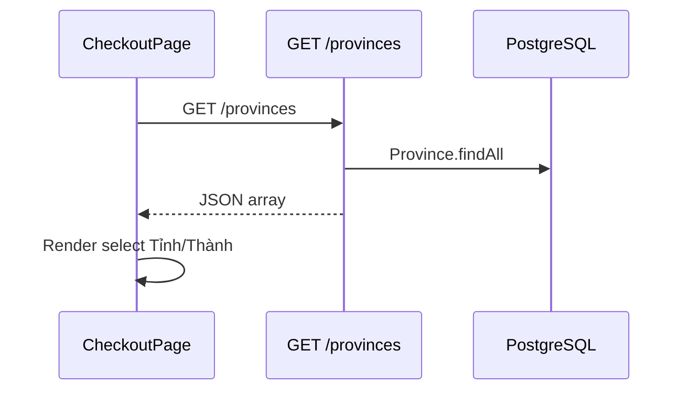

# Functional Requirement (FR) — Danh sách tỉnh/thành (List Provinces)

## 1. Feature Overview

API cung cấp **toàn bộ tỉnh/thành** trong hệ thống giao hàng Việt Nam (seed DB), kèm metadata phí ship cấp tỉnh — dùng cho dropdown checkout, sửa địa chỉ đơn, và tính phí vận chuyển.

```
GET /api/provinces
Auth: Không bắt buộc (public)
```

**FE chính:** `useProvinces()` → `api.get("/provinces")`.  
**Mount:** `server/routes/geo.js` qua `app.use('/api', geoRoutes)`.

---

## 2. Actors

| Actor | Mô tả |
|-------|-------|
| **Customer** | Chọn Tỉnh/Thành trên Checkout / Edit address |
| **CheckoutPage** | `useProvinces()` |
| **EditShippingAddressDialog** | Nhận `provincesData` preload từ `OrderDetailPage` |
| **shippingService** | `Province.findByPk` khi quote (không gọi list API) |
| **Admin** | Quản lý seed data (ngoài scope API này) |

---

## 3. Scope

### In Scope

- `findAll` provinces, sort `name ASC`.
- Trả attributes: `province_id`, `name`, `slug`, `is_hcm`, `base_shipping_fee`, `is_free_shipping`, `max_shipping_fee`.
- Hook React load một lần khi mount.
- Kích hoạt load wards con khi user chọn `province_id`.

### Out of Scope

- Phân trang, search `q` (BE không hỗ trợ).
- CRUD admin provinces qua endpoint này.
- `region` enum trên model — **không** expose trong API list.

---

## 4. API Contract

### Request

```
GET /api/provinces
```

Không query params (FE `geoAPI.getProvinces` gửi `fields=...` nhưng **BE bỏ qua**).

### Response — 200

```json
[
  {
    "province_id": 79,
    "name": "Thành phố Hồ Chí Minh",
    "slug": "ho-chi-minh",
    "is_hcm": true,
    "base_shipping_fee": 30000,
    "is_free_shipping": false,
    "max_shipping_fee": 150000
  }
]
```

| Field | Kiểu | Mô tả |
|-------|------|-------|
| `province_id` | INTEGER PK | Gửi lên order / quote |
| `name` | STRING | Hiển thị dropdown |
| `slug` | STRING | URL-friendly (ít dùng FE) |
| `is_hcm` | BOOLEAN | Freeship subtotal ≥ 1tr |
| `base_shipping_fee` | INTEGER VND | Phí cơ bản |
| `is_free_shipping` | BOOLEAN | Nếu true → quote = 0 |
| `max_shipping_fee` | INTEGER VND | Trần phí sau cộng ward |

---

## 5. Backend Implementation

```javascript
// server/routes/geo.js
router.get('/provinces', async (req, res) => {
  const provinces = await Province.findAll({
    order: [['name', 'ASC']],
    attributes: [
      'province_id', 'name', 'slug',
      'is_hcm', 'base_shipping_fee', 'is_free_shipping', 'max_shipping_fee',
    ],
  });
  res.json(provinces);
});
```

| # | Rule |
|---|------|
| BR-01 | Không filter theo quyền user |
| BR-02 | Không cache HTTP — mỗi request hit DB |
| BR-03 | Lỗi DB → 500 qua Express default (không try/catch riêng) |

### Model (`server/models/Province.js`)

Bổ sung cột `region` ENUM (`south`, `central`, …) — không trả về list API.

---

## 6. Frontend — `useProvinces`

```javascript
// client/app/hooks/useProvinces.js
export function useProvinces() {
  const [data, setData] = useState([]);
  const [loading, setLoading] = useState(true);
  useEffect(() => {
    api.get("/provinces").then(res => setData(res.data))
      .finally(() => setLoading(false));
  }, []);
  return { data, loading };
}
```

| # | Note |
|---|------|
| N-01 | `CheckoutPage` gọi `useProvinces(true)` — tham số **bị bỏ qua** (hook không nhận args) |
| N-02 | Không React Query — không share cache global |
| N-03 | `loading` ít khi dùng trên Checkout (default `[]`) |

### CheckoutPage usage

```javascript
const { data: provinces = [] } = useProvinces(true);
const provinceName = provinces.find(p => +p.province_id === +provinceId)?.name || "";
```

Đổi tỉnh → reset `wardId`, cập nhật `formData.city`, trigger geocode tỉnh (Nominatim).

---

## 7. `geoAPI` wrapper (api.js)

```javascript
geoAPI.getProvinces({ fields: "province_id,name", ...params })
// GET /provinces?fields=...
```

**Mismatch:** BE không đọc `fields` — luôn trả full attributes đã khai báo. Wrapper **ít được import**; hooks gọi `api` trực tiếp.

---

## 8. Downstream Consumers

| Consumer | Dùng province_id cho |
|----------|----------------------|
| `useWards(provinceId)` | Load phường/xã |
| `useOrderPreview` | `POST /orders/preview` |
| `createOrder` | Bắt buộc `province_id` |
| `GET /quote` | `quoteShipping` |
| `updateShippingAddress` | Recalc ship |

---

## 9. Sequence



---

## 10. Related FRs

| FR | Liên kết |
|----|----------|
| `FR_ListWardsByProvince` | Con theo province |
| `FR_QuoteShippingFee` | Dùng rules từ province row |
| `FR_CheckoutPageFlow` | UI chọn tỉnh |
| `FR_MapPickerAddressConfirmation` | Sau khi chọn tỉnh/xã |

---

## 11. Source Files

| File | Vai trò |
|------|---------|
| `server/routes/geo.js` | Route |
| `server/models/Province.js` | Model |
| `client/app/hooks/useProvinces.js` | Hook |
| `client/app/pages/CheckoutPage.jsx` | Consumer |
| `client/app/pages/OrderDetailPage.jsx` | Preload cho dialog |
| `client/app/services/api.js` | `geoAPI` (legacy) |
| `docs/master_specification.md` §8.4, §9.6 | Spec |

---

## 12. Acceptance Criteria

- [ ] GET trả mảng provinces sort A→Z theo `name`.
- [ ] Mỗi phần tử có đủ field phí ship cho quote.
- [ ] Checkout dropdown populate từ hook.
- [ ] Chọn tỉnh reset ward và kích hoạt `useWards`.

---

## 13. Known Gaps

| # | Mô tả |
|---|--------|
| GAP-01 | Không pagination — dataset VN ~63 tỉnh OK nhưng không scale search. |
| GAP-02 | `geoAPI.getProvinces` params `fields` không có hiệu lực BE. |
| GAP-03 | `useProvinces(true)` misleading — không có behavior khác. |
| GAP-04 | Không React Query — reload mỗi lần vào trang. |
| GAP-05 | `region` DB không expose — FE không biết miền để UI gợi ý. |
