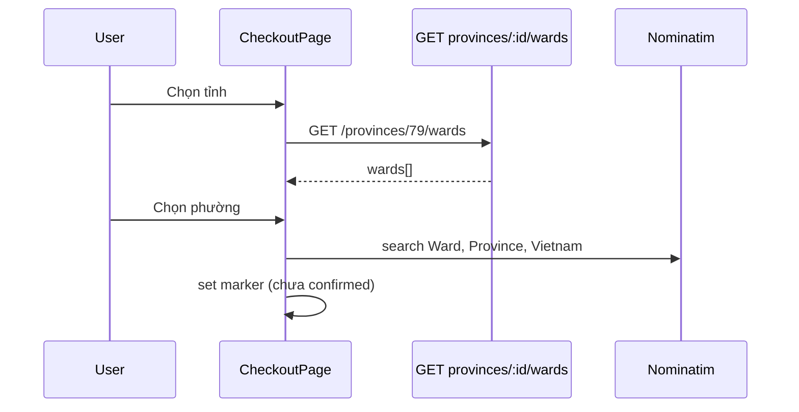

# Functional Requirement (FR) — Danh sách phường/xã theo tỉnh (List Wards by Province)

## 1. Feature Overview

Sau khi user chọn **tỉnh/thành**, FE load danh sách **phường/xã** thuộc tỉnh đó:

```
GET /api/provinces/:id/wards
Auth: Public
```

`:id` = `province_id` (INTEGER).  
**FE:** `useWards(provinceId)` → `api.get(\`/provinces/${provinceId}/wards\`)`.

---

## 2. Actors

| Actor | Mô tả |
|-------|-------|
| **Customer** | Chọn Phường/Xã |
| **useWards** | Fetch khi `provinceId` đổi |
| **quoteShipping** | Cộng `ward.extra_fee` |
| **Nominatim geocode** | Dùng `ward.name` trong query string |

---

## 3. Scope

### In Scope

- Filter `where: { province_id: req.params.id }`.
- Sort `name ASC`.
- Attributes: `ward_id`, `name`, `slug`, `extra_fee`, `province_id`.
- Reset wards khi `provinceId` null/đổi tỉnh.

### Out of Scope

- `GET /wards?province_id=` (geoAPI sai path — không implement).
- `GET /geo/wards/:id/centroid` (**không tồn tại** — xem GAP).
- Ward CRUD admin qua API này.

---

## 4. API Contract

### Request

```
GET /api/provinces/79/wards
```

`req.params.id` — string từ URL, Sequelize coerce sang số.

### Response — 200

```json
[
  {
    "ward_id": 12345,
    "name": "Phường Hiệp Bình Chánh",
    "slug": "hiep-binh-chanh",
    "extra_fee": 5000,
    "province_id": 79
  }
]
```

Mảng rỗng `[]` nếu tỉnh không có ward seed.

### Errors

| HTTP | Ngữ cảnh |
|------|----------|
| 500 | DB lỗi (không try/catch) |

---

## 5. Backend Implementation

```javascript
router.get('/provinces/:id/wards', async (req, res) => {
  const wards = await Ward.findAll({
    where: { province_id: req.params.id },
    order: [['name', 'ASC']],
    attributes: ['ward_id', 'name', 'slug', 'extra_fee', 'province_id'],
  });
  res.json(wards);
});
```

### Model (`server/models/Ward.js`)

- FK `province_id` → `provinces`, `ON DELETE CASCADE`.
- `extra_fee` INTEGER VND — cộng vào phí ship.

---

## 6. Frontend — `useWards`

```javascript
export function useWards(provinceId) {
  const [data, setData] = useState([]);
  const [loading, setLoading] = useState(false);

  useEffect(() => {
    if (!provinceId) { setData([]); return; }
    setLoading(true);
    api.get(`/provinces/${provinceId}/wards`)
      .then(res => setData(res.data))
      .finally(() => setLoading(false));
  }, [provinceId]);

  return { data, loading };
}
```

| # | Rule |
|---|------|
| BR-01 | `provinceId` falsy → wards `[]`, không gọi API |
| BR-02 | Đổi tỉnh → effect chạy lại, load wards mới |
| BR-03 | Checkout disable ward select until `provinceId` set |

### CheckoutPage

```javascript
const [provinceId, setProvinceId] = useState("");
const [wardId, setWardId] = useState("");
const { data: wards = [] } = useWards(provinceId || null);

const handleProvinceChange = (e) => {
  setProvinceId(id);
  setWardId(""); // reset ward
  ...
};

const handleWardChange = (e) => {
  setWardId(id);
  setFormData(prev => ({ ...prev, ward: wards.find(...)?.name }));
};
```

**Sau chọn ward:** `useEffect` geocode `"${wardName}, ${provinceName}, Vietnam"` (forward geocode).

---

## 7. geoAPI Mismatch

```javascript
// api.js — SAI so với BE
geoAPI.getWards(province_id) 
// → GET /wards?province_id=...
```

**Production path đúng:** `/provinces/:id/wards` (hook `useWards`).  
Sửa `geoAPI` nếu dùng wrapper sau này.

---

## 8. Centroid Endpoint (dead reference)

`CheckoutPage` định nghĩa:

```javascript
async function geoFallbackToWardCenter() {
  const { data } = await api.get(`/geo/wards/${wardId}/centroid`);
  ...
}
```

| # | Trạng thái |
|---|------------|
| GAP | Hàm **không được gọi** ở đâu — dead code |
| GAP | Route **không tồn tại** trên BE (`geo.js` chỉ 2 route) |

---

## 9. Interaction với Quote & Order

| Step | Cần ward_id? |
|------|----------------|
| `GET /quote` | Optional — thiếu ward → không cộng `extra_fee` |
| `POST /orders/preview` | BE bắt `province_id`; `ward_id` optional trong preview |
| `POST /orders` | **Bắt buộc** `province_id` + `ward_id` |

---

## 10. Sequence



---

## 11. Related FRs

| FR | Liên kết |
|----|----------|
| `FR_ListProvinces` | Parent selection |
| `FR_QuoteShippingFee` | `extra_fee` |
| `FR_ReverseGeocodeAddress` | Forward geocode dùng ward name |
| `FR_MapPickerAddressConfirmation` | Marker sau geocode |

---

## 12. Source Files

| File | Vai trò |
|------|---------|
| `server/routes/geo.js` | Route |
| `server/models/Ward.js` | Model |
| `client/app/hooks/useWards.js` | Hook |
| `client/app/pages/CheckoutPage.jsx` | Consumer + dead centroid |
| `client/app/components/EditShippingAddressDialog.jsx` | Consumer |
| `docs/master_specification.md` §410 Geo API mismatch | |

---

## 13. Acceptance Criteria

- [ ] Chọn tỉnh hợp lệ → wards dropdown có dữ liệu.
- [ ] Đổi tỉnh → ward reset + wards list đổi.
- [ ] `extra_fee` có trong JSON (quote dùng khi có ward_id).
- [ ] `provinceId` null → không gọi API wards.

---

## 14. Known Gaps

| # | Mô tả |
|---|--------|
| GAP-01 | `geoAPI.getWards` path sai. |
| GAP-02 | Centroid API documented/called nhưng không implement. |
| GAP-03 | Không validate `:id` tồn tại — invalid id → `[]`. |
| GAP-04 | Ward name trùng giữa tỉnh — FE chỉ disambiguate bằng context tỉnh đã chọn. |
