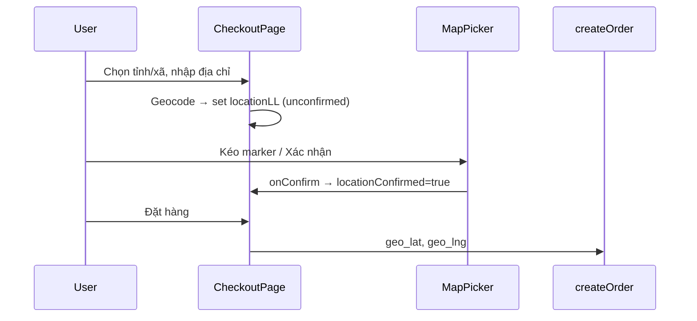

# Functional Requirement (FR) — Xác nhận địa chỉ trên bản đồ (MapPicker Address Confirmation)

## 1. Feature Overview

Khách **xác nhận tọa độ giao hàng** (`geo_lat`, `geo_lng`) bằng bản đồ tương tác Leaflet (`MapPicker.jsx`). Đây là bước bắt buộc trước `POST /orders` — backend từ chối nếu thiếu geo.

**Component:** `client/app/components/MapPicker.jsx`  
**Dùng tại:** `CheckoutPage`, `EditShippingAddressDialog` (pattern hơi khác).

---

## 2. Actors

| Actor | Mô tả |
|-------|-------|
| **Customer** | Kéo marker, click map, bấm xác nhận |
| **MapPicker** | Leaflet + OSM tiles |
| **CheckoutPage** | `locationLL`, `locationConfirmed`, banners |
| **createOrder** | Validate `geo_lat`, `geo_lng` |

---

## 3. Scope

### In Scope

- Hiển thị map OSM, marker draggable.
- Click map đặt marker.
- Nút **「Xác nhận vị trí」** (trong MapPicker hoặc ngoài dialog).
- State `locationConfirmed` gate submit checkout.
- Reset confirm khi đổi địa chỉ / tỉnh / kéo marker.

### Out of Scope

- GPS browser geolocation API (không dùng).
- Reverse geocode tự điền ô address (không có — xem FR_ReverseGeocodeAddress).
- Lưu nhiều địa chỉ saved.

---

## 4. MapPicker Component API

```javascript
export default function MapPicker({ value, onChange, onConfirm }) {
  // value: { lat, lng } | null
  // onChange(latlng) — mỗi lần click/drag
  // onConfirm(latlng) — khi bấm nút trong component
}
```

### Hành vi map

| Tính năng | Implementation |
|-----------|----------------|
| Default center | `[10.776, 106.7]` (HCMC) nếu chưa có `value` |
| Tiles | `https://{s}.tile.openstreetmap.org/{z}/{x}/{y}.png` |
| Zoom | 15 (fixed `MapContainer`) |
| Click map | `ClickToSetMarker` → `onChange` |
| Drag marker | `dragend` → `onChange` |
| Recenter | `RecenterOnLocation` khi `value` đổi, zoom 17 |

### Nút xác nhận (built-in)

```javascript
<button
  onClick={() => value && onConfirm?.(value)}
  disabled={!value}
>
  Xác nhận vị trí
</button>
```

---

## 5. CheckoutPage Integration

### State

```javascript
const [locationLL, setLocationLL] = useState(null);       // { lat, lng }
const [locationConfirmed, setLocationConfirmed] = useState(false);
const [mapCenter, setMapCenter] = useState(null);      // set nhưng...
const [mapZoom, setMapZoom] = useState(undefined);
const [locBanner, setLocBanner] = useState({ type, text });
```

### canSubmit

```javascript
locationLL && locationConfirmed  // cùng province, ward, form fields
```

### onChange (marker moved)

```javascript
onChange={(latlng) => {
  setLocationLL(latlng);
  setLocationConfirmed(false);
  setLocBanner({ type: "warning", text: "… nhấn Xác nhận vị trí …" });
}}
```

### onConfirm

```javascript
onConfirm={(latlng) => {
  setLocationLL(latlng);
  setLocationConfirmed(true);
  setLocBanner({
    type: "success",
    text: `Đã xác nhận vị trí: (${lat.toFixed(6)}, ${lng.toFixed(6)}). …`,
  });
}}
```

### Props không được MapPicker đọc (GAP)

```jsx
<MapPicker
  center={mapCenter}
  zoom={mapZoom}
  flyToOnCenterChange
/>
```

`MapPicker` **không khai báo** các props này — `mapCenter`/`mapZoom` từ geocode **không** điều khiển map trực tiếp; chỉ khi set `locationLL` thì `RecenterOnLocation` recenter.

### Banners UX

| Trạng thái | Banner |
|------------|--------|
| Có LL, chưa confirm | warning — bắt bấm xác nhận |
| Sau confirm | success — hiện tọa độ |
| Sau geocode địa chỉ | warning — kiểm tra marker |

### Submit order

```javascript
geo_lat: locationLL.lat,
geo_lng: locationLL.lng,
```

---

## 6. EditShippingAddressDialog Integration

| Khác Checkout | Chi tiết |
|---------------|----------|
| MapPicker | **Không** truyền `onConfirm` |
| Xác nhận | Nút riêng bên dưới map |
| onChange | Cập nhật `form.geo_lat/lng` + `locationConfirmed=false` |
| Submit dialog | Cần logic riêng kiểm tra confirmed (trong `submit`) |

MapPicker vẫn render nút 「Xác nhận vị trí」 nội bộ nhưng `onConfirm` undefined → click **không** set `locationConfirmed` — user phải dùng nút ngoài.

---

## 7. Triggers Reset `locationConfirmed`

| Sự kiện | Checkout |
|---------|----------|
| Đổi ô `address` | reset |
| Đổi tỉnh/xã | reset (và geocode lại) |
| `onChange` map | reset |
| Geocode Nominatim success | reset (ép user confirm lại) |

---

## 8. Backend Validation

```javascript
if (geo_lat == null || geo_lng == null) {
  return res.status(400).json({
    message: "Vui lòng xác nhận vị trí trên bản đồ",
  });
}
```

Tọa độ lưu `orders.geo_lat`, `orders.geo_lng` (DECIMAL).

---

## 9. Sequence



---

## 10. Related FRs

| FR | Liên kết |
|----|----------|
| `FR_ReverseGeocodeAddress` | Đặt marker gần đúng (forward) |
| `FR_ListProvinces` / `FR_ListWardsByProvince` | Context địa chỉ |
| `FR_CheckoutPageFlow` | Host page |
| `FR_CreateOrder` | Persist geo |

---

## 11. Source Files

| File | Vai trò |
|------|---------|
| `client/app/components/MapPicker.jsx` | Map UI |
| `client/app/pages/CheckoutPage.jsx` | Primary flow |
| `client/app/components/EditShippingAddressDialog.jsx` | Edit order |
| `server/controllers/orderController.js` | Geo validation |
| `docs/master_specification.md` | Yêu cầu xác nhận bản đồ |

---

## 12. Acceptance Criteria

- [ ] Không confirm → không submit checkout.
- [ ] Drag marker → phải confirm lại.
- [ ] Confirm → banner success + submit gửi lat/lng.
- [ ] BE từ chối thiếu geo.
- [ ] Map hiển thị marker tại HCMC default hoặc sau geocode.

---

## 13. Known Gaps

| # | Mô tả |
|---|--------|
| GAP-01 | Props `center`, `zoom`, `flyToOnCenterChange` trên Checkout **không hoạt động**. |
| GAP-02 | Dialog có **hai** nút xác nhận (MapPicker + external) — dễ nhầm. |
| GAP-03 | MapPicker `onConfirm` noop trong dialog. |
| GAP-04 | Không reverse geocode sau drag — address text có thể lệch marker. |
| GAP-05 | Không validate lat/lng trong VN bounding box. |
| GAP-06 | `geoFallbackToWardCenter` dead + API missing. |
