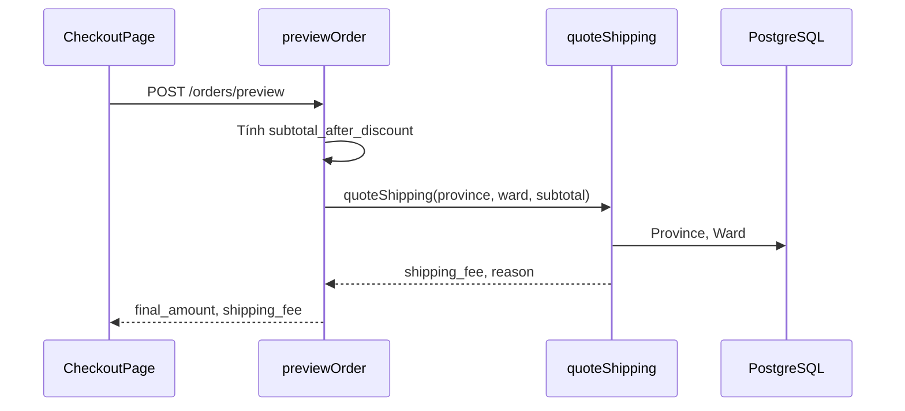

# Functional Requirement (FR) — Báo giá phí vận chuyển (Quote Shipping Fee)

## 1. Feature Overview

Hệ thống tính **phí giao hàng (VND)** từ tỉnh/thành, phường/xã (phụ phí), và **tạm tính đơn hàng** (`subtotal` sau giảm giá). Logic tập trung:

```
shippingService.quoteShipping({ province_id, ward_id, subtotal })
```

**API công khai:**

```
GET /api/quote?province_id=&ward_id=&subtotal=
```

**Cũng gọi nội bộ:** `createOrder`, `previewOrder`, `updateShippingAddress` — không qua HTTP.

---

## 2. Actors

| Actor | Mô tả |
|-------|-------|
| **Customer** | Xem phí ship checkout / sửa địa chỉ |
| **shippingController.getQuote** | HTTP wrapper |
| **useShippingQuote** | FE debounce 300ms |
| **useOrderPreview** | Preview tổng đơn (server `quoteShipping`) |
| **orderController** | Persist `orders.shipping_fee` |

---

## 3. Scope

### In Scope

- Rules: freeship tỉnh, HCM ≥1M, base + ward extra, max cap.
- Return `{ shipping_fee, reason? }`.
- Public GET `/quote`.
- Integer VND, `Math.round`, min 0.

### Out of Scope

- Cân nặng / kích thước sản phẩm.
- Nhiều kho giao.
- VAT trên phí ship.
- Coupon freeship.

---

## 4. Business Rules — `quoteShipping`

```javascript
async function quoteShipping({ province_id, ward_id, subtotal }) {
  const province = await Province.findByPk(province_id);
  if (!province) return { shipping_fee: 0, reason: "NO_PROVINCE" };

  let fee = Number(province.base_shipping_fee || 0);

  if (province.is_free_shipping)
    return { shipping_fee: 0, reason: "FREE_BY_PROVINCE" };

  if (ward_id) {
    const ward = await Ward.findByPk(ward_id);
    if (ward) fee += Number(ward.extra_fee || 0);
  }

  if (province.is_hcm && Number(subtotal) >= 1_000_000)
    return { shipping_fee: 0, reason: "HCM_SUBTOTAL_FREE" };

  if (province.max_shipping_fee != null)
    fee = Math.min(fee, Number(province.max_shipping_fee));

  return { shipping_fee: Math.max(0, Math.round(fee)) };
}
```

### Thứ tự ưu tiên (quan trọng)

| Bước | Điều kiện | Kết quả |
|------|-----------|---------|
| 1 | Province không tồn tại | `0`, `NO_PROVINCE` |
| 2 | `is_free_shipping` | `0`, `FREE_BY_PROVINCE` — **không** cộng ward |
| 3 | Cộng `ward.extra_fee` (nếu có ward_id) | fee tạm |
| 4 | `is_hcm` && subtotal ≥ 1_000_000 | `0`, `HCM_SUBTOTAL_FREE` |
| 5 | `max_shipping_fee` | cap |
| 6 | Round ≥ 0 | `shipping_fee` |

**Lưu ý:** HCM freeship kiểm tra **sau** khi đã cộng ward fee trong code — nhưng return sớm ở bước 4 bỏ qua fee đã cộng (OK).

---

## 5. HTTP API — `GET /api/quote`

### Request query

| Param | Bắt buộc | Mô tả |
|-------|----------|-------|
| `province_id` | Có (implicit) | `Number(province_id)` |
| `ward_id` | Không | Thiếu → không load ward |
| `subtotal` | Không | Default `0` |

```
GET /api/quote?province_id=79&ward_id=12345&subtotal=1500000
```

### Response — 200

```json
{
  "shipping_fee": 0,
  "reason": "HCM_SUBTOTAL_FREE"
}
```

`reason` có thể `undefined`/absent khi tính phí thường.

### Errors

| HTTP | Body |
|------|------|
| 500 | `{ "error": "QUOTE_FAILED" }` |

---

## 6. Internal Call Sites

| Caller | subtotal nguồn |
|--------|----------------|
| `previewOrder` | `subtotal_after_discount` từ items |
| `createOrder` | Cùng công thức preview |
| `updateShippingAddress` | `order.total_amount - order.discount_amount` |
| `getQuote` | Query `subtotal` từ FE |

`final_amount` đơn:

```
final_amount = subtotal_after_discount + shipping_fee
```

---

## 7. Frontend — `useShippingQuote`

```javascript
// EditShippingAddressDialog — preview đổi phí trong modal
useShippingQuote({ provinceId, wardId, subtotal });

// Debounce 300ms
GET /quote { province_id, ward_id?, subtotal }
```

| # | Rule |
|---|------|
| BR-01 | Không gọi khi thiếu `provinceId` hoặc `subtotal` |
| BR-02 | `wardId` optional trong params |

### CheckoutPage — phí ship qua **order preview**

```javascript
useOrderPreview({ provinceId, wardId, viewItems });
// POST /orders/preview — trả shipping_fee + final_amount
```

**Không** gọi `GET /quote` trực tiếp trên Checkout — dùng preview API gộp.

---

## 8. updateShippingAddress — Quote impact

Nếu đổi tỉnh/xã làm `newShipFee !== oldShipFee`:

- VNPAY **đã** `payment.completed` → **400** (chặn).
- Ngược lại → cập nhật `order.shipping_fee`, `final_amount`, `payment.amount` (nếu chưa paid).

---

## 9. Sequence — Checkout preview



---

## 10. Related FRs

| FR | Liên kết |
|----|----------|
| `FR_ListProvinces` | `base_shipping_fee`, flags |
| `FR_ListWardsByProvince` | `extra_fee` |
| `FR_PreviewOrder` | Gộp quote trong preview |
| `FR_CreateOrder` | Persist fee |
| `FR_UpdateOrderShippingAddress` | Recalc |

---

## 11. Source Files

| File | Vai trò |
|------|---------|
| `server/services/shippingService.js` | Core logic |
| `server/controllers/shippingController.js` | HTTP |
| `server/routes/shippingRoutes.js` | `GET /quote` |
| `server/server.js` | `app.use("/api", shippingRoutes)` |
| `client/app/hooks/useShippingQuote.js` | FE quote |
| `server/controllers/orderController.js` | Internal calls |
| `docs/master_specification.md` §8.4 | Rules summary |

---

## 12. Acceptance Criteria

- [ ] `is_free_shipping` → 0 bất kể ward.
- [ ] HCM + subtotal 1_000_000 → 0.
- [ ] base 30k + ward extra 5k → 35k (nếu không freeship).
- [ ] `max_shipping_fee` cap hoạt động.
- [ ] Preview và create cùng input → cùng `shipping_fee`.
- [ ] GET `/quote` khớp `quoteShipping` trực tiếp.

---

## 13. Known Gaps

| # | Mô tả |
|---|--------|
| GAP-01 | Preview cho phép thiếu `ward_id`; create **bắt buộc** ward — phí preview có thể thấp hơn lúc submit. |
| GAP-02 | `NO_PROVINCE` trả fee 0 — có thể hiểu nhầm freeship. |
| GAP-03 | Checkout không dùng `useShippingQuote` — chỉ preview POST. |
| GAP-04 | Không auth `/quote` — có thể spam (nhẹ). |
| GAP-05 | `reason` không hiển thị trên UI checkout. |
