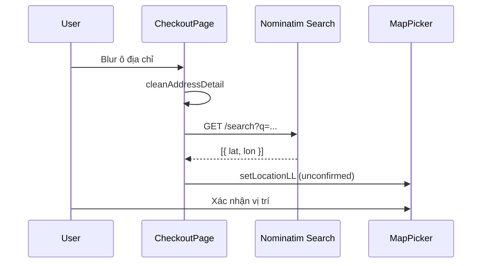

# Functional Requirement (FR) — Geocoding địa chỉ (Forward) & Reverse Geocode (Planned)

## 1. Feature Overview

Dự án cần chuyển **địa chỉ chữ** ↔ **tọa độ** để hỗ trợ `MapPicker` và giao hàng. Trong code hiện tại:

| Khái niệm | Trạng thái trong repo |
|-----------|----------------------|
| **Forward geocode** (địa chỉ → lat/lng) | **Có** — Nominatim **Search** API, gọi **trực tiếp từ browser** |
| **Reverse geocode** (lat/lng → địa chỉ) | **Không có** trong source — chỉ được nhắc trong `docs/engineering_rules/frontend-api-integration.md` |

Tài liệu này mô tả **cả hai**, nhấn mạnh implementation thực tế (forward) và khoảng trống (reverse).

**Không có** endpoint backend `/api/geocode` — toàn bộ geocoding client-side tới OpenStreetMap.

---

## 2. Actors

| Actor | Mô tả |
|-------|-------|
| **CheckoutPage** | `geocodeSimple`, `geocodeAddress`, `handleAddressBlur` |
| **EditShippingAddressDialog** | `geocodeSimple`, `geocodeAddress`, `handleAddressBlur` |
| **Nominatim OSM** | Dịch vụ bên thứ ba |
| **MapPicker** | Nhận kết quả qua `setLocationLL` |

---

## 3. Scope

### In Scope (Forward — implemented)

- Build query từ địa chỉ chi tiết + ward + province + `"Vietnam"`.
- `GET https://nominatim.openstreetmap.org/search?format=json&limit=1&q=...`
- User-Agent header bắt buộc theo policy OSM.
- `cleanAddressDetail` loại trùng từ hành chính.
- Auto geocode khi chọn ward / tỉnh (useEffect).
- Blur ô địa chỉ → geocode.

### Out of Scope (Reverse — not implemented)

```javascript
// Documented in frontend-api-integration.md ONLY:
fetch(`https://nominatim.openstreetmap.org/reverse?lat=${lat}&lon=${lng}&format=json`)
```

- Không gọi sau drag marker.
- Không điền ngược `formData.address`.
- Không proxy qua backend (tránh lộ IP server / rate limit).

### Out of Scope chung

- Backend lưu cache geocode.
- Google Maps Geocoding API.

---

## 4. Forward Geocode — `geocodeSimple`

### CheckoutPage

```javascript
async function geocodeSimple(query) {
  const url = `https://nominatim.openstreetmap.org/search?format=json&limit=1&q=${encodeURIComponent(query)}`;
  const res = await fetch(url, {
    headers: {
      Accept: "application/json",
      "User-Agent": "laptopstore-checkout/1.0 (contact: your-email@example.com)",
    },
  });
  const arr = await res.json();
  if (Array.isArray(arr) && arr.length > 0) {
    return { lat: parseFloat(arr[0].lat), lng: parseFloat(arr[0].lon) };
  }
  return null;
}
```

### EditShippingAddressDialog

Cùng pattern; User-Agent rút gọn `laptopstore-checkout/1.0`.

| # | Rule |
|---|------|
| BR-01 | `limit=1` — lấy kết quả đầu |
| BR-02 | Fail → `null` / banner warning |
| BR-03 | Success → set marker, **`locationConfirmed = false`** |

---

## 5. Query Construction

### Khi blur địa chỉ chi tiết

```javascript
const cleaned = cleanAddressDetail(formData.address, wardName, provinceName);
// Loại bỏ từ "phường", "quận", tên ward/province trùng trong chuỗi

const q = `${cleaned}, ${wardName}, ${provinceName}, Vietnam`;
// hoặc geocodeSimple(cleaned) trên Checkout blur path
```

### Khi chọn phường (useEffect)

```javascript
geocodeSimple(`${wardName}, ${provinceName}, Vietnam`);
```

### Khi chọn tỉnh (chưa có ward)

```javascript
geocodeSimple(`${provinceName}, Vietnam`);
```

### geocodeAddress (Checkout — full string)

```javascript
const q = `${addressDetail}, ${wardName}, ${provinceName}, Vietnam`;
// fetch search API — tương tự geocodeSimple
```

---

## 6. UX Sau Geocode

| Bước | Hành vi |
|------|---------|
| Tìm thấy | `setLocationLL`, `setMapCenter`/`setMapZoom` (state Checkout — map props ineffective), banner warning/success |
| Không thấy | Banner/manual map |
| User | **Bắt buộc** 「Xác nhận vị trí」 trước order |

Geocode **không** thay thế xác nhận thủ công — chỉ gợi ý vị trí.

---

## 7. Reverse Geocode — Trạng thái & Thiết kế đề xuất

### Hiện trạng

- **Zero** file `.jsx/.js` gọi `nominatim.openstreetmap.org/reverse`.
- Kéo marker chỉ cập nhật `lat/lng` — ô địa chỉ **không** đổi.

### Use case nếu implement

| Use case | Lợi ích |
|----------|---------|
| Sau drag marker | Hiển thị `display_name` gợi ý |
| Audit giao hàng | So khớp địa chỉ text vs GPS |

### Gợi ý implement (ngoài scope code hiện tại)

```javascript
async function reverseGeocode(lat, lng) {
  const url = `https://nominatim.openstreetmap.org/reverse?lat=${lat}&lon=${lng}&format=json`;
  const res = await fetch(url, { headers: { "User-Agent": "..." } });
  const data = await res.json();
  return data.display_name; // hoặc address parts
}
```

Cân nhắc: rate limit 1 req/s Nominatim — debounce khi drag.

---

## 8. Ward Centroid Fallback (không hoạt động)

```javascript
// CheckoutPage — DEAD CODE, không được gọi
async function geoFallbackToWardCenter() {
  const { data } = await api.get(`/geo/wards/${wardId}/centroid`);
  ...
}
```

Thay thế thực tế: Nominatim search theo tên ward.

---

## 9. Rate Limit & Compliance

| Policy | Thực hành hiện tại |
|--------|-------------------|
| User-Agent | Có |
| Debounce blur | Một lần sau blur |
| useEffect ward/province | Gọi mỗi lần đổi — có thể burst |
| Attribution OSM | MapPicker tile attribution |

Production nên: proxy backend, cache, hoặc dịch vụ thương mại.

---

## 10. Sequence — Forward (blur address)



---

## 11. Related FRs

| FR | Liên kết |
|----|----------|
| `FR_MapPickerAddressConfirmation` | Bước sau geocode |
| `FR_ListWardsByProvince` | Tên ward trong query |
| `FR_ListProvinces` | Tên tỉnh trong query |
| `FR_CheckoutPageFlow` | Orchestration |

---

## 12. Source Files

| File | Vai trò |
|------|---------|
| `client/app/pages/CheckoutPage.jsx` | Forward geocode chính |
| `client/app/components/EditShippingAddressDialog.jsx` | Forward geocode |
| `docs/engineering_rules/frontend-api-integration.md` §10.1 | Reverse example (doc only) |
| `docs/master_specification.md` §410 | Centroid mismatch |

---

## 13. Acceptance Criteria

### Forward (hiện tại)

- [ ] Chọn ward → marker nhảy gần khu vực (nếu Nominatim trả kết quả).
- [ ] Blur address hợp lệ → banner + marker (chưa confirmed).
- [ ] Geocode fail → user vẫn đặt marker thủ công được.
- [ ] Submit order vẫn cần `locationConfirmed` dù đã geocode.

### Reverse (chưa có)

- [ ] N/A — chưa implement.

---

## 14. Known Gaps

| # | Mô tả |
|---|--------|
| GAP-01 | **Reverse geocode không có** — tên FR mang tính đích + planned; thực tế chỉ forward. |
| GAP-02 | Geocode client-side — CORS phụ thuộc Nominatim; không qua BE. |
| GAP-03 | `mapCenter`/`zoom` không wired vào MapPicker. |
| GAP-04 | Centroid API thiếu; `geoFallbackToWardCenter` dead. |
| GAP-05 | useEffect geocode mỗi đổi ward — có thể vượt rate limit OSM. |
| GAP-06 | Kết quả geocode không validate nằm trong tỉnh/ward đã chọn. |
| GAP-07 | Doc integration mô tả reverse — **lệch** codebase, dễ hiểu nhầm cho dev mới. |
